# AMC 8 1999 Problems

## Problem 1

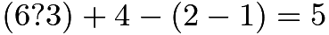
To make this statement true, the question mark between the 6 and the 3 should be replaced by

---

## Problem 2

What is the degree measure of the smaller angle formed by the hands of a clock at 10 o clock?
![[asy] draw(circle((0,0),2)); dot((0,0)); for(int i = 0; i < 12; ++i) { dot(2*dir(30*i)); }  label("$3$",2*dir(0),W); label("$2$",2*dir(30),WSW); label("$1$",2*dir(60),SSW); label("$12$",2*dir(90),S); label("$11$",2*dir(120),SSE); label("$10$",2*dir(150),ESE); label("$9$",2*dir(180),E); label("$8$",2*dir(210),ENE); label("$7$",2*dir(240),NNE); label("$6$",2*dir(270),N); label("$5$",2*dir(300),NNW); label("$4$",2*dir(330),WNW); [/asy]](images/1999/img_233df804.png)

---

## Problem 3

Which triplet of numbers has a sum NOT equal to 1?
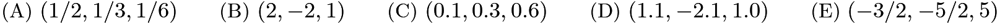

---

## Problem 4

The diagram shows the miles traveled by bikers Alberto and Bjorn. After four hours, about how many more miles has Alberto biked than Bjorn?
![[asy] for (int a = 0; a < 6; ++a) { for (int b = 0; b < 6; ++b) { dot((4*a,3*b)); } } draw((0,0)--(20,0)--(20,15)--(0,15)--cycle); draw((0,0)--(16,12)); draw((0,0)--(16,9));  label(rotate(30)*"Bjorn",(12,6.75),SE); label(rotate(37)*"Alberto",(11,8.25),NW);  label("$0$",(0,0),S); label("$1$",(4,0),S); label("$2$",(8,0),S); label("$3$",(12,0),S); label("$4$",(16,0),S); label("$5$",(20,0),S); label("$0$",(0,0),W); label("$15$",(0,3),W); label("$30$",(0,6),W); label("$45$",(0,9),W); label("$60$",(0,12),W); label("$75$",(0,15),W);  label("H",(6,-2),S); label("O",(8,-2),S); label("U",(10,-2),S); label("R",(12,-2),S); label("S",(14,-2),S);  label("M",(-4,11),N); label("I",(-4,9),N); label("L",(-4,7),N); label("E",(-4,5),N); label("S",(-4,3),N); [/asy]](images/1999/img_cb46a444.png)
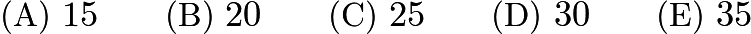

---

## Problem 5

A rectangular garden 60 feet long and 20 feet wide is enclosed by a fence. To make the garden larger, while using the same fence, its shape is changed to a square. By how many square feet does this enlarge the garden?

---

## Problem 6

Bo, Coe, Flo, Joe, and Moe have different amounts of money. Neither Joe nor Bo has as much money as Flo. Both Bo and Coe have more than Moe. Joe has more than Moe, but less than Bo. Who has the least amount of money?
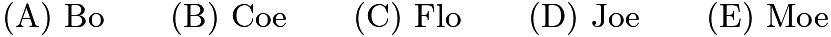

---

## Problem 7

The third exit on a highway is located at milepost 40 and the tenth exit is at milepost 160. There is a service center on the highway located three-fourths of the way from the third exit to the tenth exit. At what milepost would you expect to find this service center?

---

## Problem 8

Six squares are colored, front and back, (R = red, B = blue, O = orange, Y = yellow, G = green, and W = white). They are hinged together as shown, then folded to form a cube. The face opposite the white face is
![[asy] draw((0,2)--(1,2)--(1,1)--(2,1)--(2,0)--(3,0)--(3,1)--(4,1)--(4,2)--(2,2)--(2,3)--(0,3)--cycle); draw((1,3)--(1,2)--(2,2)--(2,1)--(3,1)--(3,2)); label("R",(.5,2.3),N); label("B",(1.5,2.3),N); label("G",(1.5,1.3),N); label("Y",(2.5,1.3),N); label("W",(2.5,.3),N); label("O",(3.5,1.3),N); [/asy]](images/1999/img_80e4cb42.png)
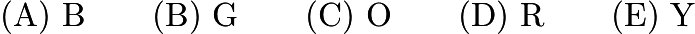

---

## Problem 9

Three flower beds overlap as shown. Bed A has 500 plants, bed B has 450 plants, and bed C has 350 plants. Beds A and B share 50 plants, while beds A and C share 100. The total number of plants is
![[asy] draw((0,0)--(3,0)--(3,1)--(0,1)--cycle); draw(circle((.3,-.1),.7)); draw(circle((2.8,-.2),.8)); label("A",(1.3,.5),N); label("B",(3.1,-.2),S); label("C",(.6,-.2),S); [/asy]](images/1999/img_aa9a1f16.png)

---

## Problem 10

A complete cycle of a traffic light takes 60 seconds. During each cycle the light is green for 25 seconds, yellow for 5 seconds, and red for 30 seconds. At a randomly chosen time, what is the probability that the light will NOT be green?
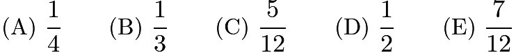

---

## Problem 11

Each of the five numbers 1, 4, 7, 10, and 13 is placed in one of the five squares so that the sum of the three numbers in the horizontal row equals the sum of the three numbers in the vertical column. The largest possible value for the horizontal or vertical sum is
![[asy] draw((0,0)--(3,0)--(3,1)--(0,1)--cycle); draw((1,-1)--(2,-1)--(2,2)--(1,2)--cycle); [/asy]](images/1999/img_958a1024.png)

---

## Problem 12

The ratio of the number of games won to the number of games lost (no ties) by the Middle School Middies is
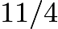
. To the nearest whole percent, what percent of its games did the team lose?
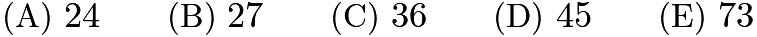

---

## Problem 13

The average age of the 40 members of a computer science camp is 17 years. There are 20 girls, 15 boys, and 5 adults. If the average age of the girls is 15 and the average age of the boys is 16, what is the average age of the adults?

---

## Problem 14

In trapezoid

, the sides

and

are equal. The perimeter of

is
![[asy] draw((0,0)--(4,3)--(12,3)--(16,0)--cycle); draw((4,3)--(4,0),dashed); draw((3.2,0)--(3.2,.8)--(4,.8));  label("$A$",(0,0),SW); label("$B$",(4,3),NW); label("$C$",(12,3),NE); label("$D$",(16,0),SE); label("$8$",(8,3),N); label("$16$",(8,0),S); label("$3$",(4,1.5),E); [/asy]](images/1999/img_f3bdd342.png)
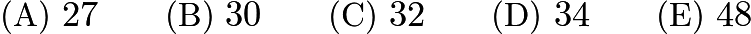

---

## Problem 15

Bicycle license plates in Flatville each contain three letters. The first is chosen from the set {C,H,L,P,R}, the second from {A,I,O}, and the third from {D,M,N,T}.
When Flatville needed more license plates, they added two new letters. The new letters may both be added to one set or one letter may be added to one set and one to another set. What is the largest possible number of ADDITIONAL license plates that can be made by adding two letters?

---

## Problem 16

Tori's mathematics test had 75 problems: 10 arithmetic, 30 algebra, and 35 geometry problems. Although she answered 70% of the arithmetic, 40% of the algebra, and 60% of the geometry problems correctly, she did not pass the test because she got less than 60% of the problems right. How many more problems would she have needed to answer correctly to earn a 60% passing grade?
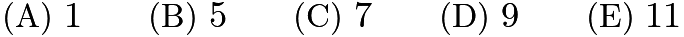

---

## Problem 17

Problems 17, 18, and 19 refer to the following:
At Central Middle School the 108 students who take the 1999 AMC 8 meet in the evening to talk about problems and eat an average of two cookies apiece. Walter and Gretel are baking Bonnie's Best Bar Cookies this year. Their recipe, which makes a pan of 15 cookies, lists these items:
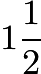
cups flour,

eggs,

tablespoons butter,
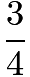
cups sugar, and

package of chocolate drops. They will make only full recipes, not partial recipes.
Walter can buy eggs by the half-dozen. How many half-dozens should he buy to make enough cookies? (Some eggs and some cookies may be left over.)
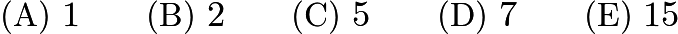

---

## Problem 18

Problems 17, 18, and 19 refer to the following:
At Central Middle School the 108 students who take the AMC 8 meet in the evening to talk about problems and eat an average of two cookies apiece. Walter and Gretel are baking Bonnie's Best Bar Cookies this year. Their recipe, which makes a pan of 15 cookies, lists these items:

cups flour,

eggs,

tablespoons butter,

cups sugar, and

package of chocolate drops. They will make only full recipes, not partial recipes.
They learn that a big concert is scheduled for the same night and attendance will be down 25%. How many recipes of cookies should they make for their smaller party?
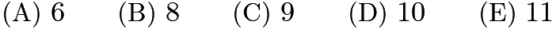

---

## Problem 19

Problems 17, 18, and 19 refer to the following:
At Central Middle School the 108 students who take the AMC 8 meet in the evening to talk about problems and eat an average of two cookies apiece. Walter and Gretel are baking Bonnie's Best Bar Cookies this year. Their recipe, which makes a pan of 15 cookies, lists these items:

cups flour,

eggs,

tablespoons butter,

cups sugar, and

package of chocolate drops. They will make only full recipes, not partial recipes.
The drummer gets sick. The concert is cancelled. Walter and Gretel must make enough pans of cookies to supply 216 cookies. There are 8 tablespoons in a stick of butter. How many sticks of butter will be needed? (Some butter may be left over, of course.)

---

## Problem 20

Figure 1 is called a "stack map." The numbers tell how many cubes are stacked in each position. Fig. 2 shows these cubes, and Fig. 3 shows the view of the stacked cubes as seen from the front.
Which of the following is the front view for the stack map in Fig. 4?
![[asy] unitsize(24);  draw((0,0)--(2,0)--(2,2)--(0,2)--cycle); draw((1,0)--(1,2)); draw((0,1)--(2,1));  draw((5,0)--(7,0)--(7,1)--(20/3,4/3)--(20/3,13/3)--(19/3,14/3)--(16/3,14/3)--(16/3,11/3)--(13/3,11/3)--(13/3,2/3)--cycle); draw((20/3,13/3)--(17/3,13/3)--(17/3,10/3)--(14/3,10/3)--(14/3,1/3)); draw((20/3,10/3)--(17/3,10/3)--(17/3,7/3)--(20/3,7/3)); draw((17/3,7/3)--(14/3,7/3)); draw((7,1)--(6,1)--(6,2)--(5,2)--(5,0)); draw((5,1)--(6,1)--(6,0)); draw((20/3,4/3)--(6,4/3)); draw((17/3,13/3)--(16/3,14/3)); draw((17/3,10/3)--(16/3,11/3)); draw((14/3,10/3)--(13/3,11/3)); draw((5,2)--(13/3,8/3)); draw((5,1)--(13/3,5/3)); draw((6,2)--(17/3,7/3));  draw((9,0)--(11,0)--(11,4)--(10,4)--(10,3)--(9,3)--cycle); draw((11,3)--(10,3)--(10,0)); draw((11,2)--(9,2)); draw((11,1)--(9,1));  draw((13,0)--(16,0)--(16,2)--(13,2)--cycle); draw((13,1)--(16,1)); draw((14,0)--(14,2)); draw((15,0)--(15,2));  label("Figure 1",(1,0),S); label("Figure 2",(17/3,0),S); label("Figure 3",(10,0),S); label("Figure 4",(14.5,0),S);  label("$1$",(1.5,.2),N); label("$2$",(.5,.2),N); label("$3$",(.5,1.2),N); label("$4$",(1.5,1.2),N);  label("$1$",(13.5,.2),N); label("$3$",(14.5,.2),N); label("$1$",(15.5,.2),N); label("$2$",(13.5,1.2),N); label("$2$",(14.5,1.2),N); label("$4$",(15.5,1.2),N); [/asy]](images/1999/img_f6121ddb.png)
![[asy] unitsize(18); draw((0,0)--(3,0)--(3,2)--(1,2)--(1,4)--(0,4)--cycle); draw((0,3)--(1,3)); draw((0,2)--(1,2)--(1,0)); draw((0,1)--(3,1)); draw((2,0)--(2,2));  draw((5,0)--(8,0)--(8,4)--(7,4)--(7,3)--(6,3)--(6,2)--(5,2)--cycle); draw((8,3)--(7,3)--(7,0)); draw((8,2)--(6,2)--(6,0)); draw((8,1)--(5,1));  draw((10,0)--(12,0)--(12,4)--(11,4)--(11,3)--(10,3)--cycle); draw((12,3)--(11,3)--(11,0)); draw((12,2)--(10,2)); draw((12,1)--(10,1));  draw((14,0)--(17,0)--(17,4)--(16,4)--(16,2)--(14,2)--cycle); draw((17,3)--(16,3)); draw((17,2)--(16,2)--(16,0)); draw((17,1)--(14,1)); draw((15,0)--(15,2));  draw((19,0)--(22,0)--(22,4)--(20,4)--(20,1)--(19,1)--cycle); draw((22,3)--(20,3)); draw((22,2)--(20,2)); draw((22,1)--(20,1)--(20,0)); draw((21,0)--(21,4));  label("(A)",(1.5,0),S); label("(B)",(6.5,0),S); label("(C)",(11,0),S); label("(D)",(15.5,0),S); label("(E)",(20.5,0),S); [/asy]](images/1999/img_29861edd.png)

---

## Problem 21

The degree measure of angle

is
![[asy] unitsize(12); draw((0,0)--(20,0)--(1,-10)--(9,5)--(18,-8)--cycle); draw(arc((1,-10),(1+19/sqrt(461),-10+10/sqrt(461)),(25/17,-155/17),CCW)); draw(arc((19/3,0),(19/3-8/17,-15/17),(22/3,0),CCW)); draw(arc((900/83,-400/83),(900/83+19/sqrt(461),-400/83+10/sqrt(461)),(900/83 - 9/sqrt(97),-400/83 + 4/sqrt(97)),CCW)); label(rotate(30)*"$40^\circ$",(2,-8.9),ENE); label("$100^\circ$",(21/3,-2/3),SE); label("$110^\circ$",(900/83,-317/83),NNW); label("$A$",(0,0),NW); [/asy]](images/1999/img_3dff10c4.png)
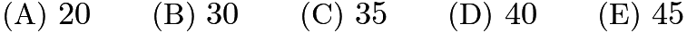

---

## Problem 22

In a far-off land three fish can be traded for two loaves of bread and a loaf of bread can be traded for four bags of rice. How many bags of rice is one fish worth?
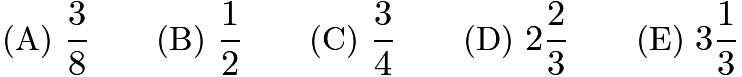

---

## Problem 23

Square

has sides of length 3. Segments

and

divide the square's area into three equal parts. How long is segment

?
![[asy] pair A,B,C,D,M,N; A = (0,0); B = (0,3); C = (3,3); D = (3,0); M = (0,1); N = (1,0); draw(A--B--C--D--cycle); draw(M--C--N); label("$A$",A,SW); label("$M$",M,W); label("$B$",B,NW); label("$C$",C,NE); label("$D$",D,SE); label("$N$",N,S); [/asy]](images/1999/img_3ef4efcb.png)
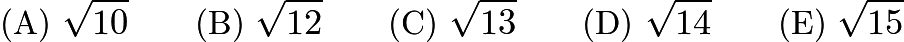

---

## Problem 24

When

is divided by

, the remainder is
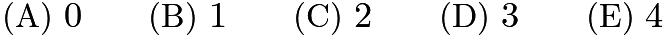

---

## Problem 25

Points

,

, and

are midpoints of the sides of right triangle

. Points

,

,

are midpoints of the sides of triangle

, etc. If the dividing and shading process is done 100 times (the first three are shown) and

, then the total area of the shaded triangles is nearest
![[asy] draw((0,0)--(6,0)--(6,6)--cycle); draw((3,0)--(3,3)--(6,3)); draw((4.5,3)--(4.5,4.5)--(6,4.5)); draw((5.25,4.5)--(5.25,5.25)--(6,5.25)); fill((3,0)--(6,0)--(6,3)--cycle,black); fill((4.5,3)--(6,3)--(6,4.5)--cycle,black); fill((5.25,4.5)--(6,4.5)--(6,5.25)--cycle,black);  label("$A$",(0,0),SW); label("$B$",(3,0),S); label("$C$",(6,0),SE); label("$D$",(6,3),E); label("$E$",(6,4.5),E); label("$F$",(6,5.25),E); label("$G$",(6,6),NE); label("$H$",(5.25,5.25),NW); label("$I$",(4.5,4.5),NW); label("$J$",(3,3),NW); label("$K$",(4.5,3),S); label("$L$",(5.25,4.5),S); [/asy]](images/1999/img_457db30c.png)

---

