# AMC 8 2000 Problems

## Problem 1

Aunt Anna is
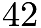
years old. Caitlin is

years younger than Brianna, and Brianna is half as old as Aunt Anna. How old is Caitlin?
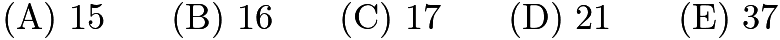

---

## Problem 2

Which of these numbers is less than its reciprocal?
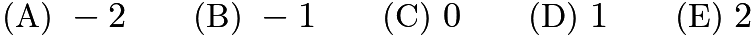

---

## Problem 3

How many whole numbers lie in the interval between
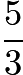
and

---

## Problem 4

In

only
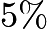
of the working adults in Carlin City worked at home. By

the "at-home" work force increased to
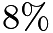
. In

there were approximately

working at home, and in

there were

. The graph that best illustrates this is
![[asy] unitsize(18);  draw((0,4)--(0,0)--(7,0)); draw((0,1)--(.2,1)); draw((0,2)--(.2,2)); draw((0,3)--(.2,3)); draw((2,0)--(2,.2)); draw((4,0)--(4,.2)); draw((6,0)--(6,.2)); for (int a = 1; a < 4; ++a) { for (int b = 1; b < 4; ++b) { draw((2*a,b-.1)--(2*a,b+.1)); draw((2*a-.1,b)--(2*a+.1,b)); } } label("1960",(0,0),S); label("1970",(2,0),S); label("1980",(4,0),S); label("1990",(6,0),S); label("10",(0,1),W); label("20",(0,2),W); label("30",(0,3),W); label("$\%$",(0,4),N);  draw((12,4)--(12,0)--(19,0)); draw((12,1)--(12.2,1)); draw((12,2)--(12.2,2)); draw((12,3)--(12.2,3)); draw((14,0)--(14,.2)); draw((16,0)--(16,.2)); draw((18,0)--(18,.2)); for (int a = 1; a < 4; ++a) { for (int b = 1; b < 4; ++b) { draw((2*a+12,b-.1)--(2*a+12,b+.1)); draw((2*a+11.9,b)--(2*a+12.1,b)); } } label("1960",(12,0),S); label("1970",(14,0),S); label("1980",(16,0),S); label("1990",(18,0),S); label("10",(12,1),W); label("20",(12,2),W); label("30",(12,3),W); label("$\%$",(12,4),N);  draw((0,12)--(0,8)--(7,8)); draw((0,9)--(.2,9)); draw((0,10)--(.2,10)); draw((0,11)--(.2,11)); draw((2,8)--(2,8.2)); draw((4,8)--(4,8.2)); draw((6,8)--(6,8.2)); for (int a = 1; a < 4; ++a) { for (int b = 1; b < 4; ++b) { draw((2*a,b+7.9)--(2*a,b+8.1)); draw((2*a-.1,b+8)--(2*a+.1,b+8)); } } label("1960",(0,8),S); label("1970",(2,8),S); label("1980",(4,8),S); label("1990",(6,8),S); label("10",(0,9),W); label("20",(0,10),W); label("30",(0,11),W); label("$\%$",(0,12),N);  draw((12,12)--(12,8)--(19,8)); draw((12,9)--(12.2,9)); draw((12,10)--(12.2,10)); draw((12,11)--(12.2,11)); draw((14,8)--(14,8.2)); draw((16,8)--(16,8.2)); draw((18,8)--(18,8.2)); for (int a = 1; a < 4; ++a) { for (int b = 1; b < 4; ++b) { draw((2*a+12,b+7.9)--(2*a+12,b+8.1)); draw((2*a+11.9,b+8)--(2*a+12.1,b+8)); } } label("1960",(12,8),S); label("1970",(14,8),S); label("1980",(16,8),S); label("1990",(18,8),S); label("10",(12,9),W); label("20",(12,10),W); label("30",(12,11),W); label("$\%$",(12,12),N);  draw((24,12)--(24,8)--(31,8)); draw((24,9)--(24.2,9)); draw((24,10)--(24.2,10)); draw((24,11)--(24.2,11)); draw((26,8)--(26,8.2)); draw((28,8)--(28,8.2)); draw((30,8)--(30,8.2)); for (int a = 1; a < 4; ++a) { for (int b = 1; b < 4; ++b) { draw((2*a+24,b+7.9)--(2*a+24,b+8.1)); draw((2*a+23.9,b+8)--(2*a+24.1,b+8)); } } label("1960",(24,8),S); label("1970",(26,8),S); label("1980",(28,8),S); label("1990",(30,8),S); label("10",(24,9),W); label("20",(24,10),W); label("30",(24,11),W); label("$\%$",(24,12),N);  draw((0,9)--(2,9.25)--(4,10)--(6,11)); draw((12,8.5)--(14,9)--(16,10)--(18,10.5)); draw((24,8.5)--(26,8.8)--(28,10.5)--(30,11)); draw((0,0.5)--(2,1)--(4,2.8)--(6,3)); draw((12,0.5)--(14,.8)--(16,1.5)--(18,3));  label("(A)",(-1,12),W); label("(B)",(11,12),W); label("(C)",(23,12),W); label("(D)",(-1,4),W); label("(E)",(11,4),W); [/asy]](images/2000/img_62cda583.png)

---

## Problem 5

Each principal of Lincoln High School serves exactly one

-year term. What is the maximum number of principals this school could have during an 8-year period?

---

## Problem 6

Figure

is a square. Inside this square three smaller squares are drawn with the side lengths as labeled. The area of the shaded

-shaped region is
![[asy] pair A,B,C,D; A = (5,5); B = (5,0); C = (0,0); D = (0,5); fill((0,0)--(0,4)--(1,4)--(1,1)--(4,1)--(4,0)--cycle,gray); draw(A--B--C--D--cycle); draw((4,0)--(4,4)--(0,4)); draw((1,5)--(1,1)--(5,1));  label("$A$",A,NE); label("$B$",B,SE); label("$C$",C,SW); label("$D$",D,NW); label("$1$",(1,4.5),E); label("$1$",(0.5,5),N); label("$3$",(1,2.5),E); label("$3$",(2.5,1),N); label("$1$",(4,0.5),E); label("$1$",(4.5,1),N); [/asy]](images/2000/img_49d14581.png)

---

## Problem 7

What is the minimum possible product of three different numbers of the set
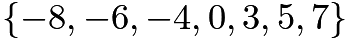
?

---

## Problem 8

Three dice with faces numbered 1 through 6 are stacked as shown. Seven of the eighteen faces are visible, leaving eleven faces hidden (back, bottom, between). The total number of dots NOT visible in this view is
![[asy] draw((0,0)--(2,0)--(3,1)--(3,7)--(1,7)--(0,6)--cycle); draw((3,7)--(2,6)--(0,6)); draw((3,5)--(2,4)--(0,4)); draw((3,3)--(2,2)--(0,2)); draw((2,0)--(2,6));  dot((1,1)); dot((.5,.5)); dot((1.5,.5)); dot((1.5,1.5)); dot((.5,1.5)); dot((2.5,1.5)); dot((.5,2.5)); dot((1.5,2.5)); dot((1.5,3.5)); dot((.5,3.5)); dot((2.25,2.75)); dot((2.5,3)); dot((2.75,3.25)); dot((2.25,3.75)); dot((2.5,4)); dot((2.75,4.25)); dot((.5,5.5)); dot((1.5,4.5)); dot((2.25,4.75)); dot((2.5,5.5)); dot((2.75,6.25)); dot((1.5,6.5)); [/asy]](images/2000/img_cc70565d.png)
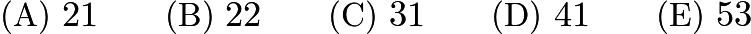

---

## Problem 9

Three-digit powers of

and

are used in this "cross-number" puzzle. What is the only possible digit for the outlined square?
![\[\begin{array}{lcl} \textbf{ACROSS} & & \textbf{DOWN} \\ \textbf{2}.~ 2^m & & \textbf{1}.~ 5^n \end{array}\]](images/2000/img_d423c4a4.png)
![[asy] draw((0,-1)--(1,-1)--(1,2)--(0,2)--cycle); draw((0,1)--(3,1)--(3,0)--(0,0)); draw((3,0)--(2,0)--(2,1)--(3,1)--cycle,linewidth(2));  label("$1$",(0,2),SE); label("$2$",(0,1),SE); [/asy]](images/2000/img_34c781b6.png)

---

## Problem 10

Ara and Shea were once the same height. Since then Shea has grown 20% while Ara has grown half as many inches as Shea. Shea is now 60 inches tall. How tall, in inches, is Ara now?
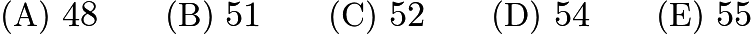

---

## Problem 11

The number
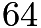
has the property that it is divisible by its units digit. How many whole numbers between 10 and 50 have this property?

---

## Problem 12

A block wall 100 feet long and 7 feet high will be constructed using blocks that are 1 foot high and either 2 feet long or 1 foot long (no blocks may be cut). The vertical joins in the blocks must be staggered as shown, and the wall must be even on the ends. What is the smallest number of blocks needed to build this wall?
![[asy] draw((0,0)--(6,0)--(6,1)--(5,1)--(5,2)--(0,2)--cycle); draw((0,1)--(5,1)); draw((1,1)--(1,2)); draw((3,1)--(3,2)); draw((2,0)--(2,1)); draw((4,0)--(4,1)); [/asy]](images/2000/img_faa6b7dd.png)
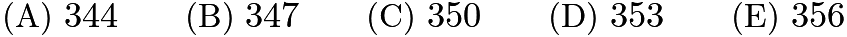

---

## Problem 13

In triangle

, we have
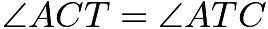
and

. If
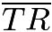
bisects

, then
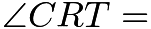
![[asy] pair A,C,T,R; C = (0,0); T = (2,0); A = (1,sqrt(5+sqrt(20))); R = (3/2 - sqrt(5)/2,1.175570); draw(C--A--T--cycle); draw(T--R); label("$A$",A,N); label("$T$",T,SE); label("$C$",C,SW); label("$R$",R,NW); [/asy]](images/2000/img_04d2e363.png)

---

## Problem 14

What is the units digit of

?
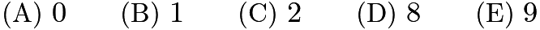

---

## Problem 15

Triangles

,

, and

are all equilateral. Points

and

are midpoints of

and

, respectively. If
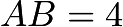
, what is the perimeter of figure

?
![[asy] pair A,B,C,D,EE,F,G; A = (4,0); B = (0,0); C = (2,2*sqrt(3)); D = (3,sqrt(3)); EE = (5,sqrt(3)); F = (5.5,sqrt(3)/2); G = (4.5,sqrt(3)/2); draw(A--B--C--cycle); draw(D--EE--A); draw(EE--F--G);  label("$A$",A,S); label("$B$",B,SW); label("$C$",C,N); label("$D$",D,NE); label("$E$",EE,NE); label("$F$",F,SE); label("$G$",G,SE); [/asy]](images/2000/img_2a8d7095.png)

---

## Problem 16

In order for Mateen to walk a kilometer (1000m) in his rectangular backyard, he must walk the length 25 times or walk its perimeter 10 times. What is the area of Mateen's backyard in square meters?

---

## Problem 17

The operation

is defined for all nonzero numbers by
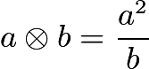
. Determine
![$[(1\otimes 2)\otimes 3] - [1\otimes (2\otimes 3)]$](images/2000/img_e280965c.png)
.
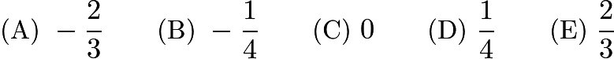

---

## Problem 18

Consider these two geoboard quadrilaterals. Which of the following statements is true?
![[asy] for (int a = 0; a < 5; ++a) { for (int b = 0; b < 5; ++b) { dot((a,b)); } }  draw((0,3)--(0,4)--(1,3)--(1,2)--cycle); draw((2,1)--(4,2)--(3,1)--(3,0)--cycle);  label("I",(0.4,3),E); label("II",(2.9,1),W); [/asy]](images/2000/img_4682867c.png)
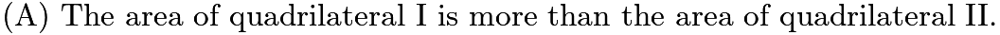
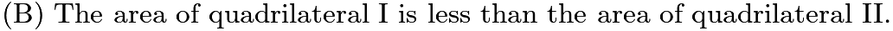

---

## Problem 19

Three circular arcs of radius 5 units bound the region shown. Arcs

and

are quarter-circles, and arc

is a semicircle. What is the area, in square units, of the region?
![[asy] pair A,B,C,D; A = (0,0); B = (-5,5); C = (0,10); D = (5,5);  draw(arc((-5,0),A,B,CCW)); draw(arc((0,5),B,D,CW)); draw(arc((5,0),D,A,CCW));  label("$A$",A,S); label("$B$",B,W); label("$C$",C,N); label("$D$",D,E); [/asy]](images/2000/img_793c8a89.png)
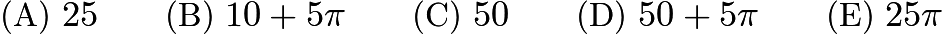

---

## Problem 20

You have nine coins: a collection of pennies, nickels, dimes, and quarters having a total value of $

, with at least one coin of each type. How many dimes must you have?
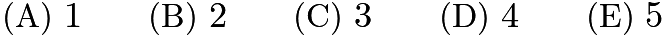

---

## Problem 21

Keiko tosses one penny and Ephraim tosses two pennies. The probability that Ephraim gets the same number of heads that Keiko gets is:
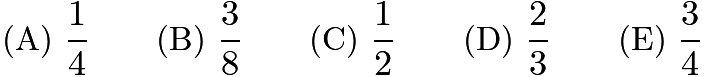

---

## Problem 22

A cube has edge length 2. Suppose that we glue a cube of edge length 1 on top of the big cube so that one of its faces rests entirely on the top face of the larger cube. The percent increase in the surface area (sides, top, and bottom) from the original cube to the new solid formed is closest to
![[asy] draw((0,0)--(2,0)--(3,1)--(3,3)--(2,2)--(0,2)--cycle); draw((2,0)--(2,2)); draw((0,2)--(1,3)); draw((1,7/3)--(1,10/3)--(2,10/3)--(2,7/3)--cycle); draw((2,7/3)--(5/2,17/6)--(5/2,23/6)--(3/2,23/6)--(1,10/3)); draw((2,10/3)--(5/2,23/6)); draw((3,3)--(5/2,3)); [/asy]](images/2000/img_4a27e5a5.png)

---

## Problem 23

There is a list of seven numbers. The average of the first four numbers is 5, and the average of the last four numbers is 8. If the average of all seven numbers is
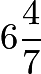
, then the number common to both sets of four numbers is
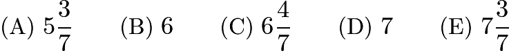

---

## Problem 24

If

and
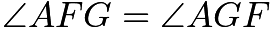
, then
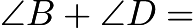
![[asy] pair A,B,C,D,EE,F,G; A = (0,0); B = (9,4); C = (21,0); D = (13,-12); EE = (4,-16); F = (13/2,-6); G = (8,0);  draw(A--C--EE--B--D--cycle);  label("$A$",A,W); label("$B$",B,N); label("$C$",C,E); label("$D$",D,SE); label("$E$",EE,SW); label("$F$",F,WSW); label("$G$",G,NW); [/asy]](images/2000/img_d899ad6f.png)
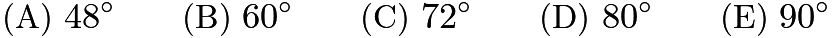

---

## Problem 25

The area of rectangle

is 72. If point

and the midpoints of

and
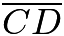
are joined to form a triangle, the area of that triangle is
![[asy] pair A,B,C,D; A = (0,8); B = (9,8); C = (9,0); D = (0,0); draw(A--B--C--D--A--(9,4)--(4.5,0)--cycle);  label("$A$",A,NW); label("$B$",B,NE); label("$C$",C,SE); label("$D$",D,SW); [/asy]](images/2000/img_c96b600e.png)

---

