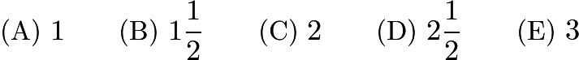
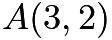
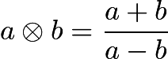
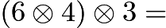
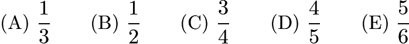
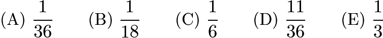

# AMC 8 2001 Problems

## Problem 1

John's shop class is making a golf trophy. He has to paint 300 dimples on a golf ball. If it takes him 2 seconds to paint one dimple, how many minutes will he need to do his job?

---

## Problem 2

I'm thinking of two whole numbers. Their product is 24 and their sum is 11. What is the larger number?

---

## Problem 3

Granny Smith has $63. Elberta has $2 more than Anjou and Anjou has one-third as much as Granny Smith. How many dollars does Elberta have?

---

## Problem 4

The digits 1, 2, 3, 4 and 9 are each used once to form the smallest possible
even
five-digit number. The digit in the tens place is

---

## Problem 5

On a dark and stormy night Snoopy suddenly saw a flash of lightning. Ten seconds later he heard the sound of thunder. The speed of sound is 1088 feet per second and one mile is 5280 feet. Estimate, to the nearest half-mile, how far Snoopy was from the flash of lightning.

---

## Problem 6

Six trees are equally spaced along one side of a straight road. The distance from the first tree to the fourth is 60 feet. What is the distance in feet between the first and last trees?

---

## Problem 7

What is the number of square inches in the area of the small kite?

---

## Problem 8

Genevieve puts bracing on her large kite in the form of cross-connecting opposite corners of the kite. How many inches of bracing material does she need?

---

## Problem 9

The large kite is covered with gold foil. The foil is cut from a rectangular piece that just covers the entire grid. How many square inches of waste material are cut off from the four corners?

---

## Problem 10

A collector offers to buy state quarters for 2000% of their face value. At that rate how much will Bryden get for his four state quarters?

---

## Problem 11

Points

,

,

and

have these coordinates:

,

,

and

. The area of quadrilateral

is
![[asy] for (int i = -4; i <= 4; ++i) { for (int j = -4; j <= 4; ++j) { dot((i,j)); } }  draw((0,-4)--(0,4),linewidth(1)); draw((-4,0)--(4,0),linewidth(1)); for (int i = -4; i <= 4; ++i) { draw((i,-1/3)--(i,1/3),linewidth(0.5)); draw((-1/3,i)--(1/3,i),linewidth(0.5)); } [/asy]](images/2001/img_2b94c958.png)

---

## Problem 12

If

, then

---

## Problem 13

Of the 36 students in Richelle's class, 12 prefer chocolate pie, 8 prefer apple, and 6 prefer blueberry. Half of the remaining students prefer cherry pie and half prefer lemon. For Richelle's pie graph showing this data, how many degrees should she use for cherry pie?

---

## Problem 14

Tyler has entered a buffet line in which he chooses one kind of meat, two different vegetables and one dessert. If the order of food items is not important, how many different meals might he choose?
Meat: beef, chicken, pork
Vegetables: baked beans, corn, potatoes, tomatoes
Dessert: brownies, chocolate cake, chocolate pudding, ice cream

---

## Problem 15

Homer began peeling a pile of 44 potatoes at the rate of 3 potatoes per minute. Four minutes later Christen joined him and peeled at the rate of 5 potatoes per minute. When they finished, how many potatoes had Christen peeled?

---

## Problem 16

A square piece of paper, 4 inches on a side, is folded in half vertically. Both layers are then cut in half parallel to the fold. Three new rectangles are formed, a large one and two small ones. What is the ratio of the perimeter of one of the small rectangles to the perimeter of the large rectangle?
![[asy] draw((0,8)--(0,0)--(4,0)--(4,8)--(0,8)--(3.5,8.5)--(3.5,8)); draw((2,-1)--(2,9),dashed); [/asy]](images/2001/img_a8050240.png)

---

## Problem 17

For the game show
Who Wants To Be A Millionaire?
, the dollar values of each question are shown in the following table (where K = 1000).
![\[\begin{tabular}{rccccccccccccccc} \text{Question} & 1 & 2 & 3 & 4 & 5 & 6 & 7 & 8 & 9 & 10 & 11 & 12 & 13 & 14 & 15 \\ \text{Value} & 100 & 200 & 300 & 500 & 1\text{K} & 2\text{K} & 4\text{K} & 8\text{K} & 16\text{K} & 32\text{K} & 64\text{K} & 125\text{K} & 250\text{K} & 500\text{K} & 1000\text{K} \end{tabular}\]](images/2001/img_d8075b86.png)
Between which two questions is the percent increase of the value the smallest?

---

## Problem 18

Two dice are thrown. What is the probability that the product of the two numbers is a multiple of 5?

---

## Problem 19

Car M traveled at a constant speed for a given time. This is shown by the dashed line. Car N traveled at twice the speed for the same distance. If Car N's speed and time are shown as solid line, which graph illustrates this?
![[asy] unitsize(12);  draw((0,9)--(0,0)--(9,0)); label("time",(4.5,0),S); label("s",(0,7),W); label("p",(0,6),W); label("e",(0,5),W); label("e",(0,4),W); label("d",(0,3),W); label("(A)",(-1,9),NW); draw((0,4)--(4,4),dashed); label("M",(4,4),E); draw((0,8)--(4,8),linewidth(1)); label("N",(4,8),E);  draw((15,9)--(15,0)--(24,0)); label("time",(19.5,0),S); label("s",(15,7),W); label("p",(15,6),W); label("e",(15,5),W); label("e",(15,4),W); label("d",(15,3),W); label("(B)",(14,9),NW); draw((15,4)--(19,4),dashed); label("M",(19,4),E); draw((15,8)--(23,8),linewidth(1)); label("N",(23,8),E);  draw((30,9)--(30,0)--(39,0)); label("time",(34.5,0),S); label("s",(30,7),W); label("p",(30,6),W); label("e",(30,5),W); label("e",(30,4),W); label("d",(30,3),W); label("(C)",(29,9),NW); draw((30,4)--(34,4),dashed); label("M",(34,4),E); draw((30,2)--(34,2),linewidth(1)); label("N",(34,2),E);  draw((0,-6)--(0,-15)--(9,-15)); label("time",(4.5,-15),S); label("s",(0,-8),W); label("p",(0,-9),W); label("e",(0,-10),W); label("e",(0,-11),W); label("d",(0,-12),W); label("(D)",(-1,-6),NW); draw((0,-11)--(4,-11),dashed); label("M",(4,-11),E); draw((0,-7)--(2,-7),linewidth(1)); label("N",(2,-7),E);  draw((15,-6)--(15,-15)--(24,-15)); label("time",(19.5,-15),S); label("s",(15,-8),W); label("p",(15,-9),W); label("e",(15,-10),W); label("e",(15,-11),W); label("d",(15,-12),W); label("(E)",(14,-6),NW); draw((15,-11)--(19,-11),dashed); label("M",(19,-11),E); draw((15,-13)--(23,-13),linewidth(1)); label("N",(23,-13),E); [/asy]](images/2001/img_8c220532.png)

---

## Problem 20

Kaleana shows her test score to Quay, Marty and Shana, but the others keep theirs hidden. Quay thinks, "At least two of us have the same score." Marty thinks, "I didn't get the lowest score." Shana thinks, "I didn't get the highest score." List the scores from lowest to highest for Marty (M), Quay (Q) and Shana (S).

---

## Problem 21

The mean of a set of five different positive integers is 15. The median is 18. The maximum possible value of the largest of these five integers is

---

## Problem 22

On a twenty-question test, each correct answer is worth 5 points, each unanswered question is worth 1 point and each incorrect answer is worth 0 points. Which of the following scores is
NOT
possible?

---

## Problem 23

Points

,

and

are vertices of an equilateral triangle, and points

,

and

are midpoints of its sides. How many noncongruent triangles can be
drawn using any three of these six points as vertices?
![[asy] pair SS,R,T,X,Y,Z; SS = (2,2*sqrt(3)); R = (0,0); T = (4,0); X = (2,0); Y = (1,sqrt(3)); Z = (3,sqrt(3)); dot(SS); dot(R); dot(T); dot(X); dot(Y); dot(Z); label("$S$",SS,N); label("$R$",R,SW); label("$T$",T,SE); label("$X$",X,S); label("$Y$",Y,NW); label("$Z$",Z,NE); [/asy]](images/2001/img_11b98a19.png)

---

## Problem 24

Each half of this figure is composed of 3 red triangles, 5 blue triangles and 8 white triangles. When the upper half is folded down over the centerline, 2 pairs of red triangles coincide, as do 3 pairs of blue triangles. There are 2 red-white pairs. How many white pairs coincide?
![[asy] draw((0,0)--(4,4*sqrt(3))); draw((1,-sqrt(3))--(5,3*sqrt(3))); draw((2,-2*sqrt(3))--(6,2*sqrt(3))); draw((3,-3*sqrt(3))--(7,sqrt(3))); draw((4,-4*sqrt(3))--(8,0)); draw((8,0)--(4,4*sqrt(3))); draw((7,-sqrt(3))--(3,3*sqrt(3))); draw((6,-2*sqrt(3))--(2,2*sqrt(3))); draw((5,-3*sqrt(3))--(1,sqrt(3))); draw((4,-4*sqrt(3))--(0,0)); draw((3,3*sqrt(3))--(5,3*sqrt(3))); draw((2,2*sqrt(3))--(6,2*sqrt(3))); draw((1,sqrt(3))--(7,sqrt(3))); draw((-1,0)--(9,0)); draw((1,-sqrt(3))--(7,-sqrt(3))); draw((2,-2*sqrt(3))--(6,-2*sqrt(3))); draw((3,-3*sqrt(3))--(5,-3*sqrt(3))); [/asy]](images/2001/img_45a50484.png)

---

## Problem 25

There are 24 four-digit whole numbers that use each of the four digits 2, 4, 5 and 7 exactly once. Only one of these four-digit numbers is a multiple of another one. Which of the following is it?

---

