# AMC 8 2002 Problems

## Problem 1

A
circle
and two distinct
lines
are drawn on a sheet of paper. What is the largest possible number of points of intersection of these figures?
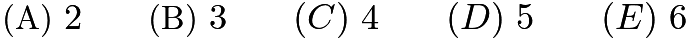

---

## Problem 2

How many different combinations of $5 bills and $2 bills can be used to make a total of $17? Order does not matter in this problem.

---

## Problem 3

What is the smallest possible average of four distinct positive even integers?
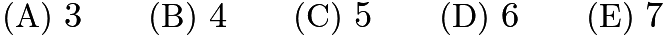

---

## Problem 4

The year 2002 is a palindrome (a number that reads the same from left to right as it does from right to left). What is the product of the digits of the next year after 2002 that is a palindrome?
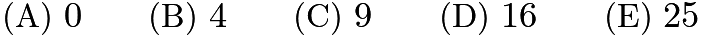

---

## Problem 5

Carlos Montado was born on Saturday, November 9, 2002. On what day of the week will Carlos be 706 days old?

---

## Problem 6

A birdbath is designed to overflow so that it will be self-cleaning. Water flows in at the rate of 20 milliliters per minute and drains at the rate of 18 milliliters per minute. One of these graphs shows the volume of water in the birdbath during the filling time and continuing into the overflow time. Which one is it?
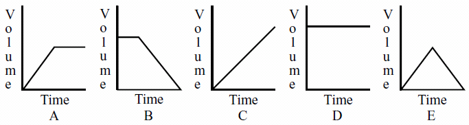

---

## Problem 7

The students in Mrs. Sawyer's class were asked to do a taste test of five kinds of candy. Each student chose one kind of candy. A bar graph of their preferences is shown. What percent of her class chose candy E?
![[asy] real[] r={6, 8, 4, 2, 5}; int i; for(i=0; i<5; i=i+1) { filldraw((4i,0)--(4i+3,0)--(4i+3,2r[i])--(4i,2r[i])--cycle, black, black); } draw(origin--(19,0)--(19,16)--(0,16)--cycle, linewidth(0.9)); for(i=1; i<8; i=i+1) { draw((0,2i)--(19,2i)); } label("$0$", (0,2*0), W); label("$1$", (0,2*1), W); label("$2$", (0,2*2), W); label("$3$", (0,2*3), W); label("$4$", (0,2*4), W); label("$5$", (0,2*5), W); label("$6$", (0,2*6), W); label("$7$", (0,2*7), W); label("$8$", (0,2*8), W); label("$A$", (0*4+1.5, 0), S); label("$B$", (1*4+1.5, 0), S); label("$C$", (2*4+1.5, 0), S); label("$D$", (3*4+1.5, 0), S); label("$E$", (4*4+1.5, 0), S); label("SWEET TOOTH", (9.5,18), N); label("Kinds of candy", (9.5,-2), S); label(rotate(90)*"Number of students", (-2,8), W);[/asy]](images/2002/img_43bdd690.png)

---

## Problem 8

How many of his European stamps were issued in the '80s?

---

## Problem 9

His South American stamps issued before the ‘70s cost him

---

## Problem 10

The average price of his '70s stamps is closest to

---

## Problem 11

A sequence of squares is made of identical square tiles. The edge of each square is one tile length longer than the edge of the previous square. The first three squares are shown. How many more tiles does the seventh square require than the sixth?
![[asy] path p=origin--(1,0)--(1,1)--(0,1)--cycle; draw(p); draw(shift(3,0)*p); draw(shift(3,1)*p); draw(shift(4,0)*p); draw(shift(4,1)*p); draw(shift(7,0)*p); draw(shift(7,1)*p); draw(shift(7,2)*p); draw(shift(8,0)*p); draw(shift(8,1)*p); draw(shift(8,2)*p); draw(shift(9,0)*p); draw(shift(9,1)*p); draw(shift(9,2)*p);[/asy]](images/2002/img_7638bff6.png)

---

## Problem 12

A board game spinner is divided into three regions labeled

,

and

. The probability of the arrow stopping on region

is

and on region

is

. The probability of the arrow stopping on region

is
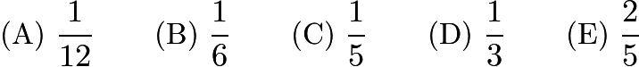

---

## Problem 13

For his birthday, Bert gets a box that holds 125 jellybeans when filled to capacity. A few weeks later, Carrie gets a larger box full of jellybeans. Her box is twice as high, twice as wide and twice as long as Bert's. Approximately, how many jellybeans did Carrie get?

---

## Problem 14

A merchant offers a large group of items at 30% off. Later, the merchant takes 20% off these sale prices. The total discount is

---

## Problem 15

Which of the following polygons has the largest area?
![[asy] size(330); int i,j,k; for(i=0;i<5; i=i+1) { for(j=0;j<5;j=j+1) { for(k=0;k<5;k=k+1) { dot((6i+j, k)); }}} draw((0,0)--(4,0)--(3,1)--(3,3)--(2,3)--(2,1)--(1,1)--cycle); draw(shift(6,0)*((0,0)--(4,0)--(4,1)--(3,1)--(3,2)--(2,1)--(1,1)--(0,2)--cycle)); draw(shift(12,0)*((0,1)--(1,0)--(3,2)--(3,3)--(1,1)--(1,3)--(0,4)--cycle)); draw(shift(18,0)*((0,1)--(2,1)--(3,0)--(3,3)--(2,2)--(1,3)--(1,2)--(0,2)--cycle)); draw(shift(24,0)*((1,0)--(2,1)--(2,3)--(3,2)--(3,4)--(0,4)--(1,3)--cycle)); label("$A$", (0*6+2, 0), S); label("$B$", (1*6+2, 0), S); label("$C$", (2*6+2, 0), S); label("$D$", (3*6+2, 0), S); label("$E$", (4*6+2, 0), S);[/asy]](images/2002/img_5bfc6b88.png)

---

## Problem 16

Right isosceles triangles are constructed on the sides of a 3-4-5 right triangle, as shown. A capital letter represents the area of each triangle. Which one of the following is true?
![[asy]/* AMC8 2002 #16 Problem */ draw((0,0)--(4,0)--(4,3)--cycle); draw((4,3)--(-4,4)--(0,0)); draw((-0.15,0.1)--(0,0.25)--(.15,0.1)); draw((0,0)--(4,-4)--(4,0)); draw((4,0.2)--(3.8,0.2)--(3.8,-0.2)--(4,-0.2)); draw((4,0)--(7,3)--(4,3)); draw((4,2.8)--(4.2,2.8)--(4.2,3)); label(scale(0.8)*"$Z$", (0, 3), S); label(scale(0.8)*"$Y$", (3,-2)); label(scale(0.8)*"$X$", (5.5, 2.5)); label(scale(0.8)*"$W$", (2.6,1)); label(scale(0.65)*"5", (2,2)); label(scale(0.65)*"4", (2.3,-0.4)); label(scale(0.65)*"3", (4.3,1.5));[/asy]](images/2002/img_78dff886.png)
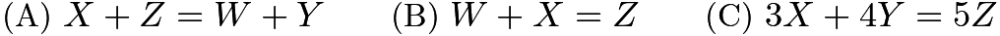
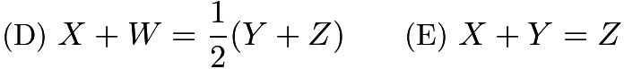

---

## Problem 17

In a mathematics contest with ten problems, a student gains 5 points for a correct answer and loses 2 points for an incorrect answer. If Olivia answered every problem and her score was 29, how many correct answers did she have?

---

## Problem 18

Vincent skated 1 hr 15 min each day for 5 days and 1 hr 30 min each day for 3 days. How long would he have to skate the ninth day in order to average 85 minutes of skating each day for the entire time?

---

## Problem 19

How many whole numbers between 99 and 999 contain exactly one 0?

---

## Problem 20

The area of triangle

is 8 square inches. Points

and

are midpoints of congruent segments

and

. Altitude

bisects
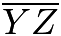
. The area (in square inches) of the shaded region is
![[asy]/* AMC8 2002 #20 Problem */ fill((0,0)--(2.5,2)--(5,2)--(5,0)--cycle, mediumgrey); draw((0,0)--(10,0)--(5,4)--cycle); draw((2.5,2)--(7.5,2)); draw((5,4)--(5,0)); label(scale(0.8)*"$X$", (5,4), N); label(scale(0.8)*"$Y$", (0,0), W); label(scale(0.8)*"$Z$", (10,0), E); label(scale(0.8)*"$A$", (2.5,2.2), W); label(scale(0.8)*"$B$", (7.5,2.2), E); label(scale(0.8)*"$C$", (5,0), S); fill((0,-.8)--(1,-.8)--(1,-.95)--cycle, white);[/asy]](images/2002/img_c63de8c6.png)
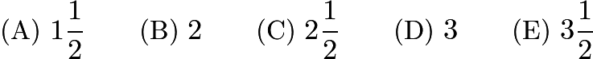

---

## Problem 21

Harold tosses a nickel four times. The probability that he gets at least as many heads as tails is
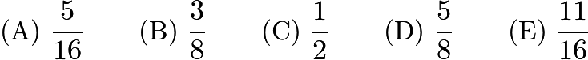

---

## Problem 22

Six cubes, each an inch on an edge, are fastened together, as shown. Find the total surface area in square inches. Include the top, bottom and sides.
![[asy]/* AMC8 2002 #22 Problem */ draw((0,0)--(0,1)--(1,1)--(1,0)--cycle); draw((0,1)--(0.5,1.5)--(1.5,1.5)--(1,1)); draw((1,0)--(1.5,0.5)--(1.5,1.5)); draw((0.5,1.5)--(1,2)--(1.5,2)); draw((1.5,1.5)--(1.5,3.5)--(2,4)--(3,4)--(2.5,3.5)--(2.5,0.5)--(1.5,.5)); draw((1.5,3.5)--(2.5,3.5)); draw((1.5,1.5)--(3.5,1.5)--(3.5,2.5)--(1.5,2.5)); draw((3,4)--(3,3)--(2.5,2.5)); draw((3,3)--(4,3)--(4,2)--(3.5,1.5)); draw((4,3)--(3.5,2.5)); draw((2.5,.5)--(3,1)--(3,1.5));[/asy]](images/2002/img_b894b5d1.png)

---

## Problem 23

A corner of a tiled floor is shown. If the entire floor is tiled in this way and each of the four corners looks like this one, then what fraction of the tiled floor is made of
darker tiles?
![[asy]/* AMC8 2002 #23 Problem */ fill((0,2)--(1,3)--(2,3)--(2,4)--(3,5)--(4,4)--(4,3)--(5,3)--(6,2)--(5,1)--(4,1)--(4,0)--(2,0)--(2,1)--(1,1)--cycle, mediumgrey); fill((7,1)--(6,2)--(7,3)--(8,3)--(8,4)--(9,5)--(10,4)--(7,0)--cycle, mediumgrey); fill((3,5)--(2,6)--(2,7)--(1,7)--(0,8)--(1,9)--(2,9)--(2,10)--(3,11)--(4,10)--(4,9)--(5,9)--(6,8)--(5,7)--(4,7)--(4,6)--cycle, mediumgrey); fill((6,8)--(7,9)--(8,9)--(8,10)--(9,11)--(10,10)--(10,9)--(11,9)--(11,7)--(10,7)--(10,6)--(9,5)--(8,6)--(8,7)--(7,7)--cycle, mediumgrey);  draw((0,0)--(0,11)--(11,11)); for ( int x = 1; x &lt; 11; ++x ) {     draw((x,11)--(x,0), linetype("4 4")); }  for ( int y = 1; y &lt; 11; ++y ) {     draw((0,y)--(11,y), linetype("4 4")); } clip((0,0)--(0,11)--(11,11)--(11,5)--(4,1)--cycle);[/asy]](images/2002/img_bc97869c.png)
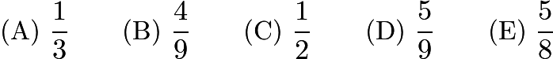

---

## Problem 24

Miki has a dozen oranges of the same size and a dozen pears of the same size. Miki uses her juicer to extract 8 ounces of pear juice from 3 pears and 8 ounces of orange juice from 2 oranges. She makes a pear-orange juice blend from an equal number of pears and oranges. What percent of the blend is pear juice?

---

## Problem 25

Loki, Moe, Nick and Ott are good friends. Ott had no money, but the others did. Moe gave Ott one-fifth of his money, Loki gave Ott one-fourth of his money and Nick gave Ott one-third of his money. Each gave Ott the same amount of money. What fractional part of the group's money does Ott now have?
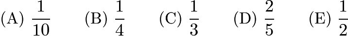

---

