# AMC 8 2003 Problems

## Problem 1

Jamie counted the number of edges of a cube, Jimmy counted the numbers of corners, and Judy counted the number of faces. They then added the three numbers. What was the resulting sum?

---

## Problem 2

Which of the following numbers has the smallest prime factor?
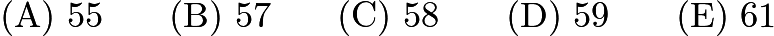

---

## Problem 3

A burger at Ricky C's weighs 120 grams, of which 30 grams are filler. What percent of the burger is not filler?
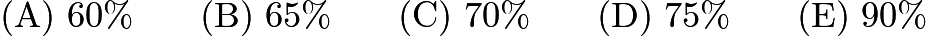

---

## Problem 4

A group of children riding on bicycles and tricycles rode past Billy Bob's house. Billy Bob counted 7 children and 19 wheels. How many tricycles were there?

---

## Problem 5

If 20% of a number is 12, what is 30% of the same number?

---

## Problem 6

Given the areas of the three squares in the figure, what is the area of the interior triangle?
![[asy] draw((0,0)--(-5,12)--(7,17)--(12,5)--(17,5)--(17,0)--(12,0)--(12,-12)--(0,-12)--(0,0)--(12,5)--(12,0)--cycle,linewidth(1)); label("$25$",(14.5,1),N); label("$144$",(6,-7.5),N); label("$169$",(3.5,7),N); [/asy]](images/2003/img_3732bce1.png)

---

## Problem 7

Blake and Jenny each took four 100-point tests. Blake averaged 78 on the four tests. Jenny scored 10 points higher than Blake on the first test, 10 points lower than him on the second test, and 20 points higher on both the third and fourth tests. What is the difference between Jenny's average and Blake's average on these four tests?

---

## Problem 8

(Problems 8, 9, and 10 use the data found in the accompanying paragraph and figures)
Four friends, Art, Roger, Paul and Trisha, bake cookies, and all cookies have the same thickness. The shapes of the cookies differ, as shown.

Art's cookies are trapezoids.
![[asy] size(80);defaultpen(linewidth(0.8));defaultpen(fontsize(8)); draw(origin--(5,0)--(5,3)--(2,3)--cycle); draw(rightanglemark((5,3), (5,0), origin)); label("5 in", (2.5,0), S); label("3 in", (5,1.5), E); label("3 in", (3.5,3), N); [/asy]](images/2003/img_2ae071d7.png)

Roger's cookies are rectangles.
![[asy] size(80);defaultpen(linewidth(0.8));defaultpen(fontsize(8)); draw(origin--(4,0)--(4,2)--(0,2)--cycle); draw(rightanglemark((4,2), (4,0), origin)); draw(rightanglemark((0,2), origin, (4,0))); label("4 in", (2,0), S); label("2 in", (4,1), E); [/asy]](images/2003/img_f96bdb96.png)

Paul's cookies are parallelograms.
![[asy] size(80);defaultpen(linewidth(0.8));defaultpen(fontsize(8)); draw(origin--(3,0)--(2.5,2)--(-0.5,2)--cycle); draw((2.5,2)--(2.5,0), dashed); draw(rightanglemark((2.5,2),(2.5,0), origin)); label("3 in", (1.5,0), S); label("2 in", (2.5,1), W); [/asy]](images/2003/img_824e41ca.png)

Trisha's cookies are triangles.
![[asy] size(80);defaultpen(linewidth(0.8));defaultpen(fontsize(8)); draw(origin--(3,0)--(3,4)--cycle); draw(rightanglemark((3,4),(3,0), origin)); label("3 in", (1.5,0), S); label("4 in", (3,2), E); [/asy]](images/2003/img_a2db2fa6.png)
Each friend uses the same amount of dough, and Art makes exactly 12 cookies. Who gets the fewest cookies from one batch of cookie dough?

---

## Problem 9

Each friend uses the same amount of dough, and Art makes exactly

cookies. Art's cookies sell for

cents each. To earn the same amount from a single batch, how much should one of Roger's cookies cost in cents?

---

## Problem 10

How many cookies will be in one batch of Trisha's cookies?

---

## Problem 11

Business is a little slow at Lou's Fine Shoes, so Lou decides to have a sale. On Friday, Lou increases all of Thursday's prices by 10%. Over the weekend, Lou advertises the sale: "Ten percent off the listed price. Sale starts Monday." How much does a pair of shoes cost on Monday that cost 40 dollars on Thursday?

---

## Problem 12

When a fair six-sided die is tossed on a table top, the bottom face cannot be seen. What is the probability that the product of the numbers on the five faces that can be seen is divisible by 6?
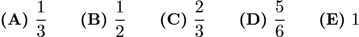

---

## Problem 13

Fourteen white cubes are put together to form the figure below. The complete surface of the figure, including the bottom, is painted red. The figure is then separated into individual cubes. How many of the individual cubes have exactly four red faces?
![[asy] import three; defaultpen(linewidth(0.8)); real r=0.5; currentprojection=orthographic(3/4,8/15,7/15); draw(unitcube, white, thick(), nolight); draw(shift(1,0,0)*unitcube, white, thick(), nolight); draw(shift(2,0,0)*unitcube, white, thick(), nolight); draw(shift(0,0,1)*unitcube, white, thick(), nolight); draw(shift(2,0,1)*unitcube, white, thick(), nolight); draw(shift(0,1,0)*unitcube, white, thick(), nolight); draw(shift(2,1,0)*unitcube, white, thick(), nolight); draw(shift(0,2,0)*unitcube, white, thick(), nolight); draw(shift(2,2,0)*unitcube, white, thick(), nolight); draw(shift(0,3,0)*unitcube, white, thick(), nolight); draw(shift(0,3,1)*unitcube, white, thick(), nolight); draw(shift(1,3,0)*unitcube, white, thick(), nolight); draw(shift(2,3,0)*unitcube, white, thick(), nolight); draw(shift(2,3,1)*unitcube, white, thick(), nolight);[/asy]](images/2003/img_9a145dcc.png)

---

## Problem 14

In this addition problem, each letter stands for a different digit.
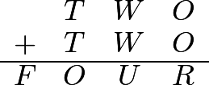
If
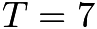
and the letter

represents an even number, what is the only possible value for
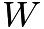
?

---

## Problem 15

A figure is constructed from unit cubes. Each cube shares at least one face with another cube. What is the minimum number of cubes needed to build a figure with the front and side views shown?
![[asy] defaultpen(linewidth(0.8)); path p=unitsquare; draw(p^^shift(0,1)*p^^shift(1,0)*p); draw(shift(4,0)*p^^shift(5,0)*p^^shift(5,1)*p); label("FRONT", (1,0), S); label("SIDE", (5,0), S);[/asy]](images/2003/img_dbe6d65c.png)

---

## Problem 16

Ali, Bonnie, Carlo, and Dianna are going to drive together to a nearby theme park. The car they are using has 4 seats: 1 driver's seat, 1 front passenger seat, and 2 back passenger seats. Bonnie and Carlo are the only ones who know how to drive the car. How many possible seating arrangements are there?

---

## Problem 17

The six children listed below are from two families of three siblings each. Each child has blue or brown eyes and black or blond hair. Children from the same family have at least one of these characteristics in common. Which two children are Jim's siblings?
![\[\begin{array}{c|c|c}\text{Child}&\text{Eye Color}&\text{Hair Color}\\ \hline\text{Benjamin}&\text{Blue}&\text{Black}\\ \hline\text{Jim}&\text{Brown}&\text{Blonde}\\ \hline\text{Nadeen}&\text{Brown}&\text{Black}\\ \hline\text{Austin}&\text{Blue}&\text{Blonde}\\ \hline\text{Tevyn}&\text{Blue}&\text{Black}\\ \hline\text{Sue}&\text{Blue}&\text{Blonde}\\ \hline\end{array}\]](images/2003/img_e7900ccc.png)

---

## Problem 18

Each of the twenty dots on the graph below represents one of Sarah's classmates.  Classmates who are friends are connected with a line segment.  For her birthday party, Sarah is inviting only the following:  all of her friends and all of those classmates who are friends with at least one of her friends.  How many classmates will not be invited to Sarah's party?
![[asy]/* AMC8 2003 #18 Problem */ pair a=(102,256), b=(68,131), c=(162,101), d=(134,150); pair e=(269,105), f=(359,104), g=(303,12), h=(579,211); pair i=(534, 342), j=(442,432), k=(374,484), l=(278,501); pair m=(282,411), n=(147,451), o=(103,437), p=(31,373); pair q=(419,175), r=(462,209), s=(477,288), t=(443,358); pair oval=(282,303); draw(l--m--n--cycle); draw(p--oval); draw(o--oval); draw(b--d--oval); draw(c--d--e--oval); draw(e--f--g--h--i--j--oval); draw(k--oval); draw(q--oval); draw(s--oval); draw(r--s--t--oval); dot(a); dot(b); dot(c); dot(d); dot(e); dot(f); dot(g); dot(h); dot(i); dot(j); dot(k); dot(l); dot(m); dot(n); dot(o); dot(p); dot(q); dot(r); dot(s); dot(t); filldraw(yscale(.5)*Circle((282,606),80),white,black); label(scale(0.75)*"Sarah", oval);[/asy]](images/2003/img_239e86ba.png)

---

## Problem 19

How many integers between 1000 and 2000 have all three of the numbers 15, 20, and 25 as factors?
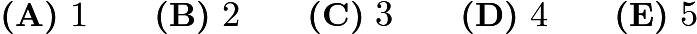

---

## Problem 20

What is the measure of the acute angle formed by the hands of the clock at 4:20 PM?

---

## Problem 21

The area of trapezoid

is
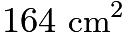
.  The altitude is 8 cm,

is 10 cm, and

is 17 cm.  What is

, in centimeters?
![[asy]/* AMC8 2003 #21 Problem */ size(4inch,2inch); draw((0,0)--(31,0)--(16,8)--(6,8)--cycle); draw((11,8)--(11,0), linetype("8 4")); draw((11,1)--(12,1)--(12,0)); label("$A$", (0,0), SW); label("$D$", (31,0), SE); label("$B$", (6,8), NW); label("$C$", (16,8), NE); label("10", (3,5), W); label("8", (11,4), E); label("17", (22.5,5), E);[/asy]](images/2003/img_251d874a.png)

---

## Problem 22

The following figures are composed of squares and circles. Which figure has a shaded region with largest area?
![[asy]/* AMC8 2003 #22 Problem */ size(3inch, 2inch); unitsize(1cm); pen outline = black+linewidth(1); filldraw((0,0)--(2,0)--(2,2)--(0,2)--cycle, mediumgrey, outline); filldraw(shift(3,0)*((0,0)--(2,0)--(2,2)--(0,2)--cycle), mediumgrey, outline); filldraw(Circle((7,1), 1), mediumgrey, black+linewidth(1)); filldraw(Circle((1,1), 1), white, outline); filldraw(Circle((3.5,.5), .5), white, outline); filldraw(Circle((4.5,.5), .5), white, outline); filldraw(Circle((3.5,1.5), .5), white, outline); filldraw(Circle((4.5,1.5), .5), white, outline); filldraw((6.3,.3)--(7.7,.3)--(7.7,1.7)--(6.3,1.7)--cycle, white, outline); label("A", (1, 2), N); label("B", (4, 2), N); label("C", (7, 2), N); draw((0,-.5)--(.5,-.5), BeginArrow); draw((1.5, -.5)--(2, -.5), EndArrow); label("2 cm", (1, -.5));  draw((3,-.5)--(3.5,-.5), BeginArrow); draw((4.5, -.5)--(5, -.5), EndArrow); label("2 cm", (4, -.5));  draw((6,-.5)--(6.5,-.5), BeginArrow); draw((7.5, -.5)--(8, -.5), EndArrow); label("2 cm", (7, -.5));  draw((6,1)--(6,-.5), linetype("4 4")); draw((8,1)--(8,-.5), linetype("4 4"));[/asy]](images/2003/img_150190d5.png)

---

## Problem 23

In the pattern below, the cat moves clockwise through the four squares  and the mouse moves counterclockwise through the eight exterior segments of the four squares.
If the pattern is continued, where would the cat and mouse be after the 247th move?

---

## Problem 24

A ship travels from point

to point

along a semicircular path, centered at Island

. Then it travels along a straight path from

to

. Which of these graphs best shows the ship's distance from Island

as it moves along its course?
![[asy]size(150); pair X=origin, A=(-5,0), B=(5,0), C=(0,5); draw(Arc(X, 5, 180, 360)^^B--C); dot(X); label("$X$", X, NE); label("$C$", C, N); label("$B$", B, E); label("$A$", A, W); [/asy]](images/2003/img_f0791400.png)

---

## Problem 25

In the figure, the area of square
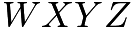
is
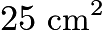
. The four smaller squares have sides 1 cm long, either parallel to or coinciding with the sides of the large square. In

,

, and when

is folded over side

, point

coincides with

, the center of square

. What is the area of

, in square centimeters?
![[asy] defaultpen(fontsize(8)); size(225); pair Z=origin, W=(0,10), X=(10,10), Y=(10,0), O=(5,5), B=(-4,8), C=(-4,2), A=(-13,5); draw((-4,0)--Y--X--(-4,10)--cycle); draw((0,-2)--(0,12)--(-2,12)--(-2,8)--B--A--C--(-2,2)--(-2,-2)--cycle); dot(O); label("$A$", A, NW); label("$O$", O, NE); label("$B$", B, SW); label("$C$", C, NW); label("$W$",W , NE); label("$X$", X, N); label("$Y$", Y, S); label("$Z$", Z, SE); [/asy]](images/2003/img_e9e550c6.png)
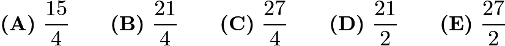

---

