# AMC 8 2004 Problems

## Problem 1

On a map, a

-centimeter length represents
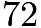
kilometers. How many kilometers does a

-centimeter length represent?

---

## Problem 2

How many different four-digit numbers can be formed by rearranging the four digits in

?

---

## Problem 3

Twelve friends met for dinner at Oscar's Overstuffed Oyster House, and each ordered one meal. The portions were so large, there was enough food for

people. If they shared, how many meals should they have ordered to have just enough food for the

of them?

---

## Problem 4

Ms. Hamilton’s eighth-grade class wants to participate in the annual three-person-team basketball tournament. Lance, Sally, Joy, and Fred are chosen for the team. In how many ways can the three starters be chosen?

---

## Problem 5

Ms. Hamilton's eighth-grade class wants to participate in the annual three-person-team basketball tournament. The losing team of each game is eliminated from the tournament. If sixteen teams compete, how many games will be played to determine the winner?

---

## Problem 6

After Sally takes

shots, she has made
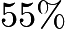
of her shots. After she takes

more shots, she raises her percentage to

. How many of the last

shots did she make?

---

## Problem 7

An athlete's target heart rate, in beats per minute, is

of the theoretical maximum heart rate. The maximum heart rate is found by subtracting the athlete's age, in years, from

. To the nearest whole number, what is the target heart rate of an athlete who is

years old?

---

## Problem 8

Find the number of two-digit positive integers whose digits total

.

---

## Problem 9

The average of the five numbers in a list is
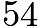
. The average of the first two
numbers is

. What is the average of the last three numbers?

---

## Problem 10

Handy Aaron helped a neighbor
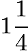
hours on Monday,

minutes on Tuesday, from 8:20 to 10:45 on Wednesday morning, and a half-hour on Friday. He is paid

per hour. How much did he earn for the week?

---

## Problem 11

The numbers
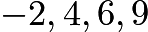
and

are rearranged according to these rules:
What is the average of the first and last numbers?

---

## Problem 12

Niki usually leaves her cell phone on. If her cell phone is on but
she is not actually using it, the battery will last for

hours. If
she is using it constantly, the battery will last for only

hours.
Since the last recharge, her phone has been on

hours, and during
that time she has used it for

minutes. If she doesn’t talk any
more but leaves the phone on, how many more hours will the battery last?

---

## Problem 13

Amy, Bill and Celine are friends with different ages. Exactly one of the following statements is true.
Rank the friends from the oldest to the youngest.
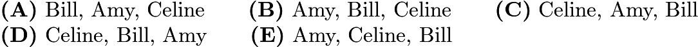

---

## Problem 14

What is the area enclosed by the geoboard quadrilateral below?
![[asy] unitsize(3mm); defaultpen(linewidth(.8pt)); dotfactor=2;  for(int a=0; a<=10; ++a) for(int b=0; b<=10; ++b)  {   dot((a,b));  };  draw((4,0)--(0,5)--(3,4)--(10,10)--cycle); [/asy]](images/2004/img_b4ab034c.png)
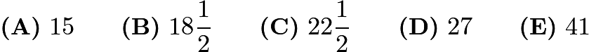

---

## Problem 15

Thirteen black and six white hexagonal tiles were used to create the figure below. If a new figure is created by attaching a border of white tiles with the same size and shape as the others, what will be the difference between the total number of white tiles and the total number of black tiles in the new figure?

---

## Problem 16

Two

mL pitchers contain orange juice. One pitcher is
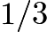
full and the other pitcher is
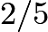
full. Water is added to fill each pitcher completely, then both pitchers are poured into one large container. What fraction of the mixture in the large container is orange juice?
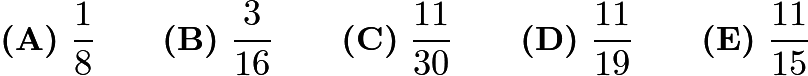

---

## Problem 17

Three friends have a total of

identical pencils, and each one has at least one pencil. In how many ways can this happen?

---

## Problem 18

Five friends compete in a dart-throwing contest. Each one has two darts to throw at the same circular target, and each individual's score is the sum of the scores in the target regions that are hit. The scores for the target regions are the whole numbers

through

. Each throw hits the target in a region with a different value. The scores are: Alice

points, Ben

points, Cindy

points, Dave

points, and Ellen

points. Who hits the region worth

points?

---

## Problem 19

A whole number larger than

leaves a remainder of

when divided by each of the numbers
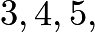
and

. The smallest such number lies between which two numbers?

---

## Problem 20

Two-thirds of the people in a room are seated in three-fourths of the chairs. The rest of the people are standing. If there are

empty chairs, how many people are in the room?

---

## Problem 21

Spinners

and

are spun. On each spinner, the arrow is equally likely to land on each number. What is the probability that the product of the two spinners' numbers is even?
![[asy] pair A=(0,0); pair B=(3,0); draw(Circle(A,1)); draw(Circle(B,1));  draw((-1,0)--(1,0)); draw((0,1)--(0,-1)); draw((3,0)--(3,1)); draw((3+sqrt(3)/2,-.5)--(3,0)); draw((3,0)--(3-sqrt(3)/2,-.5));   label("$A$",(-1,1)); label("$B$",(2,1));  label("$1$",(-.4,.4)); label("$2$",(.4,.4)); label("$3$",(.4,-.4)); label("$4$",(-.4,-.4)); label("$1$",(2.6,.4)); label("$2$",(3.4,.4)); label("$3$",(3,-.5));  [/asy]](images/2004/img_cea1aa27.png)

---

## Problem 22

At a party there are only single women and married men with their wives. The probability that a randomly selected woman is single is

. What fraction of the people in the room are married men?
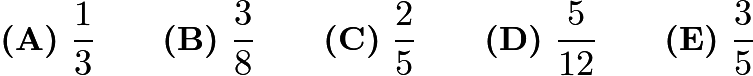

---

## Problem 23

Tess runs counterclockwise around rectangular block

. She lives at corner

. Which graph could represent her straight-line distance from home?
![[asy] unitsize(5mm); pair J=(-3,2); pair K=(-3,-2); pair L=(3,-2); pair M=(3,2);  draw(J--K--L--M--cycle); label("$J$",J,NW); label("$K$",K,SW); label("$L$",L,SE); label("$M$",M,NE); [/asy]](images/2004/img_3d997135.png)
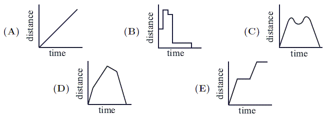

---

## Problem 24

In the figure,

is a rectangle and

is a parallelogram. Using the measurements given in the figure, what is the length

of the segment that is perpendicular to
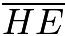
and

?
![[asy] unitsize(3mm); defaultpen(linewidth(.8pt)+fontsize(10pt));  pair D=(0,0), C=(10,0), B=(10,8), A=(0,8); pair E=(4,8), F=(10,3), G=(6,0), H=(0,5);  draw(A--B--C--D--cycle); draw(E--F--G--H--cycle);  label("$A$",A,NW); label("$B$",B,NE); label("$C$",C,SE); label("$D$",D,SW);  label("$E$",E,N); label("$F$",(10.8,3)); label("$G$",G,S); label("$H$",H,W);  label("$4$",A--E,N); label("$6$",B--E,N); label("$5$",(10.8,5.5)); label("$3$",(10.8,1.5)); label("$4$",G--C,S); label("$6$",G--D,S); label("$5$",D--H,W); label("$3$",A--H,W);  draw((3,7.25)--(7.56,1.17)); label("$d$",(3,7.25)--(7.56,1.17), NE);  [/asy]](images/2004/img_55a50bd3.png)

---

## Problem 25

Two

squares intersect at right angles, bisecting their intersecting sides, as shown. The circle's diameter is the segment between the two points of intersection. What is the area of the shaded region created by removing the circle from the squares?
![[asy] unitsize(6mm); draw(unitcircle); filldraw((0,1)--(1,2)--(3,0)--(1,-2)--(0,-1)--(-1,-2)--(-3,0)--(-1,2)--cycle,lightgray,black); filldraw(unitcircle,white,black); [/asy]](images/2004/img_e7fcd3af.png)
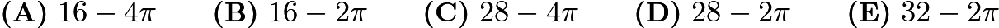

---

