# AMC 8 2005 Problems

## Problem 1

Connie multiplies a number by 2 and gets 60 as her answer. However, she should
have divided the number by 2 to get the correct answer. What is the correct
answer?

---

## Problem 2

Karl bought five folders from Pay-A-Lot at a cost of

each.
Pay-A-Lot had a 20%-off sale the following day. How much could
Karl have saved on the purchase by waiting a day?

---

## Problem 3

What is the minimum number of small squares that must be colored black so that a line of symmetry lies on the diagonal
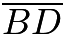
of square

?
![[asy]defaultpen(linewidth(1)); for ( int x = 0; x < 5; ++x ) {     draw((0,x)--(4,x));     draw((x,0)--(x,4)); }  fill((1,0)--(2,0)--(2,1)--(1,1)--cycle); fill((0,3)--(1,3)--(1,4)--(0,4)--cycle); fill((2,3)--(4,3)--(4,4)--(2,4)--cycle); fill((3,1)--(4,1)--(4,2)--(3,2)--cycle); label("$A$", (0, 4), NW); label("$B$", (4, 4), NE); label("$C$", (4, 0), SE); label("$D$", (0, 0), SW);[/asy]](images/2005/img_9f2de554.png)

---

## Problem 4

A square and a triangle have equal perimeters. The lengths of the three sides of the triangle are 6.1 cm, 8.2 cm and 9.7 cm. What is the area of the square in square centimeters?
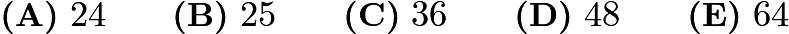

---

## Problem 5

Soda is sold in packs of 6, 12 and 24 cans. What is the minimum number of packs needed to buy exactly 90 cans of soda?
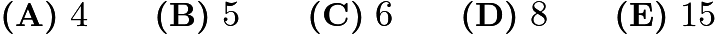

---

## Problem 6

Suppose

is a digit. For how many values of

is
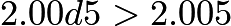
?

---

## Problem 7

Bill walks
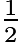
mile south, then
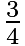
mile east, and finally

mile south. How many miles is he, in a direct line, from his starting point?
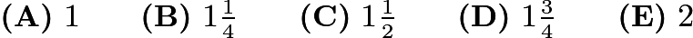

---

## Problem 8

Suppose m and n are positive odd integers. Which of the following must also be an odd integer?
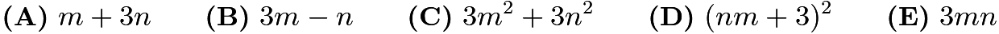

---

## Problem 9

In quadrilateral

, sides
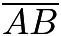
and

both have length 10, sides

and

both have length 17, and the measure of angle

is

. What is the length of diagonal

?
![[asy]draw((0,0)--(17,0)); draw(rotate(301, (17,0))*(0,0)--(17,0)); picture p; draw(p, (0,0)--(0,10)); draw(p, rotate(115, (0,10))*(0,0)--(0,10)); add(rotate(3)*p);  draw((0,0)--(8.25,14.5), linetype("8 8"));  label("$A$", (8.25, 14.5), N); label("$B$", (-0.25, 10), W); label("$C$", (0,0), SW); label("$D$", (17, 0), E);[/asy]](images/2005/img_9b7526c3.png)
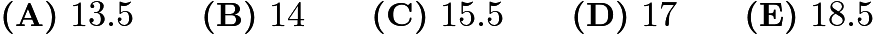

---

## Problem 10

Joe had walked half way from home to school when he realized he was late. He ran the rest of the way to school. He ran 3 times as fast as he walked. Joe took 6 minutes to walk half way to school. How many minutes did it take Joe to get from home to school?
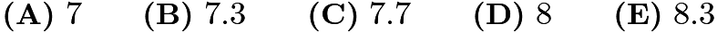

---

## Problem 11

The sales tax rate in Bergville is 6%. During a sale at the Bergville Coat Closet, the price of a coat is discounted 20% from its $90.00 price. Two clerks, Jack and Jill, calculate the bill independently. Jack brings up $90.00 and adds 6% sales tax, then subtracts 20% from this total. Jill brings up $90.00, subtracts 20% of the price, then adds 6% of the discounted price for sales tax. What is Jack's total minus Jill's total?

---

## Problem 12

Big Al the ape ate 100 delicious yellow bananas from May 1 through May 5. Each day he ate six more bananas than on the previous day. How many delicious bananas did Big Al eat on May 5?
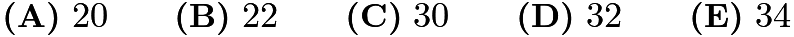

---

## Problem 13

The area of polygon

is 52 with

,

and
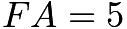
. What is

?
![[asy]pair a=(0,9), b=(8,9), c=(8,0), d=(4,0), e=(4,4), f=(0,4); draw(a--b--c--d--e--f--cycle); draw(shift(0,-.25)*a--shift(.25,-.25)*a--shift(.25,0)*a); draw(shift(-.25,0)*b--shift(-.25,-.25)*b--shift(0,-.25)*b); draw(shift(-.25,0)*c--shift(-.25,.25)*c--shift(0,.25)*c); draw(shift(.25,0)*d--shift(.25,.25)*d--shift(0,.25)*d); draw(shift(.25,0)*f--shift(.25,.25)*f--shift(0,.25)*f); label("$A$", a, NW); label("$B$", b, NE); label("$C$", c, SE); label("$D$", d, SW); label("$E$", e, SW); label("$F$", f, SW); label("5", (0,6.5), W); label("8", (4,9), N); label("9", (8, 4.5), E);[/asy]](images/2005/img_28fce75a.png)
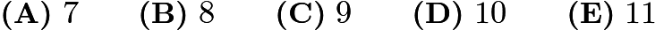

---

## Problem 14

The Little Twelve Basketball League has two divisions, with six teams in each division. Each team plays each of the other teams in its own division twice and every team in the other division once. How many games are scheduled?

---

## Problem 15

How many different isosceles triangles have integer side lengths and perimeter 23?
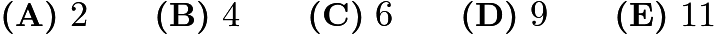

---

## Problem 16

A five-legged Martian has a drawer full of socks, each of which is red, white or blue, and there are at least five socks of each color. The Martian pulls out one sock at a time without looking. How many socks must the Martian remove from the drawer to be certain there will be 5 socks of the same color?
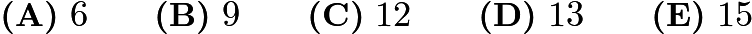

---

## Problem 17

The results of a cross-country team's training run are graphed below. Which student has the greatest average speed?
![[asy] for ( int i = 1; i <= 7; ++i ) {     draw((i,0)--(i,6)); }  for ( int i = 1; i <= 5; ++i ) {     draw((0,i)--(8,i)); } draw((-0.5,0)--(8,0), linewidth(1)); draw((0,-0.5)--(0,6), linewidth(1)); label("$O$", (0,0), SW); label(scale(.85)*rotate(90)*"distance", (0, 3), W); label(scale(.85)*"time", (4, 0), S); dot((1.25, 4.5)); label(scale(.85)*"Evelyn", (1.25, 4.8), N); dot((2.5, 2.2)); label(scale(.85)*"Briana", (2.5, 2.2), S); dot((4.25,5.2)); label(scale(.85)*"Carla", (4.25, 5.2), SE); dot((5.6, 2.8)); label(scale(.85)*"Debra", (5.6, 2.8), N); dot((6.8, 1.4)); label(scale(.85)*"Angela", (6.8, 1.4), E); [/asy]](images/2005/img_6a158c4a.png)

---

## Problem 18

How many three-digit numbers are divisible by 13?
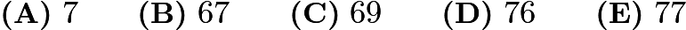

---

## Problem 19

What is the perimeter of trapezoid

?
![[asy]size(3inch, 1.5inch); pair a=(0,0), b=(18,24), c=(68,24), d=(75,0), f=(68,0), e=(18,0); draw(a--b--c--d--cycle); draw(b--e); draw(shift(0,2)*e--shift(2,2)*e--shift(2,0)*e); label("30", (9,12), W); label("50", (43,24), N); label("25", (71.5, 12), E); label("24", (18, 12), E); label("$A$", a, SW); label("$B$", b, N); label("$C$", c, N); label("$D$", d, SE); label("$E$", e, S);[/asy]](images/2005/img_ae27eb2c.png)

---

## Problem 20

Alice and Bob play a game involving a circle whose circumference is divided by 12 equally-spaced points. The points are numbered clockwise, from 1 to 12. Both start on point 12. Alice moves clockwise and Bob, counterclockwise.
In a turn of the game, Alice moves 5 points clockwise and Bob moves 9 points counterclockwise. The game ends when they stop on the same point. How many turns will this take?

---

## Problem 21

How many distinct triangles can be drawn using three of the dots below as vertices?
![[asy]dot(origin^^(1,0)^^(2,0)^^(0,1)^^(1,1)^^(2,1));[/asy]](images/2005/img_c09dd548.png)

---

## Problem 22

A company sells detergent in three different sized boxes: small (S), medium (M) and large (L). The medium size costs 50% more than the small size and contains 20% less detergent than the large size. The large size contains twice as much detergent as the small size and costs 30% more than the medium size. Rank the three sizes from best to worst buy.

---

## Problem 23

Isosceles right triangle

encloses a semicircle of area
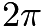
. The circle has its center

on hypotenuse

and is tangent to sides

and

. What is the area of triangle

?
![[asy]pair a=(4,4), b=(0,0), c=(0,4), d=(4,0), o=(2,2); draw(circle(o, 2)); clip(a--b--c--cycle); draw(a--b--c--cycle); dot(o); label("$C$", c, NW); label("$A$", a, NE); label("$B$", b, SW);[/asy]](images/2005/img_02654f81.png)
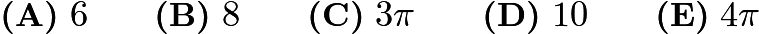

---

## Problem 24

A certain calculator has only two keys [+1] and [x2]. When you press one of the keys, the calculator automatically  displays the result. For instance, if the calculator originally displayed "9" and you pressed [+1], it would display "10." If you then pressed [x2], it would display "20." Starting with the display "1," what is the fewest number of keystrokes you would need to reach "200"?

---

## Problem 25

A square with side length 2.0 and a circle share the same center. The total area of the regions that are inside the circle and outside the square is equal to the total area of the regions that are outside the circle and inside the square. What is the radius of the circle?
![[asy]pair a=(4,4), b=(0,0), c=(0,4), d=(4,0), o=(2,2); draw(a--d--b--c--cycle); draw(circle(o, 2.25));[/asy]](images/2005/img_a8596dbb.png)
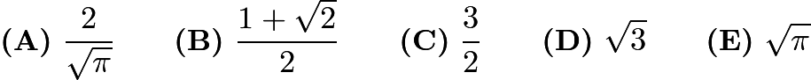

---

