# AMC 8 2006 Problems

## Problem 1

Mindy made three purchases for
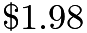
,

, and
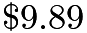
. What was her total, to the nearest dollar?

---

## Problem 2

On the AMC 8 contest Billy answers 13 questions correctly, answers 7 questions incorrectly and doesn't answer the last 5. What is his score?

---

## Problem 3

Elisa swims laps in the pool. When she first started, she completed 10 laps in 25 minutes. Now she can finish 12 laps in 24 minutes. By how many minutes has she improved her lap time?
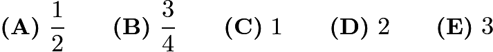

---

## Problem 4

Initially, a spinner points west. Chenille moves it clockwise
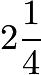
revolutions and then counterclockwise
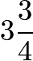
revolutions. In what direction does the spinner point after the two moves?
![[asy]size(96); draw(circle((0,0),1),linewidth(1)); draw((0,0.75)--(0,1.25),linewidth(1)); draw((0,-0.75)--(0,-1.25),linewidth(1)); draw((0.75,0)--(1.25,0),linewidth(1)); draw((-0.75,0)--(-1.25,0),linewidth(1)); label("$N$",(0,1.25), N); label("$W$",(-1.25,0), W); label("$E$",(1.25,0), E); label("$S$",(0,-1.25), S); draw((0,0)--(-0.5,0),EndArrow);[/asy]](images/2006/img_50f305c1.png)

---

## Problem 5

Points

and

are midpoints of the sides of the larger square. If the larger square has area 60, what is the area of the smaller square?
![[asy]size(100); draw((0,0)--(2,0)--(2,2)--(0,2)--cycle,linewidth(1)); draw((0,1)--(1,2)--(2,1)--(1,0)--cycle); label("$A$", (1,2), N); label("$B$", (2,1), E); label("$C$", (1,0), S); label("$D$", (0,1), W);[/asy]](images/2006/img_eaa866e7.png)

---

## Problem 6

The letter T is formed by placing two
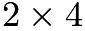
inch rectangles next to each other, as shown. What is the perimeter of the T, in inches?
![[asy] size(150); draw((0,6)--(4,6)--(4,4)--(3,4)--(3,0)--(1,0)--(1,4)--(0,4)--cycle, linewidth(1));[/asy]](images/2006/img_204023be.png)

---

## Problem 7

Circle

has a radius of
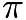
. Circle

has a circumference of
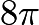
. Circle
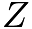
has an area of
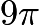
. List the circles in order from smallest to largest radius.

---

## Problem 8

The table shows some of the results of a survey by radiostation KACL. What percentage of the males surveyed listen to the station?
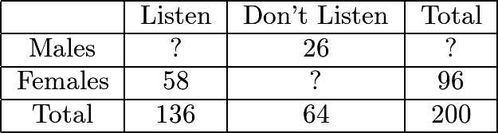
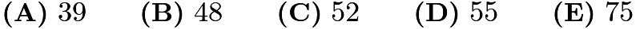

---

## Problem 9

What is the product of
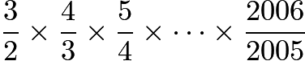
?

---

## Problem 10

Jorge's teacher asks him to plot all the ordered pairs
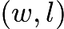
of positive integers for which

is the width and

is the length of a rectangle with area 12. What should his graph look like?
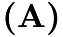
![[asy] size(75); draw((0,-1)--(0,13)); draw((-1,0)--(13,0)); dot((1,12)); dot((2,6)); dot((3,4)); dot((4,3)); dot((6,2)); dot((12,1)); label("$l$", (0,6), W); label("$w$", (6,0), S);[/asy]](images/2006/img_c8bb79b8.png)

![[asy] size(75); draw((0,-1)--(0,13)); draw((-1,0)--(13,0)); dot((1,1)); dot((3,3)); dot((5,5)); dot((7,7)); dot((9,9)); dot((11,11)); label("$l$", (0,6), W); label("$w$", (6,0), S);[/asy]](images/2006/img_7fa325da.png)

![[asy] size(75); draw((0,-1)--(0,13)); draw((-1,0)--(13,0)); dot((1,11)); dot((3,9)); dot((5,7)); dot((7,5)); dot((9,3)); dot((11,1)); label("$l$", (0,6), W); label("$w$", (6,0), S);[/asy]](images/2006/img_fb0de033.png)

![[asy] size(75); draw((0,-1)--(0,13)); draw((-1,0)--(13,0)); dot((1,6)); dot((3,6)); dot((5,6)); dot((7,6)); dot((9,6)); dot((11,6)); label("$l$", (0,6), W); label("$w$", (6,0), S);[/asy]](images/2006/img_c409eea8.png)

![[asy] size(75); draw((0,-1)--(0,13)); draw((-1,0)--(13,0)); dot((6,1)); dot((6,3)); dot((6,5)); dot((6,7)); dot((6,9)); dot((6,11)); label("$l$", (0,6), W); label("$w$", (6,0), S);[/asy]](images/2006/img_62772ce3.png)

---

## Problem 11

How many two-digit numbers have digits whose sum is a perfect square?

---

## Problem 12

Antonette gets
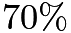
on a 10-problem test,
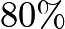
on a 20-problem test and

on a 30-problem test. If the three tests are combined into one 60-problem test, which percent is closest to her overall score?

---

## Problem 13

Cassie leaves Escanaba at 8:30 AM heading for Marquette on her bike. She bikes at a uniform rate of 12 miles per hour. Brian leaves Marquette at 9:00 AM heading for Escanaba on his bike. He bikes at a uniform rate of 16 miles per hour. They both bike on the same 62-mile route between Escanaba and Marquette. At what time in the morning do they meet?

---

## Problem 14

Problems 14, 15 and 16 involve Mrs. Reed's English assignment.
A Novel Assignment
The students in Mrs. Reed's English class are reading the same 760-page novel. Three friends, Alice, Bob and Chandra, are in the class. Alice reads a page in 20 seconds, Bob reads a page in 45 seconds and Chandra reads a page in 30 seconds.
If Bob and Chandra both read the whole book, Bob will spend how many more seconds reading than Chandra?

---

## Problem 15

Problems 14, 15 and 16 involve Mrs. Reed's English assignment.
A Novel Assignment
The students in Mrs. Reed's English class are reading the same 760-page novel. Three friends, Alice, Bob and Chandra, are in the class. Alice reads a page in 20 seconds, Bob reads a page in 45 seconds and Chandra reads a page in 30 seconds.
Chandra and Bob, who each have a copy of the book, decide that they can save time by "team reading" the novel. In this scheme, Chandra will read from page 1 to a certain page and Bob will read from the next page through page 760, finishing the book. When they are through they will tell each other about the part they read. What is the last page that Chandra should read so that he and Bob spend the same amount of time reading the novel?

---

## Problem 16

Problems 14, 15 and 16 involve Mrs. Reed's English assignment.
A Novel Assignment
The students in Mrs. Reed's English class are reading the same 760-page novel. Three friends, Alice, Bob and Chandra, are in the class. Alice reads a page in 20 seconds, Bob reads a page in 45 seconds and Chandra reads a page in 30 seconds.
Before Chandra and Bob start reading, Alice says she would like to team read with them. If they divide the book into three sections so that each reads for the same length of time, how many seconds will each have to read?

---

## Problem 17

Jeff rotates spinners

,

and

and adds the resulting numbers. What is the probability that his sum is an odd number?
![[asy] size(200); path circle=circle((0,0),2); path r=(0,0)--(0,2); draw(circle,linewidth(1)); draw(shift(5,0)*circle,linewidth(1)); draw(shift(10,0)*circle,linewidth(1)); draw(r,linewidth(1)); draw(rotate(120)*r,linewidth(1)); draw(rotate(240)*r,linewidth(1)); draw(shift(5,0)*r,linewidth(1)); draw(shift(5,0)*rotate(90)*r,linewidth(1)); draw(shift(5,0)*rotate(180)*r,linewidth(1)); draw(shift(5,0)*rotate(270)*r,linewidth(1)); draw(shift(10,0)*r,linewidth(1)); draw(shift(10,0)*rotate(60)*r,linewidth(1)); draw(shift(10,0)*rotate(120)*r,linewidth(1)); draw(shift(10,0)*rotate(180)*r,linewidth(1)); draw(shift(10,0)*rotate(240)*r,linewidth(1)); draw(shift(10,0)*rotate(300)*r,linewidth(1)); label("$P$", (-2,2)); label("$Q$", shift(5,0)*(-2,2)); label("$R$", shift(10,0)*(-2,2)); label("$1$", (-1,sqrt(2)/2)); label("$2$", (1,sqrt(2)/2)); label("$3$", (0,-1)); label("$2$", shift(5,0)*(-sqrt(2)/2,sqrt(2)/2)); label("$4$", shift(5,0)*(sqrt(2)/2,sqrt(2)/2)); label("$6$", shift(5,0)*(sqrt(2)/2,-sqrt(2)/2)); label("$8$", shift(5,0)*(-sqrt(2)/2,-sqrt(2)/2)); label("$1$", shift(10,0)*(-0.5,1)); label("$3$", shift(10,0)*(0.5,1)); label("$5$", shift(10,0)*(1,0)); label("$7$", shift(10,0)*(0.5,-1)); label("$9$", shift(10,0)*(-0.5,-1)); label("$11$", shift(10,0)*(-1,0));[/asy]](images/2006/img_5fe3d510.png)
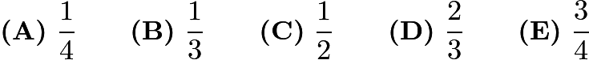

---

## Problem 18

A cube with 3-inch edges is made using 27 cubes with 1-inch edges. Nineteen of the smaller cubes are white and eight are black. If the eight black cubes are placed at the corners of the larger cube, what fraction of the surface area of the larger cube is white?
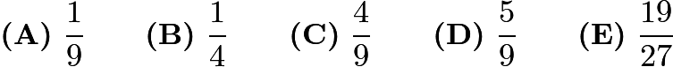

---

## Problem 19

Triangle

is an isosceles triangle with

. Point

is the midpoint of both

and

, and
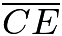
is 11 units long. Triangle

is congruent to triangle

. What is the length of

?
![[asy] size(100); draw((0,0)--(2,4)--(4,0)--(6,4)--cycle--(4,0),linewidth(1)); label("$A$", (0,0), SW); label("$B$", (2,4), N); label("$C$", (4,0), SE); label("$D$", shift(0.2,0.1)*intersectionpoint((0,0)--(6,4),(2,4)--(4,0)), N); label("$E$", (6,4), NE);[/asy]](images/2006/img_29a472a5.png)

---

## Problem 20

A singles tournament had six players. Each player played every other player only once, with no ties. If Helen won 4 games, Ines won 3 games, Janet won 2 games, Kendra won 2 games and Lara won 2 games, how many games did Monica (the sixth player) win?
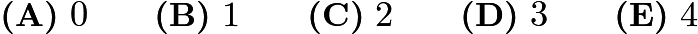

---

## Problem 21

An aquarium has a rectangular base that measures

cm by

cm and has a height of

cm. The aquarium is filled with water to a depth of
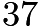
cm. A rock with volume
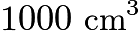
is then placed in the aquarium and completely submerged. By how many centimeters does the water level rise?

---

## Problem 22

Three different one-digit positive integers are placed in the bottom row of cells. Numbers in adjacent cells are added and the sum is placed in the cell above them. In the second row, continue the same process to obtain a number in the top cell. What is the difference between the largest and smallest numbers possible in the top cell?
![[asy] path cell=((0,0)--(1,0)--(1,1)--(0,1)--cycle); path sw=((0,0)--(1,sqrt(3))); path se=((5,0)--(4,sqrt(3))); draw(cell, linewidth(1)); draw(shift(2,0)*cell, linewidth(1)); draw(shift(4,0)*cell, linewidth(1)); draw(shift(1,3)*cell, linewidth(1)); draw(shift(3,3)*cell, linewidth(1)); draw(shift(2,6)*cell, linewidth(1)); draw(shift(0.45,1.125)*sw, EndArrow); draw(shift(2.45,1.125)*sw, EndArrow); draw(shift(1.45,4.125)*sw, EndArrow); draw(shift(-0.45,1.125)*se, EndArrow); draw(shift(-2.45,1.125)*se, EndArrow); draw(shift(-1.45,4.125)*se, EndArrow); label("$+$", (1.5,1.5)); label("$+$", (3.5,1.5)); label("$+$", (2.5,4.5));[/asy]](images/2006/img_25fcb74e.png)
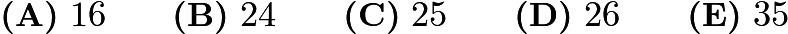

---

## Problem 23

A box contains gold coins. If the coins are equally divided among six people, four coins are left over. If the coins are equally divided among five people, three coins are left over. If the box holds the smallest number of coins that meets these two conditions, how many coins are left when equally divided among seven people?
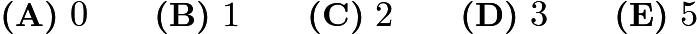

---

## Problem 24

In the multiplication problem below

,

,

,

and  are different digits. What is

?
![\[\begin{array}{cccc}& A & B & A\\ \times & & C & D\\ \hline C & D & C & D\\ \end{array}\]](images/2006/img_5d877b2c.png)

---

## Problem 25

Barry wrote 6 different numbers, one on each side of 3 cards, and laid the cards on a table, as shown. The sums of the two numbers on each of the three cards are equal. The three numbers on the hidden sides are prime numbers. What is the average of the hidden prime numbers?
![[asy] path card=((0,0)--(0,3)--(2,3)--(2,0)--cycle); draw(card, linewidth(1)); draw(shift(2.5,0)*card, linewidth(1)); draw(shift(5,0)*card, linewidth(1)); label("$44$", (1,1.5)); label("$59$", shift(2.5,0)*(1,1.5)); label("$38$", shift(5,0)*(1,1.5));[/asy]](images/2006/img_d1aba3cb.png)

---

