# AMC 8 2007 Problems

## Problem 1

Theresa's parents have agreed to buy her tickets to see her favorite band if she spends an average of

hours per week helping around the house for

weeks. For the first

weeks she helps around the house for

,

,

,

and

hours. How many hours must she work for the final week to earn the tickets?

---

## Problem 2

students were surveyed about their pasta preferences. The choices were lasagna, manicotti, ravioli and spaghetti. The results of the survey are displayed in the bar graph. What is the ratio of the number of students who preferred spaghetti to the number of students who preferred manicotti?
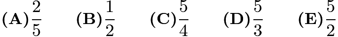

---

## Problem 3

What is the sum of the two smallest prime factors of

?

---

## Problem 4

A haunted house has six windows. In how many ways can
Georgie the Ghost enter the house by one window and leave
by a different window?

---

## Problem 5

Chandler wants to buy a

mountain bike. For his birthday, his grandparents
send him

, his aunt sends him
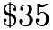
and his cousin gives him

. He earns

per week for his paper route. He will use all of his birthday money and all
of the money he earns from his paper route. In how many weeks will he be able
to buy the mountain bike?

---

## Problem 6

The average cost of a long-distance call in the USA in
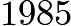
was

cents per minute, and the average cost of a long-distance
call in the USA in

was

cents per minute. Find the
approximate percent decrease in the cost per minute of a long-
distance call.

---

## Problem 7

The average age of

people in a room is

years. An

-year-old person leaves
the room. What is the average age of the four remaining people?

---

## Problem 8

In trapezoid

,

is perpendicular to

,

, and

. In addition,

is on

, and

is parallel to

. Find the area of

.
![[asy] defaultpen(linewidth(0.7)); pair A=(0,3), B=(3,3), C=(6,0), D=origin, E=(3,0); draw(E--B--C--D--A--B); draw(rightanglemark(A, D, C)); label("$A$", A, NW); label("$B$", B, NW); label("$C$", C, SE); label("$D$", D, SW); label("$E$", E, NW); label("$3$", A--D, W); label("$3$", A--B, N); label("$6$", E, S); [/asy]](images/2007/img_84abdf69.png)

---

## Problem 9

To complete the grid below, each of the digits 1 through 4 must occur once
in each row and once in each column. What number will occupy the lower
right-hand square?

cannot be determined

---

## Problem 10

For any positive integer

, define
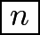
to be the sum of the positive factors of

.
For example,
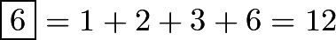
. Find
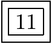
.

---

## Problem 11

Tiles
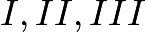
and

are translated so one tile coincides with each of the rectangles

and

. In the final arrangement, the two numbers on any side common to two adjacent tiles must be the same. Which of the tiles is translated to Rectangle

?

cannot be determined

---

## Problem 12

A unit hexagram is composed of a regular hexagon of side length

and its

equilateral triangular extensions, as shown in the diagram. What is the ratio of
the area of the extensions to the area of the original hexagon?

---

## Problem 13

Sets

and

, shown in the Venn diagram, have the same number of elements.
Their union has

elements and their intersection has

elements. Find
the number of elements in

.

---

## Problem 14

The base of isosceles

is

and its area is

. What is the length of one
of the congruent sides?

---

## Problem 15

Let
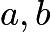
and

be numbers with

. Which of the following is
impossible?
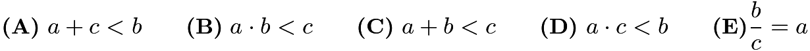

---

## Problem 16

Amanda draws five circles with radii
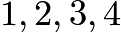
and

. Then for each circle she plots the point
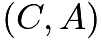
,
where

is its circumference and

is its area. Which of the
following could be her graph?

---

## Problem 17

A mixture of

liters of paint is

red tint,
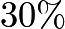
yellow
tint and
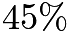
water. Five liters of yellow tint are added to
the original mixture. What is the percent of yellow tint
in the new mixture?

---

## Problem 18

The product of the two

-digit numbers

and

has thousands digit

and units digit

. What is the sum of

and

?

---

## Problem 19

Pick two consecutive positive integers whose sum is less than

. Square both
of those integers and then find the difference of the squares. Which of the
following could be the difference?

---

## Problem 20

Before district play, the Unicorns had won

of their
basketball games. During district play, they won six more
games and lost two, to finish the season having won half
their games. How many games did the Unicorns play in
all?

---

## Problem 21

Two cards are dealt from a deck of four red cards labeled

and four
green cards labeled

. A winning pair is two of the same color or two
of the same letter. What is the probability of drawing a winning pair?
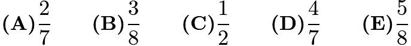

---

## Problem 22

A lemming sits at a corner of a square with side length

meters. The lemming
runs

meters along a diagonal toward the opposite corner. It stops, makes
a

degree right turn and runs

more meters. A scientist measures the shortest
distance between the lemming and each side of the square. What is the average
of these four distances in meters?

---

## Problem 23

What is the area of the shaded part shown in the

x

grid?

---

## Problem 24

A bag contains four pieces of paper, each labeled with one of the digits "1, 2, 3"
or "4", with no repeats. Three of these pieces are drawn, one at a time without
replacement, to construct a three-digit number. What is the probability that
the three-digit number is a multiple of 3?
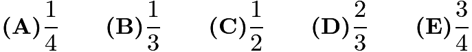

---

## Problem 25

On the dart board shown in the figure, the outer circle has radius

and the inner circle has a radius of 3.
Three radii divide each circle into three congruent
regions, with point values shown. The probability that a dart will hit a given
region is proportional to the area of the region. When two darts hit this board,
the score is the sum of the point values in the regions. What is the probability
that the score is odd?
![[asy] draw(Circle(origin, 2)); draw(Circle(origin, 1)); draw(origin--2*dir(90)); draw(origin--2*dir(210)); draw(origin--2*dir(330)); label("$1$", 0.35*dir(150), dir(150)); label("$1$", 1.3*dir(30), dir(30)); label("$1$", (0,-1.3), dir(270)); label("$2$", 1.3*dir(150), dir(150)); label("$2$", 0.35*dir(30), dir(30)); label("$2$", (0,-0.35), dir(270)); [/asy]](images/2007/img_bfdc8a19.png)
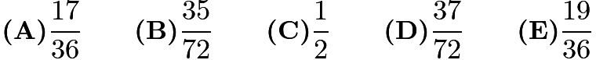

---

