# AMC 8 2010 Problems

## Problem 1

At Euclid Middle School, the mathematics teachers are Miss Germain, Mr. Newton, and Mrs. Young. There are
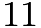
students in Mrs. Germain's class,

students in Mr. Newton's class, and

students in Mrs. Young's class taking the AMC 8 this year. How many mathematics students at Euclid Middle School are taking the contest?

---

## Problem 2

If
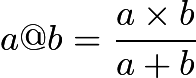
for

positive integers, then what is

?
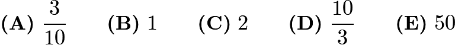

---

## Problem 3

The graph shows the price of five gallons of gasoline during the first ten months of the year. By what percent is the highest price more than the lowest price?
![[asy] import graph; size(16.38cm); real lsf=2; pathpen=linewidth(0.7); pointpen=black; pen fp = fontsize(10); pointfontpen=fp; real xmin=-1.33,xmax=11.05,ymin=-9.01,ymax=-0.44; pen ycycyc=rgb(0.55,0.55,0.55); pair A=(1,-6), B=(1,-2), D=(1,-5.8), E=(1,-5.6), F=(1,-5.4), G=(1,-5.2), H=(1,-5), J=(1,-4.8), K=(1,-4.6), L=(1,-4.4), M=(1,-4.2), N=(1,-4), P=(1,-3.8), Q=(1,-3.6), R=(1,-3.4), S=(1,-3.2), T=(1,-3), U=(1,-2.8), V=(1,-2.6), W=(1,-2.4), Z=(1,-2.2), E_1=(1.4,-2.6), F_1=(1.8,-2.6), O_1=(14,-6), P_1=(14,-5), Q_1=(14,-4), R_1=(14,-3), S_1=(14,-2), C_1=(1.4,-6), D_1=(1.8,-6), G_1=(2.4,-6), H_1=(2.8,-6), I_1=(3.4,-6), J_1=(3.8,-6), K_1=(4.4,-6), L_1=(4.8,-6), M_1=(5.4,-6), N_1=(5.8,-6), T_1=(6.4,-6), U_1=(6.8,-6), V_1=(7.4,-6), W_1=(7.8,-6), Z_1=(8.4,-6), A_2=(8.8,-6), B_2=(9.4,-6), C_2=(9.8,-6), D_2=(10.4,-6), E_2=(10.8,-6), L_2=(2.4,-3.2), M_2=(2.8,-3.2), N_2=(3.4,-4), O_2=(3.8,-4), P_2=(4.4,-3.6), Q_2=(4.8,-3.6), R_2=(5.4,-3.6), S_2=(5.8,-3.6), T_2=(6.4,-3.4), U_2=(6.8,-3.4), V_2=(7.4,-3.8), W_2=(7.8,-3.8), Z_2=(8.4,-2.8), A_3=(8.8,-2.8), B_3=(9.4,-3.2), C_3=(9.8,-3.2), D_3=(10.4,-3.8), E_3=(10.8,-3.8); filldraw(C_1--E_1--F_1--D_1--cycle,ycycyc); filldraw(G_1--L_2--M_2--H_1--cycle,ycycyc); filldraw(I_1--N_2--O_2--J_1--cycle,ycycyc); filldraw(K_1--P_2--Q_2--L_1--cycle,ycycyc); filldraw(M_1--R_2--S_2--N_1--cycle,ycycyc); filldraw(T_1--T_2--U_2--U_1--cycle,ycycyc); filldraw(V_1--V_2--W_2--W_1--cycle,ycycyc); filldraw(Z_1--Z_2--A_3--A_2--cycle,ycycyc); filldraw(B_2--B_3--C_3--C_2--cycle,ycycyc); filldraw(D_2--D_3--E_3--E_2--cycle,ycycyc); D(B--A,linewidth(0.4)); D(H--(8,-5),linewidth(0.4)); D(N--(8,-4),linewidth(0.4)); D(T--(8,-3),linewidth(0.4)); D(B--(8,-2),linewidth(0.4)); D(B--S_1); D(T--R_1); D(N--Q_1); D(H--P_1); D(A--O_1); D(C_1--E_1); D(E_1--F_1); D(F_1--D_1); D(D_1--C_1); D(G_1--L_2); D(L_2--M_2); D(M_2--H_1); D(H_1--G_1); D(I_1--N_2); D(N_2--O_2); D(O_2--J_1); D(J_1--I_1); D(K_1--P_2); D(P_2--Q_2); D(Q_2--L_1); D(L_1--K_1); D(M_1--R_2); D(R_2--S_2); D(S_2--N_1); D(N_1--M_1); D(T_1--T_2); D(T_2--U_2); D(U_2--U_1); D(U_1--T_1); D(V_1--V_2); D(V_2--W_2); D(W_2--W_1); D(W_1--V_1); D(Z_1--Z_2); D(Z_2--A_3); D(A_3--A_2); D(A_2--Z_1); D(B_2--B_3); D(B_3--C_3); D(C_3--C_2); D(C_2--B_2); D(D_2--D_3); D(D_3--E_3); D(E_3--E_2); D(E_2--D_2); label("0",(0.88,-5.91),SE*lsf,fp); label("$ 5$",(0.3,-4.84),SE*lsf,fp); label("$ 10$",(0.2,-3.84),SE*lsf,fp); label("$ 15$",(0.2,-2.85),SE*lsf,fp); label("$ 20$",(0.2,-1.85),SE*lsf,fp); label("$\mathrm{Price}$",(0.16,-3.45),SE*lsf,fp); label("$1$",(1.54,-5.97),SE*lsf,fp); label("$2$",(2.53,-5.95),SE*lsf,fp); label("$3$",(3.53,-5.94),SE*lsf,fp); label("$4$",(4.55,-5.94),SE*lsf,fp); label("$5$",(5.49,-5.95),SE*lsf,fp); label("$6$",(6.53,-5.95),SE*lsf,fp); label("$7$",(7.55,-5.95),SE*lsf,fp); label("$8$",(8.52,-5.95),SE*lsf,fp); label("$9$",(9.57,-5.97),SE*lsf,fp); label("$10$",(10.56,-5.94),SE*lsf,fp); label("Month",(7.14,-6.43),SE*lsf,fp); D(A,linewidth(1pt)); D(B,linewidth(1pt)); D(D,linewidth(1pt)); D(E,linewidth(1pt)); D(F,linewidth(1pt)); D(G,linewidth(1pt)); D(H,linewidth(1pt)); D(J,linewidth(1pt)); D(K,linewidth(1pt)); D(L,linewidth(1pt)); D(M,linewidth(1pt)); D(N,linewidth(1pt)); D(P,linewidth(1pt)); D(Q,linewidth(1pt)); D(R,linewidth(1pt)); D(S,linewidth(1pt)); D(T,linewidth(1pt)); D(U,linewidth(1pt)); D(V,linewidth(1pt)); D(W,linewidth(1pt)); D(Z,linewidth(1pt)); D(E_1,linewidth(1pt)); D(F_1,linewidth(1pt)); D(O_1,linewidth(1pt)); D(P_1,linewidth(1pt)); D(Q_1,linewidth(1pt)); D(R_1,linewidth(1pt)); D(S_1,linewidth(1pt)); D(C_1,linewidth(1pt)); D(D_1,linewidth(1pt)); D(G_1,linewidth(1pt)); D(H_1,linewidth(1pt)); D(I_1,linewidth(1pt)); D(J_1,linewidth(1pt)); D(K_1,linewidth(1pt)); D(L_1,linewidth(1pt)); D(M_1,linewidth(1pt)); D(N_1,linewidth(1pt)); D(T_1,linewidth(1pt)); D(U_1,linewidth(1pt)); D(V_1,linewidth(1pt)); D(W_1,linewidth(1pt)); D(Z_1,linewidth(1pt)); D(A_2,linewidth(1pt)); D(B_2,linewidth(1pt)); D(C_2,linewidth(1pt)); D(D_2,linewidth(1pt)); D(E_2,linewidth(1pt)); D(L_2,linewidth(1pt)); D(M_2,linewidth(1pt)); D(N_2,linewidth(1pt)); D(O_2,linewidth(1pt)); D(P_2,linewidth(1pt)); D(Q_2,linewidth(1pt)); D(R_2,linewidth(1pt)); D(S_2,linewidth(1pt)); D(T_2,linewidth(1pt)); D(U_2,linewidth(1pt)); D(V_2,linewidth(1pt)); D(W_2,linewidth(1pt)); D(Z_2,linewidth(1pt)); D(A_3,linewidth(1pt)); D(B_3,linewidth(1pt)); D(C_3,linewidth(1pt)); D(D_3,linewidth(1pt)); D(E_3,linewidth(1pt)); clip((xmin,ymin)--(xmin,ymax)--(xmax,ymax)--(xmax,ymin)--cycle);[/asy]](images/2010/4d2eb2a3064c58ec4d4dc470211f19b664492a17.png)

---

## Problem 4

What is the sum of the mean, median, and mode of the numbers
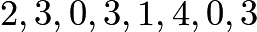
?

---

## Problem 5

Alice needs to replace a light bulb located

centimeters below the ceiling in her kitchen. The ceiling is
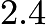
meters above the floor. Alice is
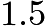
meters tall and can reach
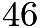
centimeters above the top of her head. Standing on a stool, she can just reach the light bulb. What is the height of the stool, in centimeters?

---

## Problem 6

Which of the following figures has the greatest number of lines of symmetry?

---

## Problem 7

Using only pennies, nickels, dimes, and quarters, what is the smallest number of coins Freddie would need so he could pay any amount of money less than a dollar?

---

## Problem 8

As Emily is riding her bicycle on a long straight road, she spots Emerson skating in the same direction
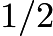
mile in front of her. After she passes him, she can see him in her rear mirror until he is

mile behind her. Emily rides at a constant rate of

miles per hour, and Emerson skates at a constant rate of

miles per hour. For how many minutes can Emily see Emerson?

---

## Problem 9

Ryan got

of the problems correct on a

-problem test,
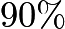
on a

-problem test, and
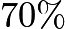
on a

-problem test. What percent of all the problems did Ryan answer correctly?
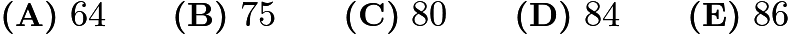

---

## Problem 10

Six pepperoni circles will exactly fit across the diameter of a

-inch pizza when placed. If a total of
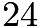
circles of pepperoni are placed on this pizza without overlap, what fraction of the pizza is covered by pepperoni?
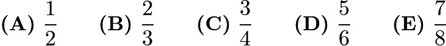

---

## Problem 11

The top of one tree is
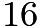
feet higher than the top of another tree. The heights of the two trees are in the ratio
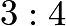
. In feet, how tall is the taller tree?

---

## Problem 12

Of the

balls in a large bag,

are red and the rest are blue. How many of the red balls must be removed from the bag so that
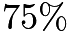
of the remaining balls are red?

---

## Problem 13

The lengths of the sides of a triangle in inches are three consecutive integers. The length of the shortest side is

of the perimeter. What is the length of the longest side?

---

## Problem 14

What is the sum of the prime factors of

?

---

## Problem 15

A jar contains five different colors of gumdrops:

are blue,

are brown,
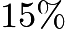
red,
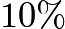
yellow, and the other

gumdrops are green. If half of the blue gumdrops are replaced with brown gumdrops, how many gumdrops will be brown?
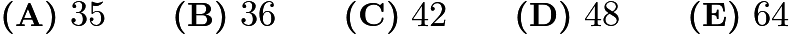

---

## Problem 16

A square and a circle have the same area. What is the ratio of the side length of the square to the radius of the circle?
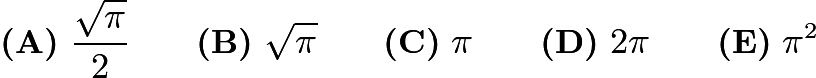

---

## Problem 17

The diagram shows an octagon consisting of

unit squares. The portion below

is a unit square and a triangle with base

. If

bisects the area of the octagon, what is the ratio
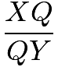
?
![[asy] import graph; size(300);  real lsf = 0.5;  pen dp = linewidth(0.7) + fontsize(10);  defaultpen(dp);  pen ds = black;  pen xdxdff = rgb(0.49,0.49,1); draw((0,0)--(6,0),linewidth(1.2pt));  draw((0,0)--(0,1),linewidth(1.2pt));  draw((0,1)--(1,1),linewidth(1.2pt));  draw((1,1)--(1,2),linewidth(1.2pt));  draw((1,2)--(5,2),linewidth(1.2pt));  draw((5,2)--(5,1),linewidth(1.2pt));  draw((5,1)--(6,1),linewidth(1.2pt));  draw((6,1)--(6,0),linewidth(1.2pt));  draw((1,1)--(5,1),linewidth(1.2pt)); draw((1,1)--(1,0),linewidth(1.2pt));  draw((2,2)--(2,0),linewidth(1.2pt));  draw((3,2)--(3,0),linewidth(1.2pt));  draw((4,2)--(4,0),linewidth(1.2pt));  draw((5,1)--(5,0),linewidth(1.2pt)); draw((0,0)--(5,1.5),linewidth(1.2pt)); dot((0,0),ds); label("$P$", (-0.23,-0.26),NE*lsf);  dot((0,1),ds);  dot((1,1),ds);  dot((1,2),ds);  dot((5,2),ds);  label("$X$", (5.14,2.02),NE*lsf); dot((5,1),ds);  label("$Y$", (5.12,1.14),NE*lsf); dot((6,1),ds);  dot((6,0),ds); dot((1,0),ds); dot((2,0),ds); dot((3,0),ds);  dot((4,0),ds); dot((5,0),ds); dot((2,2),ds); dot((3,2),ds);  dot((4,2),ds); dot((5,1.5),ds);  label("$Q$", (5.14,1.51),NE*lsf);  clip((-4.19,-5.52)--(-4.19,6.5)--(10.08,6.5)--(10.08,-5.52)--cycle); [/asy]](images/2010/3bba290e642b0a44220ce1e8ce69c823fe134b28.png)
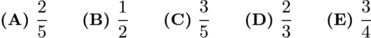

---

## Problem 18

A decorative window is made up of a rectangle with semicircles on either end. The ratio of

to

is

, and

is 30 inches. What is the ratio of the area of the rectangle to the combined areas of the semicircles?
![[asy] import graph; size(5cm); real lsf=0; pen dps=linewidth(0.7)+fontsize(8); defaultpen(dps); pen ds=black; real xmin=-4.27,xmax=14.73,ymin=-3.22,ymax=6.8; draw((0,4)--(0,0)); draw((0,0)--(2.5,0)); draw((2.5,0)--(2.5,4)); draw((2.5,4)--(0,4)); draw(shift((1.25,4))*xscale(1.25)*yscale(1.25)*arc((0,0),1,0,180)); draw(shift((1.25,0))*xscale(1.25)*yscale(1.25)*arc((0,0),1,-180,0)); dot((0,0),ds); label("$A$",(-0.26,-0.23),NE*lsf); dot((2.5,0),ds); label("$B$",(2.61,-0.26),NE*lsf); dot((0,4),ds); label("$D$",(-0.26,4.02),NE*lsf); dot((2.5,4),ds); label("$C$",(2.64,3.98),NE*lsf); clip((xmin,ymin)--(xmin,ymax)--(xmax,ymax)--(xmax,ymin)--cycle);[/asy]](images/2010/1bd7bb101d1f617dcc2d568edfde1a17ef3345b4.png)
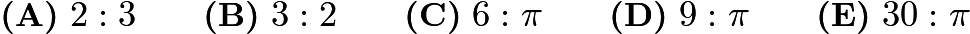

---

## Problem 19

The two circles pictured have the same center

. Chord

is tangent to the inner circle at

,

is

, and chord

has length

. What is the area between the two circles?
![[asy] unitsize(45); import graph; size(300); real lsf = 0.5; pen dp = linewidth(0.7) + fontsize(10); defaultpen(dp); pen ds = black; pen xdxdff = rgb(0.49,0.49,1); draw((2,0.15)--(1.85,0.15)--(1.85,0)--(2,0)--cycle); draw(circle((2,1),2.24)); draw(circle((2,1),1)); draw((0,0)--(4,0)); draw((0,0)--(2,1)); draw((2,1)--(2,0)); draw((2,1)--(4,0)); dot((0,0),ds); label("$A$", (-0.19,-0.23),NE*lsf); dot((2,0),ds); label("$B$", (1.97,-0.31),NE*lsf); dot((2,1),ds); label("$C$", (1.96,1.09),NE*lsf); dot((4,0),ds); label("$D$", (4.07,-0.24),NE*lsf); clip((-3.1,-7.72)--(-3.1,4.77)--(11.74,4.77)--(11.74,-7.72)--cycle); [/asy]](images/2010/2cfa82378d1bafff2108201dd94835ed7a9aab8d.png)
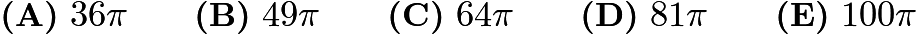

---

## Problem 20

In a room,

of the people are wearing gloves, and
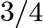
of the people are wearing hats. What is the minimum number of people in the room wearing both a hat and a glove?

---

## Problem 21

Hui is an avid reader. She bought a copy of the best seller
Math is Beautiful
. On the first day, Hui read
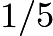
of the pages plus

more, and on the second day she read
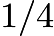
of the remaining pages plus

pages. On the third day she read

of the remaining pages plus

pages. She then realized that there were only
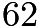
pages left to read, which she read the next day. How many pages are in this book?

---

## Problem 22

The hundreds digit of a three-digit number is

more than the units digit. The digits of the three-digit number are reversed, and the result is subtracted from the original three-digit number. What is the units digit of the result?

---

## Problem 23

Semicircles

and

pass through the center of circle

. What is the ratio of the combined areas of the two semicircles to the area of circle

?
![[asy] import graph; size(7.5cm); real lsf=0.5; pen dps=linewidth(0.7)+fontsize(10); defaultpen(dps); pen ds=black; real xmin=-6.27,xmax=10.01,ymin=-5.65,ymax=10.98; draw(circle((0,0),2)); draw((-3,0)--(3,0),EndArrow(6)); draw((0,-3)--(0,3),EndArrow(6)); draw(shift((0.01,1.42))*xscale(1.41)*yscale(1.41)*arc((0,0),1,179.76,359.76)); draw(shift((-0.01,-1.42))*xscale(1.41)*yscale(1.41)*arc((0,0),1,-0.38,179.62)); draw((-1.4,1.43)--(1.41,1.41)); draw((-1.42,-1.41)--(1.4,-1.42)); label("$ P(-1,1) $",(-2.57,2.17),SE*lsf); label("$ Q(1,1) $",(1.55,2.21),SE*lsf); label("$ R(-1,-1) $",(-2.72,-1.45),SE*lsf); label("$S(1,-1)$",(1.59,-1.49),SE*lsf);  dot((0,0),ds); label("$O$",(-0.24,-0.35),NE*lsf); dot((1.41,1.41),ds); dot((-1.4,1.43),ds); dot((1.4,-1.42),ds); dot((-1.42,-1.41),ds);  clip((xmin,ymin)--(xmin,ymax)--(xmax,ymax)--(xmax,ymin)--cycle);[/asy]](images/2010/6fef195a7bd352396d3561535ac6c4b7e2c67129.png)
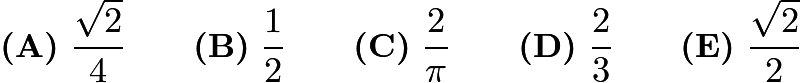

---

## Problem 24

What is the correct ordering of the three numbers,

,
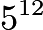
, and
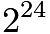
?
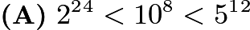

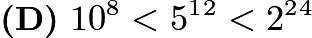
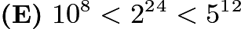

---

## Problem 25

Everyday at school, Jo climbs a flight of

stairs. Jo can take the stairs

,

, or

at a time. For example, Jo could climb

, then

, then

. In how many ways can Jo climb the stairs?

---

