# AMC 8 2011 Problems

## Problem 1

Margie bought

apples at a cost of

cents per apple. She paid with a 5-dollar bill. How much change did Margie receive?

---

## Problem 2

Karl's rectangular vegetable garden is

feet by

feet, and Makenna's is

feet by

feet. Which of the following statements are true?

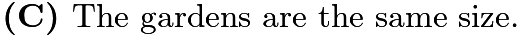

---

## Problem 3

Extend the square pattern of 8 black and 17 white square tiles by attaching a border of black tiles around the square. What is the ratio of black tiles to white tiles in the extended pattern?
![[asy] filldraw((0,0)--(5,0)--(5,5)--(0,5)--cycle,white,black); filldraw((1,1)--(4,1)--(4,4)--(1,4)--cycle,mediumgray,black); filldraw((2,2)--(3,2)--(3,3)--(2,3)--cycle,white,black); draw((4,0)--(4,5)); draw((3,0)--(3,5)); draw((2,0)--(2,5)); draw((1,0)--(1,5)); draw((0,4)--(5,4)); draw((0,3)--(5,3)); draw((0,2)--(5,2)); draw((0,1)--(5,1)); [/asy]](images/2011/a24e23a268700a40b52b1b449dac9c6d2ec80a4e.png)
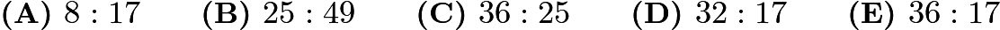

---

## Problem 4

Here is a list of the numbers of fish that Tyler caught in nine outings last summer:
![\[2,0,1,3,0,3,3,1,2.\]](images/2011/6b7acd21d15b3e6744a3b750c1c6fbd688b75635.png)
Which statement about the mean, median, and mode is true?

---

## Problem 5

What time was it
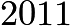
minutes after midnight on January 1, 2011?

---

## Problem 6

In a town of 351 adults, every adult owns a car, motorcycle, or both. If 331 adults own cars and 45 adults own motorcycles, how many of the car owners do not own a motorcycle?
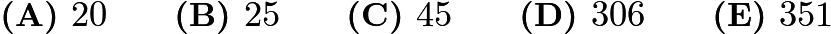

---

## Problem 7

Each of the following four large congruent squares is subdivided into combinations of congruent triangles or rectangles and is partially bolded. What percent of the total area is partially bolded?
![[asy] import graph; size(7.01cm); real lsf=0.5; pen dps=linewidth(0.7)+fontsize(10); defaultpen(dps); pen ds=black; real xmin=-0.42,xmax=14.59,ymin=-10.08,ymax=5.26;  pair A=(0,0), B=(4,0), C=(0,4), D=(4,4), F=(2,0), G=(3,0), H=(1,4), I=(2,4), J=(3,4), K=(0,-2), L=(4,-2), M=(0,-6), O=(0,-4), P=(4,-4), Q=(2,-2), R=(2,-6), T=(6,4), U=(10,0), V=(10,4), Z=(10,2), A_1=(8,4), B_1=(8,0), C_1=(6,-2), D_1=(10,-2), E_1=(6,-6), F_1=(10,-6), G_1=(6,-4), H_1=(10,-4), I_1=(8,-2), J_1=(8,-6), K_1=(8,-4);  draw(C--H--(1,0)--A--cycle,linewidth(1.6)); draw(M--O--Q--R--cycle,linewidth(1.6)); draw(A_1--V--Z--cycle,linewidth(1.6)); draw(G_1--K_1--J_1--E_1--cycle,linewidth(1.6));  draw(C--D); draw(D--B); draw(B--A); draw(A--C); draw(H--(1,0)); draw(I--F); draw(J--G); draw(C--H,linewidth(1.6)); draw(H--(1,0),linewidth(1.6)); draw((1,0)--A,linewidth(1.6)); draw(A--C,linewidth(1.6)); draw(K--L); draw((4,-6)--L); draw((4,-6)--M); draw(M--K); draw(O--P); draw(Q--R); draw(O--Q); draw(M--O,linewidth(1.6)); draw(O--Q,linewidth(1.6)); draw(Q--R,linewidth(1.6)); draw(R--M,linewidth(1.6)); draw(T--V); draw(V--U); draw(U--(6,0)); draw((6,0)--T); draw((6,2)--Z); draw(A_1--B_1); draw(A_1--Z); draw(A_1--V,linewidth(1.6)); draw(V--Z,linewidth(1.6)); draw(Z--A_1,linewidth(1.6)); draw(C_1--D_1); draw(D_1--F_1); draw(F_1--E_1); draw(E_1--C_1); draw(G_1--H_1); draw(I_1--J_1); draw(G_1--K_1,linewidth(1.6)); draw(K_1--J_1,linewidth(1.6)); draw(J_1--E_1,linewidth(1.6)); draw(E_1--G_1,linewidth(1.6));  dot(A,linewidth(1pt)+ds); dot(B,linewidth(1pt)+ds); dot(C,linewidth(1pt)+ds); dot(D,linewidth(1pt)+ds); dot((1,0),linewidth(1pt)+ds); dot(F,linewidth(1pt)+ds); dot(G,linewidth(1pt)+ds); dot(H,linewidth(1pt)+ds); dot(I,linewidth(1pt)+ds); dot(J,linewidth(1pt)+ds); dot(K,linewidth(1pt)+ds); dot(L,linewidth(1pt)+ds); dot(M,linewidth(1pt)+ds); dot((4,-6),linewidth(1pt)+ds); dot(O,linewidth(1pt)+ds); dot(P,linewidth(1pt)+ds); dot(Q,linewidth(1pt)+ds); dot(R,linewidth(1pt)+ds); dot((6,0),linewidth(1pt)+ds); dot(T,linewidth(1pt)+ds); dot(U,linewidth(1pt)+ds); dot(V,linewidth(1pt)+ds); dot((6,2),linewidth(1pt)+ds); dot(Z,linewidth(1pt)+ds); dot(A_1,linewidth(1pt)+ds); dot(B_1,linewidth(1pt)+ds); dot(C_1,linewidth(1pt)+ds); dot(D_1,linewidth(1pt)+ds); dot(E_1,linewidth(1pt)+ds); dot(F_1,linewidth(1pt)+ds); dot(G_1,linewidth(1pt)+ds); dot(H_1,linewidth(1pt)+ds); dot(I_1,linewidth(1pt)+ds); dot(J_1,linewidth(1pt)+ds); dot(K_1,linewidth(1pt)+ds);  clip((xmin,ymin)--(xmin,ymax)--(xmax,ymax)--(xmax,ymin)--cycle);[/asy]](images/2011/cdbba2ea0ada53090463d4e816585674ffb314ef.png)
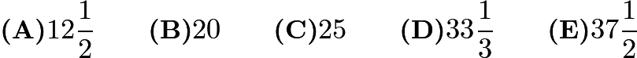

---

## Problem 8

Bag A has three chips labeled 1, 3, and 5. Bag B has three chips labeled 2, 4, and 6. If one chip is drawn from each bag, how many different values are possible for the sum of the two numbers on the chips?
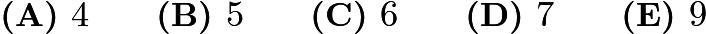

---

## Problem 9

Carmen takes a long bike ride on a hilly highway. The graph indicates the miles traveled during the time of her ride. What is Carmen's average speed for her entire ride in miles per hour?
![[asy] import graph; size(8.76cm); real lsf=0.5; pen dps=linewidth(0.7)+fontsize(10); defaultpen(dps); pen ds=black; real xmin=-3.58,xmax=10.19,ymin=-4.43,ymax=9.63;  draw((0,0)--(0,8)); draw((0,0)--(8,0)); draw((0,1)--(8,1)); draw((0,2)--(8,2)); draw((0,3)--(8,3)); draw((0,4)--(8,4)); draw((0,5)--(8,5)); draw((0,6)--(8,6)); draw((0,7)--(8,7)); draw((1,0)--(1,8)); draw((2,0)--(2,8)); draw((3,0)--(3,8)); draw((4,0)--(4,8)); draw((5,0)--(5,8)); draw((6,0)--(6,8)); draw((7,0)--(7,8)); label("$1$",(0.95,-0.24),SE*lsf); label("$2$",(1.92,-0.26),SE*lsf); label("$3$",(2.92,-0.31),SE*lsf); label("$4$",(3.93,-0.26),SE*lsf); label("$5$",(4.92,-0.27),SE*lsf); label("$6$",(5.95,-0.29),SE*lsf); label("$7$",(6.94,-0.27),SE*lsf); label("$5$",(-0.49,1.22),SE*lsf); label("$10$",(-0.59,2.23),SE*lsf); label("$15$",(-0.61,3.22),SE*lsf); label("$20$",(-0.61,4.23),SE*lsf); label("$25$",(-0.59,5.22),SE*lsf); label("$30$",(-0.59,6.2),SE*lsf); label("$35$",(-0.56,7.18),SE*lsf); draw((0,0)--(1,1),linewidth(1.6)); draw((1,1)--(2,3),linewidth(1.6)); draw((2,3)--(4,4),linewidth(1.6)); draw((4,4)--(7,7),linewidth(1.6)); label("HOURS",(3.41,-0.85),SE*lsf); label("M",(-1.39,5.32),SE*lsf); label("I",(-1.34,4.93),SE*lsf); label("L",(-1.36,4.51),SE*lsf); label("E",(-1.37,4.11),SE*lsf); label("S",(-1.39,3.7),SE*lsf);  clip((xmin,ymin)--(xmin,ymax)--(xmax,ymax)--(xmax,ymin)--cycle);[/asy]](images/2011/b7b1eec1082e610840acfb54c74952d80d4dc7a3.png)
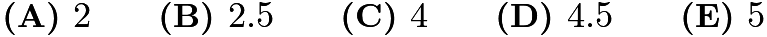

---

## Problem 10

The taxi fare in Gotham City is $2.40 for the first
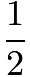
mile and additional mileage charged at the rate $0.20 for each additional 0.1 mile. You plan to give the driver a $2 tip. How many miles can you ride for $10?
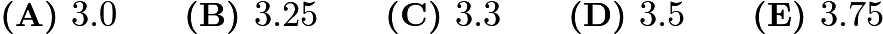

---

## Problem 11

The graph shows the number of minutes studied by both Asha (black bar) and Sasha (grey bar) in one week. On the average, how many more minutes per day did Sasha study than Asha?
![[asy] size(300); real i; defaultpen(linewidth(0.8)); draw((0,140)--origin--(220,0)); for(i=1;i<13;i=i+1) { draw((0,10*i)--(220,10*i)); } label("$0$",origin,W); label("$20$",(0,20),W); label("$40$",(0,40),W); label("$60$",(0,60),W); label("$80$",(0,80),W); label("$100$",(0,100),W); label("$120$",(0,120),W); path MonD=(20,0)--(20,60)--(30,60)--(30,0)--cycle,MonL=(30,0)--(30,70)--(40,70)--(40,0)--cycle,TuesD=(60,0)--(60,90)--(70,90)--(70,0)--cycle,TuesL=(70,0)--(70,80)--(80,80)--(80,0)--cycle,WedD=(100,0)--(100,100)--(110,100)--(110,0)--cycle,WedL=(110,0)--(110,120)--(120,120)--(120,0)--cycle,ThurD=(140,0)--(140,80)--(150,80)--(150,0)--cycle,ThurL=(150,0)--(150,110)--(160,110)--(160,0)--cycle,FriD=(180,0)--(180,70)--(190,70)--(190,0)--cycle,FriL=(190,0)--(190,50)--(200,50)--(200,0)--cycle; fill(MonD,black); fill(MonL,grey); fill(TuesD,black); fill(TuesL,grey); fill(WedD,black); fill(WedL,grey); fill(ThurD,black); fill(ThurL,grey); fill(FriD,black); fill(FriL,grey); draw(MonD^^MonL^^TuesD^^TuesL^^WedD^^WedL^^ThurD^^ThurL^^FriD^^FriL); label("M",(30,-5),S); label("Tu",(70,-5),S); label("W",(110,-5),S); label("Th",(150,-5),S); label("F",(190,-5),S); label("M",(-25,85),W); label("I",(-27,75),W); label("N",(-25,65),W); label("U",(-25,55),W); label("T",(-25,45),W); label("E",(-25,35),W); label("S",(-26,25),W);[/asy]](images/2011/9ad674e2f4cda6e96405994fb0d15130809d1606.png)
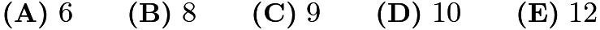

---

## Problem 12

Angie, Bridget, Carlos, and Diego are seated at random around a square table, one person to a side. What is the probability that Angie and Carlos are seated opposite each other?
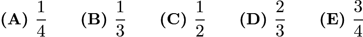

---

## Problem 13

Two congruent squares,

and
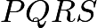
, have side length

. They overlap to form the

by

rectangle

shown. What percent of the area of rectangle

is shaded?
![[asy] filldraw((0,0)--(25,0)--(25,15)--(0,15)--cycle,white,black); label("D",(0,0),S); label("R",(25,0),S); label("Q",(25,15),N); label("A",(0,15),N); filldraw((10,0)--(15,0)--(15,15)--(10,15)--cycle,mediumgrey,black); label("S",(10,0),S); label("C",(15,0),S); label("B",(15,15),N); label("P",(10,15),N);[/asy]](images/2011/236d17f1bb6b7c18318444d3cce64f632976b385.png)
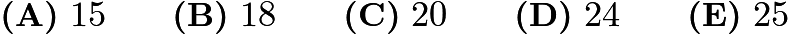

---

## Problem 14

There are
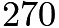
students at Colfax Middle School, where the ratio of boys to girls is
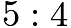
. There are

students at Winthrop Middle School, where the ratio of boys to girls is
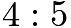
. The two schools hold a dance and all students from both schools attend. What fraction of the students at the dance are girls?
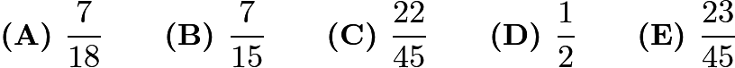

---

## Problem 15

How many digits are in the product
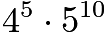
?
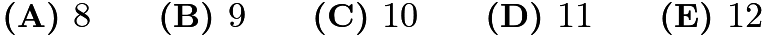

---

## Problem 16

Let

be the area of the triangle with sides of length
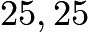
, and

. Let

be the area of the triangle with sides of length
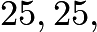
and

. What is the relationship between

and

?
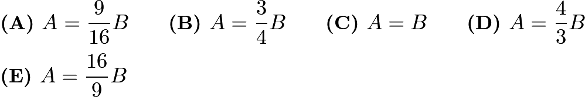

---

## Problem 17

Let

,

,

, and
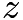
be whole numbers. If
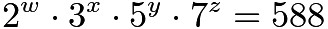
, then what does
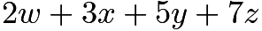
equal?
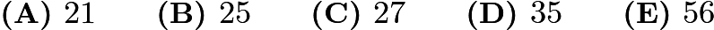

---

## Problem 18

A fair 6-sided die is rolled twice. What is the probability that the first number that comes up is greater than or equal to the second number?
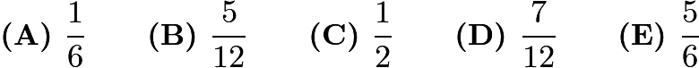

---

## Problem 19

How many rectangles are in this figure?
![[asy] pair A,B,C,D,E,F,G,H,I,J,K,L; A=(0,0); B=(20,0); C=(20,20); D=(0,20); draw(A--B--C--D--cycle); E=(-10,-5); F=(13,-5); G=(13,5); H=(-10,5); draw(E--F--G--H--cycle); I=(10,-20); J=(18,-20); K=(18,13); L=(10,13); draw(I--J--K--L--cycle);[/asy]](images/2011/7111cf9af97b6671111a8bda634b2877ecb06289.png)

---

## Problem 20

Quadrilateral

is a trapezoid,
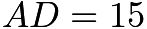
,

,

, and the altitude is
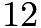
. What is the area of the trapezoid?
![[asy] pair A,B,C,D; A=(3,20); B=(35,20); C=(47,0); D=(0,0); draw(A--B--C--D--cycle); dot((0,0)); dot((3,20)); dot((35,20)); dot((47,0)); label("A",A,N); label("B",B,N); label("C",C,S); label("D",D,S); draw((19,20)--(19,0)); dot((19,20)); dot((19,0)); draw((19,3)--(22,3)--(22,0)); label("12",(21,10),E); label("50",(19,22),N); label("15",(1,10),W); label("20",(41,12),E);[/asy]](images/2011/a5bd7719b521c33191726670908546d54161aeda.png)

---

## Problem 21

Students guess that Norb's age is
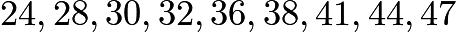
, and
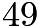
. Norb says, "At least half of you guessed too low, two of you are off by one, and my age is a prime number." How old is Norb?
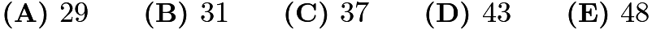

---

## Problem 22

What is the
tens
digit of
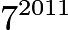
?
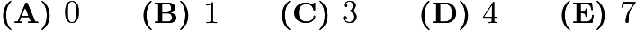

---

## Problem 23

How many 4-digit positive integers have four different digits, where the leading digit is not zero, the integer is a multiple of 5, and 5 is the largest digit?
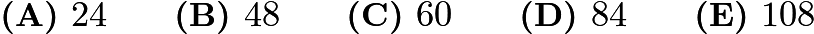

---

## Problem 24

In how many ways can 10001 be written as the sum of two primes?
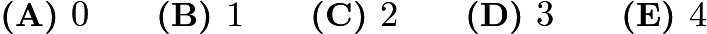

---

## Problem 25

A circle with radius

is inscribed in a square and circumscribed about another square as shown. Which fraction is closest to the ratio of the circle's shaded area to the area between the two squares?
![[asy] filldraw((-1,-1)--(-1,1)--(1,1)--(1,-1)--cycle,gray,black); filldraw(Circle((0,0),1), mediumgray,black); filldraw((-1,0)--(0,1)--(1,0)--(0,-1)--cycle,white,black);[/asy]](images/2011/ec1e342aed303af8799c42492f077aab15037276.png)
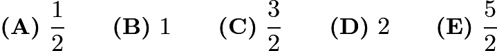

---

