# AMC 8 2012 Problems

## Problem 1

Rachelle uses

pounds of meat to make

hamburgers for her family. How many pounds of meat does she need to make

hamburgers for a neighborhood picnic?
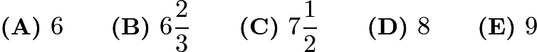

---

## Problem 2

In the country of East Westmore, statisticians estimate there is a baby born every

hours and a death every day. To the nearest hundred, how many people are added to the population of East Westmore each year?

---

## Problem 3

On February 13

listed the length of daylight as 10 hours and 24 minutes, the sunrise was

, and the sunset as

. The length of daylight and sunrise were correct, but the sunset was wrong. When did the sun really set?

---

## Problem 4

Peter's family ordered a 12-slice pizza for dinner. Peter ate one slice and shared another slice equally with his brother Paul. What fraction of the pizza did Peter eat?
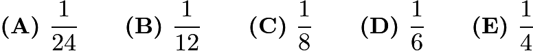

---

## Problem 5

In the diagram, all angles are right angles and the lengths of the sides are given in centimeters. Note that the diagram is not drawn to scale. What is the length of

,  in centimeters?
![[asy] pair A,B,C,D,E,F,G,H,I,J,K,L,M,N,O,P,Q,R; A=(4,0); B=(7,0); C=(7,4); D=(8,4); E=(8,5); F=(10,5); G=(10,7); H=(7,7); I=(7,8); J=(5,8); K=(5,7); L=(4,7); M=(4,6); N=(0,6); O=(0,5); P=(2,5); Q=(2,3); R=(4,3); draw(A--B--C--D--E--F--G--H--I--J--K--L--M--N--O--P--Q--R--cycle); label("$X$",(3.4,1.5)); label("6",(7.6,1.5)); label("1",(7.6,3.5)); label("1",(8.4,4.6)); label("2",(9.4,4.6)); label("2",(10.4,6)); label("3",(8.4,7.4)); label("1",(7.5,7.8)); label("2",(6,8.5)); label("1",(4.7,7.8)); label("1",(4.3,7.5)); label("1",(3.5,6.5)); label("4",(1.8,6.5)); label("1",(-0.5,5.5)); label("2",(0.8,4.5)); label("2",(1.5,3.8)); label("2",(2.8,2.6));[/asy]](images/2012/bcd57a9d78159bce4d3873f81f5d879beaed1d5a.png)

---

## Problem 6

A rectangular photograph is placed in a frame that forms a border two inches wide on all sides of the photograph. The photograph measures 8 inches high and 10 inches wide. What is the area of the border, in square inches?

---

## Problem 7

Isabella must take four 100-point tests in her math class. Her goal is to achieve an average grade of 95 on the tests. Her first two test scores were 97 and 91. After seeing her score on the third test, she realized she can still reach her goal. What is the lowest possible score she could have made on the third test?

---

## Problem 8

A shop advertises everything is "half price in today's sale." In addition, a coupon gives a 20% discount on sale prices. Using the coupon, the price today represents what percentage off the original price?

---

## Problem 9

The Fort Worth Zoo has a number of two-legged birds and a number of four-legged mammals. On one visit to the zoo, Margie counted 200 heads and 522 legs. How many of the animals that Margie counted were two-legged birds?

---

## Problem 10

How many 4-digit numbers greater than 1000 are there that use the four digits of 2012?

---

## Problem 11

The mean, median, and unique mode of the positive integers 3, 4, 5, 6, 6, 7, and

are all equal. What is the value of

?

---

## Problem 12

What is the units digit (ones place digit) of

?

---

## Problem 13

Jamar bought some pencils costing more than a penny each at the school bookstore and paid

. Sharona bought some of the same pencils and paid

. How many more pencils did Sharona buy than Jamar?

---

## Problem 14

In the BIG N, a middle school football conference, each team plays every other team exactly once. If a total of 21 conference games were played during the 2012 season, how many teams were members of the BIG N conference?

---

## Problem 15

The smallest number greater than 2 that leaves a remainder of 2 when divided by 3, 4, 5, or 6 lies between what numbers?

---

## Problem 16

Each of the digits 0, 1, 2, 3, 4, 5, 6, 7, 8, and 9 is used only once to make two five-digit numbers so that they have the largest possible sum. Which of the following could be one of the numbers?

---

## Problem 17

A square with integer side length is cut into 10 squares, all of which have integer side length and at least 8 of which have area 1. What is the smallest possible value of the length of the side of the original square?

---

## Problem 18

What is the smallest positive integer that is neither prime nor square and that has no prime factor less than 50?

---

## Problem 19

In a jar of red, green, and blue marbles, all but 6 are red marbles, all but 8 are green, and all but 4 are blue. How many marbles are in the jar?

---

## Problem 20

What is the correct ordering of the three numbers
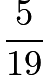
,
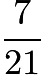
, and
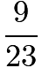
, in increasing order?
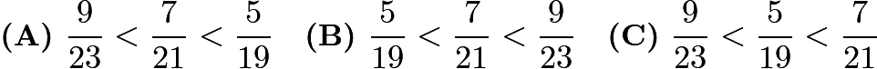
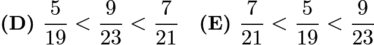

---

## Problem 21

Marla has a large white cube that has an edge of 10 feet. She also has enough green paint to cover 300 square feet. Marla uses all the paint to create a white square centered on each face, surrounded by a green border. What is the area of one of the white squares, in square feet?
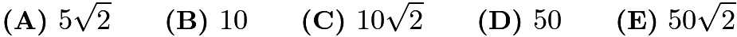

---

## Problem 22

Let

be a set of nine distinct integers. Six of the elements are 2, 3, 4, 6, 9, and 14. What is the number of possible values of the median of

?

---

## Problem 23

An equilateral triangle and a regular hexagon have equal perimeters. If the area of the triangle is 4, what is the area of the hexagon?
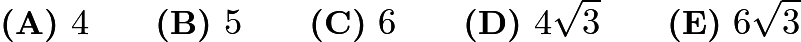

---

## Problem 24

A circle of radius 2 is cut into four congruent arcs. The four arcs are joined to form the star figure shown. What is the ratio of the area of the star figure to the area of the original circle?
![[asy] size(0,50); draw((-1,1)..(-2,2)..(-3,1)..(-2,0)..cycle); dot((-1,1)); dot((-2,2)); dot((-3,1)); dot((-2,0)); draw((1,0){up}..{left}(0,1)); dot((1,0)); dot((0,1)); draw((0,1){right}..{up}(1,2)); dot((1,2)); draw((1,2){down}..{right}(2,1)); dot((2,1)); draw((2,1){left}..{down}(1,0));[/asy]](images/2012/4fe4633986b1f264beb80f6015661aef00c4f803.png)
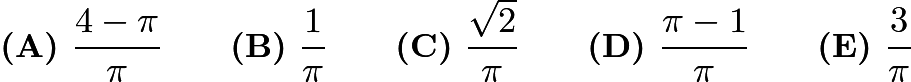

---

## Problem 25

A square with area 4 is inscribed in a square with area 5, with one vertex of the smaller square on each side of the larger square. A vertex of the smaller square divides a side of the larger square into two segments, one of length

, and the other of length

. What is the value of

?
![[asy] draw((0,2)--(2,2)--(2,0)--(0,0)--cycle); draw((0,0.3)--(0.3,2)--(2,1.7)--(1.7,0)--cycle); label("$a$",(-0.1,0.15)); label("$b$",(-0.1,1.15));[/asy]](images/2012/3d4cdd3dbcabe3dc76b806d60b785416afc65f11.png)
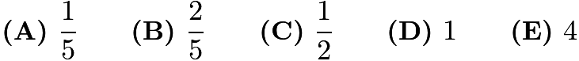

---

