# AMC 8 2013 Problems

## Problem 1

Danica wants to arrange her model cars in rows with exactly 6 cars in each row. She now has 23 model cars. What is the smallest number of additional cars she must buy in order to be able to arrange all her cars this way?

---

## Problem 2

A sign at the fish market says, "50% off, today only: half-pound packages for just $3 per package." What is the regular price for a full pound of fish, in dollars? (Assume that there are no deals for bulk)

---

## Problem 3

What is the value of

?

---

## Problem 4

Eight friends ate at a restaurant and agreed to share the bill equally. Because Judi forgot her money, each of her seven friends paid an extra $2.50 to cover her portion of the total bill. What was the total bill?

---

## Problem 5

Hammie is in the
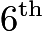
grade and weighs 106 pounds. Her quadruplet sisters are tiny babies and weigh 5, 5, 6, and 8 pounds. Which is greater, the average (mean) weight of these five children or the median weight, and by how many pounds?

---

## Problem 6

The number in each box below is the product of the numbers in the two boxes that touch it in the row above. For example,
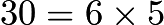
. What is the missing number in the top row?
![[asy] unitsize(0.8cm); draw((-1,0)--(1,0)--(1,-2)--(-1,-2)--cycle); draw((-2,0)--(0,0)--(0,2)--(-2,2)--cycle); draw((0,0)--(2,0)--(2,2)--(0,2)--cycle); draw((-3,2)--(-1,2)--(-1,4)--(-3,4)--cycle); draw((-1,2)--(1,2)--(1,4)--(-1,4)--cycle); draw((1,2)--(1,4)--(3,4)--(3,2)--cycle); label("600",(0,-1)); label("30",(-1,1)); label("6",(-2,3)); label("5",(0,3)); [/asy]](images/2013/6ff959a8ad5edfb7806895cbf5fa087e79899f3f.png)
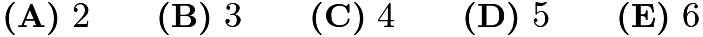

---

## Problem 7

Trey and his mom stopped at a railroad crossing to let a train pass. As the train began to pass, Trey counted 6 cars in the first 10 seconds. It took the train 2 minutes and 45 seconds to clear the crossing at a constant speed. Which of the following was the most likely number of cars in the train?

---

## Problem 8

A fair coin is tossed 3 times. What is the probability of at least two consecutive heads?
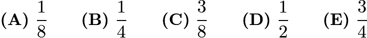

---

## Problem 9

The Incredible Hulk can double the distance it jumps with each succeeding jump. If its first jump is 1 meter, the second jump is 2 meters, the third jump is 4 meters, and so on, then on which jump will it first be able to jump more than 1 kilometer?
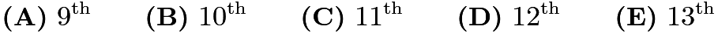

---

## Problem 10

What is the ratio of the least common multiple of 180 and 594 to the greatest common factor of 180 and 594?

---

## Problem 11

Ted's grandfather used his treadmill on 3 days this week. He went 2 miles each day. On Monday he jogged at a speed of 5 miles per hour. He walked at the rate of 3 miles per hour on Wednesday and at 4 miles per hour on Friday. If Grandfather had always walked at 4 miles per hour, he would have spent less time on the treadmill. How many minutes less?

---

## Problem 12

At the 2013 Winnebago County Fair a vendor is offering a "fair special" on sandals. If you buy one pair of sandals at the regular price of

, you get a second pair at a 40% discount, and a third pair at half the regular price. Javier took advantage of the "fair special" to buy three pairs of sandals. What percentage of the 150 dollar regular price did he save?

---

## Problem 13

When Clara totaled her scores, she inadvertently reversed the units digit and the tens digit of one score. By which of the following might her incorrect sum have differed from the correct one?

---

## Problem 14

Abe holds 1 green and 1 red jelly bean in his hand. Bob holds 1 green, 1 yellow, and 2 red jelly beans in his hand. Each randomly picks a jelly bean to show the other. What is the probability that the colors match?
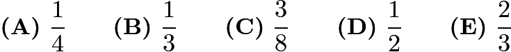

---

## Problem 15

If

,
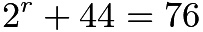
, and
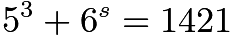
, what is the product of
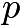
,

, and

?

---

## Problem 16

A number of students from Fibonacci Middle School are taking part in a community service project. The ratio of

-graders to

-graders is
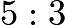
, and the ratio of

-graders to
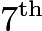
-graders is
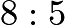
. What is the smallest number of students that could be participating in the project?

---

## Problem 17

The sum of six consecutive positive integers is 2013. What is the largest of these six integers?

---

## Problem 18

Isabella uses one-foot cubical blocks to build a rectangular fort that is 12 feet long, 10 feet wide, and 5 feet high. The floor and the four walls are all one foot thick. How many blocks does the fort contain?
![[asy] import three; size(3inch); currentprojection=orthographic(-8,15,15); triple A,B,C,D,E,F,G,H,I,J,K,L,M,N,O,P; A = (0,0,0); B = (0,10,0); C = (12,10,0); D = (12,0,0); E = (0,0,5); F = (0,10,5); G = (12,10,5); H = (12,0,5); I = (1,1,1); J = (1,9,1); K = (11,9,1); L = (11,1,1); M = (1,1,5); N = (1,9,5); O = (11,9,5); P = (11,1,5); //outside box far draw(surface(A--B--C--D--cycle),white,nolight); draw(A--B--C--D--cycle); draw(surface(E--A--D--H--cycle),white,nolight); draw(E--A--D--H--cycle); draw(surface(D--C--G--H--cycle),white,nolight); draw(D--C--G--H--cycle); //inside box far draw(surface(I--J--K--L--cycle),white,nolight); draw(I--J--K--L--cycle); draw(surface(I--L--P--M--cycle),white,nolight); draw(I--L--P--M--cycle); draw(surface(L--K--O--P--cycle),white,nolight); draw(L--K--O--P--cycle); //inside box near draw(surface(I--J--N--M--cycle),white,nolight); draw(I--J--N--M--cycle); draw(surface(J--K--O--N--cycle),white,nolight); draw(J--K--O--N--cycle); //outside box near draw(surface(A--B--F--E--cycle),white,nolight); draw(A--B--F--E--cycle); draw(surface(B--C--G--F--cycle),white,nolight); draw(B--C--G--F--cycle); //top draw(surface(E--H--P--M--cycle),white,nolight); draw(surface(E--M--N--F--cycle),white,nolight); draw(surface(F--N--O--G--cycle),white,nolight); draw(surface(O--G--H--P--cycle),white,nolight); draw(M--N--O--P--cycle); draw(E--F--G--H--cycle); label("10",(A--B),SE); label("12",(C--B),SW); label("5",(F--B),W);[/asy]](images/2013/64b7e0744817140d045970a04dd92366fc71de37.png)

---

## Problem 19

Bridget, Cassie, and Hannah are discussing the results of their last math test. Hannah shows Bridget and Cassie her test, but Bridget and Cassie don't show theirs to anyone. Cassie says, 'I didn't get the lowest score in our class,' and Bridget adds, 'I didn't get the highest score.' What is the ranking of the three girls from the highest score to the lowest score?

---

## Problem 20

A

rectangle is inscribed in a semicircle with longer side on the diameter. What is the area of the semicircle?
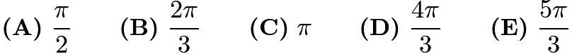

---

## Problem 21

Samantha lives 2 blocks west and 1 block south of the southwest corner of City Park. Her school is 2 blocks east and 2 blocks north of the northeast corner of City Park. On school days she bikes on streets to the southwest corner of City Park, then takes a diagonal path through the park to the northeast corner, and then bikes on streets to school. If her route is as short as possible, how many different routes can she take?

---

## Problem 22

Toothpicks are used to make a grid that is 60 toothpicks long and 32 toothpicks wide. How many toothpicks are used altogether?
![[asy] picture corner; draw(corner,(5,0)--(35,0)); draw(corner,(0,-5)--(0,-35)); for (int i=0; i<3; ++i) { for (int j=0; j>-2; --j) { if ((i-j)<3) { add(corner,(50i,50j)); } } } draw((5,-100)--(45,-100)); draw((155,0)--(185,0),dotted); draw((105,-50)--(135,-50),dotted); draw((100,-55)--(100,-85),dotted); draw((55,-100)--(85,-100),dotted); draw((50,-105)--(50,-135),dotted); draw((0,-105)--(0,-135),dotted); [/asy]](images/2013/9cdf66bc220448244c86ecf00447cd8a3b65b24d.png)
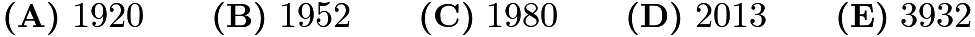

---

## Problem 23

Angle

of

is a right angle. The sides of

are the diameters of semicircles as shown. The area of the semicircle on

equals

, and the arc of the semicircle on

has length
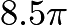
. What is the radius of the semicircle on

?
![[asy] import graph; pair A,B,C; A=(0,8); B=(0,0); C=(15,0); draw((0,8)..(-4,4)..(0,0)--(0,8)); draw((0,0)..(7.5,-7.5)..(15,0)--(0,0)); real theta = aTan(8/15); draw(arc((15/2,4),17/2,-theta,180-theta)); draw((0,8)--(15,0)); dot(A); dot(B); dot(C); label("$A$", A, NW); label("$B$", B, SW); label("$C$", C, SE);[/asy]](images/2013/2624acb19756f1b697f71413e9840070908905da.png)

---

## Problem 24

Squares

,

, and

are equal in area. Points

and

are the midpoints of sides

and

, respectively. What is the ratio of the area of the shaded pentagon

to the sum of the areas of the three squares?
![[asy] pair A,B,C,D,E,F,G,H,I,J;  A = (0.5,2); B = (1.5,2); C = (1.5,1); D = (0.5,1); E = (0,1); F = (0,0); G = (1,0); H = (1,1); I = (2,1); J = (2,0);  draw(A--B);  draw(C--B);  draw(D--A);   draw(F--E);  draw(I--J);  draw(J--F);  draw(G--H);  draw(A--J);  filldraw(A--B--C--I--J--cycle,grey); draw(E--I); label("$A$", A, NW); label("$B$", B, NE); label("$C$", C, NE); label("$D$", D, NW); label("$E$", E, NW); label("$F$", F, SW); label("$G$", G, S); label("$H$", H, N); label("$I$", I, NE); label("$J$", J, SE); [/asy]](images/2013/fba537995d130b17a771855c766afe6338cb3e41.png)
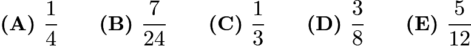

---

## Problem 25

A ball with diameter 4 inches starts at point A to roll along the track shown. The track is comprised of 3 semicircular arcs whose radii are

inches,
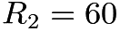
inches, and

inches, respectively. The ball always remains in contact with the track and does not slip. What is the distance the center of the ball travels over the course from A to B?
![[asy] pair A,B; size(8cm); A=(0,0); B=(480,0); draw((0,0)--(480,0),linetype("3 4")); filldraw(circle((8,0),8),black); draw((0,0)..(100,-100)..(200,0)); draw((200,0)..(260,60)..(320,0)); draw((320,0)..(400,-80)..(480,0)); draw((100,0)--(150,-50sqrt(3)),Arrow(size=4)); draw((260,0)--(290,30sqrt(3)),Arrow(size=4)); draw((400,0)--(440,-40sqrt(3)),Arrow(size=4)); label("$A$", A, SW); label("$B$", B, SE); label("$R_1$", (100,-40), W); label("$R_2$", (260,40), SW); label("$R_3$", (400,-40), W);[/asy]](images/2013/3ac0f4254d038847d9ee52d724bc0df18b1b1df4.png)
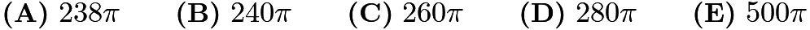

---

