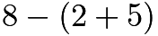
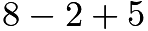
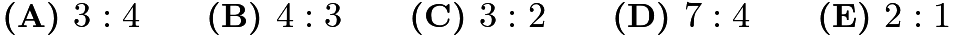
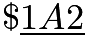
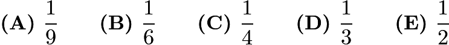
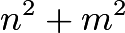
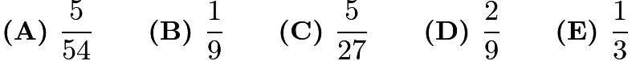
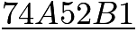
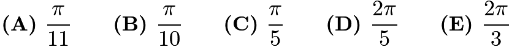

# AMC 8 2014 Problems

## Problem 1

Harry and Terry are each told to calculate

. Harry gets the correct answer. Terry ignores the parentheses and calculates

. If Harry's answer is

and Terry's answer is

, what is

?

---

## Problem 2

Paul owes Paula 35 cents and has a pocket full of 5-cent coins, 10-cent coins, and 25-cent coins that he can use to pay her. What is the difference between the largest and the smallest number of coins he can use to pay her?

---

## Problem 3

Isabella had a week to read a book for a school assignment. She read an average of 36 pages per day for the first three days and an average of 44 pages per day for the next three days. She then finished the book by reading 10 pages on the last day. How many pages were in the book?

---

## Problem 4

The sum of two prime numbers is 85. What is the product of these two prime numbers?

---

## Problem 5

Margie's car can go 32 miles on a gallon of gas, and gas currently costs $4 per gallon. How many miles can Margie drive on $20?

---

## Problem 6

Six rectangles each with a common base width of 2 have lengths of 1, 4, 9, 16, 25, and 36. What is the sum of the areas of the six rectangles?

---

## Problem 7

There are four more girls than boys in Ms. Raub's class of 28 students. What is the ratio of number of girls to the number of boys in her class?

---

## Problem 8

Eleven members of the Middle School Math Club each paid the same integer amount for a guest speaker to talk about problem solving at their math club meeting. In all, they paid their guest speaker

. What is the missing digit A of this 3-digit number?

---

## Problem 9

In

,

is a point on side

such that

and

measures

. What is the degree measure of

?
![[asy]  size(300); defaultpen(linewidth(0.8)); pair A=(-1,0),C=(1,0),B=dir(40),D=origin; draw(A--B--C--A); draw(D--B); dot("$A$", A, SW); dot("$B$", B, NE); dot("$C$", C, SE); dot("$D$", D, S); label("$70^\circ$",C,2*dir(180-35));[/asy]](images/2014/379c94f92980cbdf3ee7fc1dda348ddf50ca17f7.png)

---

## Problem 10

The first AMC 8 was given in 1985 and it has been given annually since that time. Samantha turned 12 years old the year that she took the seventh AMC 8. In what year was Samantha born?

---

## Problem 11

Jack wants to bike from his house to Jill's house, which is located three blocks east and two blocks north of Jack's house. After biking each block, Jack can continue either east or north, but he needs to avoid a dangerous intersection one block east and one block north of his house. In how many ways can he reach Jill's house by biking a total of five blocks?

---

## Problem 12

A magazine printed photos of three celebrities along with three photos of the celebrities as babies. The baby pictures did not identify the celebrities. Readers were asked to match each celebrity with the correct baby pictures. What is the probability that a reader guessing at random will match all three correctly as a fraction?

---

## Problem 13

If

and

are integers and

is even, which of the following is impossible?

---

## Problem 14

Rectangle

and right triangle

have the same area. They are joined to form a trapezoid, as shown. What is

?
![[asy] size(250); defaultpen(linewidth(0.8)); pair A=(0,5),B=origin,C=(6,0),D=(6,5),E=(18,0); draw(A--B--E--D--cycle^^C--D); draw(rightanglemark(D,C,E,30)); label("$A$",A,NW); label("$B$",B,SW); label("$C$",C,S); label("$D$",D,N); label("$E$",E,S); label("$5$",A/2,W); label("$6$",(A+D)/2,N); [/asy]](images/2014/c358884777664e69762bbb69b74c260349626ff4.png)

---

## Problem 15

The circumference of the circle with center

is divided into

equal arcs, marked the letters

through

as seen below. What is the number of degrees in the sum of the angles

and

?
![[asy] size(230); defaultpen(linewidth(0.65)); pair O=origin; pair[] circum = new pair[12]; string[] let = {"$A$","$B$","$C$","$D$","$E$","$F$","$G$","$H$","$I$","$J$","$K$","$L$"}; draw(unitcircle); for(int i=0;i<=11;i=i+1) { circum[i]=dir(120-30*i); dot(circum[i],linewidth(2.5)); label(let[i],circum[i],2*dir(circum[i])); } draw(O--circum[4]--circum[0]--circum[6]--circum[8]--cycle); label("$x$",circum[0],2.75*(dir(circum[0]--circum[4])+dir(circum[0]--circum[6]))); label("$y$",circum[6],1.75*(dir(circum[6]--circum[0])+dir(circum[6]--circum[8]))); label("$O$",O,dir(60)); [/asy]](images/2014/371f42726ae702ba57a0002d787f0e3c62767ec2.png)

---

## Problem 16

The "Middle School Eight" basketball conference has 8 teams. Every season, each team plays every other conference team twice (home and away), and each team also plays 4 games against non-conference opponents. What is the total number of games in a season involving the "Middle School Eight" teams?

---

## Problem 17

George walks

mile to school. He leaves home at the same time each day, walks at a steady speed of

miles per hour, and arrives just as school begins. Today he was distracted by the pleasant weather and walked the first

mile at a speed of only

miles per hour. At how many miles per hour must George run the last

mile in order to arrive just as school begins today?

---

## Problem 18

Four children were born at City Hospital yesterday. Assume each child is equally likely to be a boy or a girl. Which of the following outcomes is most likely?

All 4 are boys

All 4 are girls

2 are girls and 2 are boys

3 are of one gender and 1 is of the other gender

All of these outcomes are equally likely

---

## Problem 19

A cube with 3-inch edges is to be constructed from 27 smaller cubes with 1-inch edges. Twenty-one of the cubes are colored red and 6 are colored white. If the 3-inch cube is constructed to have the smallest possible white surface area showing, what fraction of the surface area is white?

---

## Problem 20

Rectangle

has sides

and

. A circle with a radius of

is centered at

, a circle with a radius of

is centered at

, and a circle with a radius of

is centered at

. Which of the following is closest to the area of the region inside the rectangle but outside all three circles?
![[asy] draw((0,0)--(5,0)--(5,3)--(0,3)--(0,0)); draw(Circle((0,0),1)); draw(Circle((0,3),2)); draw(Circle((5,3),3)); label("A",(0.2,0),W); label("B",(0.2,2.8),NW); label("C",(4.8,2.8),NE); label("D",(5,0),SE); label("5",(2.5,0),N); label("3",(5,1.5),E);[/asy]](images/2014/0a5cf23036c6f8baa2e09775cc716c2ef6913400.png)

---

## Problem 21

The 7-digit numbers

and

are each multiples of 3. Which of the following could be the value of

?

---

## Problem 22

A 2-digit number is such that the product of the digits plus the sum of the digits is equal to the number. What is the units digit of the number?

---

## Problem 23

Three members of the Euclid Middle School girls' softball team had the following conversation.
Ashley: I just realized that our uniform numbers are all 2-digit primes.
Bethany: And the sum of your two uniform numbers is the date of my birthday earlier this month.
Caitlin: That's funny. The sum of your two uniform numbers is the date of my birthday later this month.
Ashley: And the sum of your two uniform numbers is today's date.
What number does Caitlin wear?

---

## Problem 24

One day the Beverage Barn sold 252 cans of soda to 100 customers, and every customer bought at least one can of soda. What is the maximum possible median number of cans of soda bought per customer on that day?

---

## Problem 25

A straight one-mile stretch of highway, 40 feet wide, is closed. Robert rides his bike on a path composed of semicircles as shown. If he rides at 5 miles per hour, how many hours will it take to cover the one-mile stretch?
![[asy] size(10cm); pathpen=black; pointpen=black; D(arc((-2,0),1,300,360)); D(arc((0,0),1,0,180)); D(arc((2,0),1,180,360)); D(arc((4,0),1,0,180)); D(arc((6,0),1,180,240)); D((-1.5,-1)--(5.5,-1));[/asy]](images/2014/9bfd6c6da0e6dd2e44273638e505746be51e3021.png)
Note: 1 mile = 5280 feet!

---

