# AMC 8 2015 Problems

## Problem 1

How many square yards of carpet are required to cover a rectangular floor that is

feet long and

feet wide? (There are

feet in a yard.)
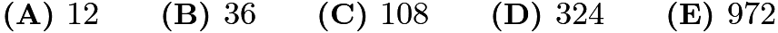

---

## Problem 2

Point

is the center of the regular octagon

, and

is the midpoint of the side

What fraction of the area of the octagon is shaded?
![[asy] pair A,B,C,D,E,F,G,H,O,X; A=dir(45); B=dir(90); C=dir(135); D=dir(180); E=dir(-135); F=dir(-90); G=dir(-45); H=dir(0); O=(0,0); X=midpoint(A--B);  fill(X--B--C--D--E--O--cycle,rgb(0.75,0.75,0.75)); draw(A--B--C--D--E--F--G--H--cycle);  dot("$A$",A,dir(45)); dot("$B$",B,dir(90)); dot("$C$",C,dir(135)); dot("$D$",D,dir(180)); dot("$E$",E,dir(-135)); dot("$F$",F,dir(-90)); dot("$G$",G,dir(-45)); dot("$H$",H,dir(0)); dot("$X$",X,dir(135/2)); dot("$O$",O,dir(0)); draw(E--O--X); [/asy]](images/2015/06635650c87a3cbd84380b9105fc49cc48e3792e.png)
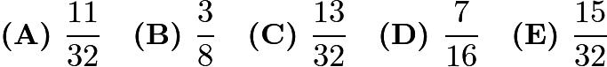

---

## Problem 3

Jack and Jill are going swimming at a pool that is one mile from their house. They leave home simultaneously. Jill rides her bicycle to the pool at a constant speed of

miles per hour. Jack walks to the pool at a constant speed of

miles per hour. How many minutes before Jack does Jill arrive?

---

## Problem 4

The Centerville Middle School chess team consists of two boys and three girls. A photographer wants to take a picture of the team to appear in the local newspaper. She decides to have them sit in a row with a boy at each end and the three girls in the middle. How many such arrangements are possible?

---

## Problem 5

Billy's basketball team scored the following points over the course of the first

games of the season:
![\[42, 47, 53, 53, 58, 58, 58, 61, 64, 65, 73\]](images/2015/4c24d4c07e2a72cf04fa5c16f6d7ec90faad13b5.png)
If his team scores 40 in the 12th game, which of the following statistics will show an increase?

---

## Problem 6

In

,

, and

. What is the area of

?

---

## Problem 7

Each of two boxes contains three chips numbered

,

,

. A chip is drawn randomly from each box and the numbers on the two chips are multiplied. What is the probability that their product is even?
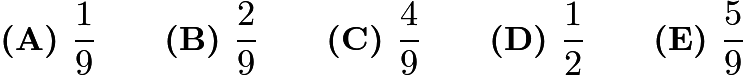

---

## Problem 8

What is the smallest whole number larger than the perimeter of any triangle with a side of length

and a side of length

？
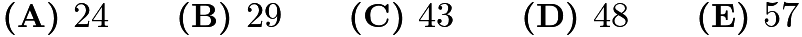

---

## Problem 9

On her first day of work, Janabel sold one widget. On day two, she sold three widgets. On day three, she sold five widgets, and on each succeeding day, she sold two more widgets than she had sold on the previous day. How many widgets in total had Janabel sold after working

days?

---

## Problem 10

How many integers between

and

have four distinct digits?

---

## Problem 11

In the small country of Mathland, all automobile license plates have four symbols. The first must be a vowel (
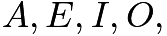
or

), the second and third must be two different letters among the

non-vowels, and the fourth must be a digit (

through

). If the symbols are chosen at random subject to these conditions, what is the probability that the plate will read "

"?
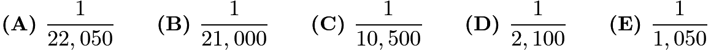

---

## Problem 12

How many pairs of parallel edges, such as
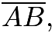
and

or
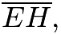
and
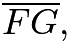
does a cube have?
![[asy] import three; currentprojection=orthographic(1/2,-1,1/2); /* three - currentprojection, orthographic */ draw((0,0,0)--(1,0,0)--(1,1,0)--(0,1,0)--cycle); draw((0,0,0)--(0,0,1)); draw((0,1,0)--(0,1,1)); draw((1,1,0)--(1,1,1)); draw((1,0,0)--(1,0,1));  draw((0,0,1)--(1,0,1)--(1,1,1)--(0,1,1)--cycle); label("$D$",(0,0,0),S); label("$A$",(0,0,1),N); label("$H$",(0,1,0),S); label("$E$",(0,1,1),N); label("$C$",(1,0,0),S); label("$B$",(1,0,1),N); label("$G$",(1,1,0),S); label("$F$",(1,1,1),N); [/asy]](images/2015/4405a1743b5fd0c6b01eced58489bb15d61aac2f.png)

---

## Problem 13

How many subsets of two elements can be removed from the set
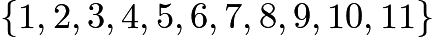
so that the mean (average) of the remaining numbers is

?

---

## Problem 14

Which of the following integers cannot be written as the sum of four consecutive odd integers?

---

## Problem 15

At Euler Middle School,
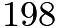
students voted on two issues in a school referendum with the following results:
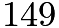
voted in favor of the first issue and

voted in favor of the second issue. If there were exactly

students who voted against both issues, how many students voted in favor of both issues?

---

## Problem 16

In a middle-school mentoring program, a number of the sixth graders are paired with a ninth-grade student as a buddy. No ninth grader is assigned more than one sixth-grade buddy. If
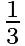
of all the ninth graders are paired with

of all the sixth graders, what fraction of the total number of sixth and ninth graders have a buddy?
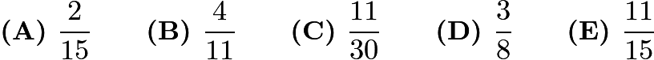

---

## Problem 17

Jeremy's father drives him to school in rush hour traffic in

minutes. One day, there is no traffic, so his father can drive him

miles per hour faster and gets him to school in

minutes. How far in miles is it to school?

---

## Problem 18

An arithmetic sequence is a sequence in which each term after the first is obtained by adding a constant to the previous term. For example,
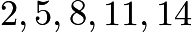
is an arithmetic sequence with five terms, in which the first term is

and the constant added is

. Each row and each column in this
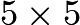
array is an arithmetic sequence with five terms. The square in the center is labelled

as shown. What is the value of

?
![[asy] size(3.85cm); label("$X$",(2.5,2.1),N); for (int i=0; i<=5; ++i) draw((i,0)--(i,5), linewidth(.5));  for (int j=0; j<=5; ++j) draw((0,j)--(5,j), linewidth(.5)); void draw_num(pair ll_corner, int num)  { label(string(num), ll_corner + (0.5, 0.5), p = fontsize(19pt)); }  draw_num((0,0), 17); draw_num((4, 0), 81);  draw_num((0, 4), 1);  draw_num((4,4), 25);   void foo(int x, int y, string n) { label(n, (x+0.5,y+0.5), p = fontsize(19pt)); }  foo(2, 4, " "); foo(3, 4, " "); foo(0, 3, " "); foo(2, 3, " "); foo(1, 2, " "); foo(3, 2, " "); foo(1, 1, " "); foo(2, 1, " "); foo(3, 1, " "); foo(4, 1, " "); foo(2, 0, " "); foo(3, 0, " "); foo(0, 1, " "); foo(0, 2, " "); foo(1, 0, " "); foo(1, 3, " "); foo(1, 4, " "); foo(3, 3, " "); foo(4, 2, " "); foo(4, 3, " ");   [/asy]](images/2015/b504cb3ebe3dce9a957520b3e34ea6bd957cfc3c.png)
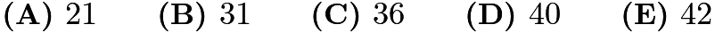

---

## Problem 19

A triangle with vertices as
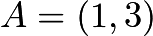
,
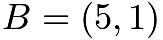
, and
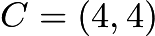
is plotted on a
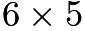
grid. What fraction of the grid is covered by the triangle?
![[asy]  draw((1,0)--(1,5),linewidth(.5)); draw((2,0)--(2,5),linewidth(.5)); draw((3,0)--(3,5),linewidth(.5)); draw((4,0)--(4,5),linewidth(.5)); draw((5,0)--(5,5),linewidth(.5)); draw((6,0)--(6,5),linewidth(.5)); draw((0,1)--(6,1),linewidth(.5)); draw((0,2)--(6,2),linewidth(.5)); draw((0,3)--(6,3),linewidth(.5)); draw((0,4)--(6,4),linewidth(.5)); draw((0,5)--(6,5),linewidth(.5));  draw((0,0)--(0,6),EndArrow); draw((0,0)--(7,0),EndArrow); draw((1,3)--(4,4)--(5,1)--cycle); label("$y$",(0,6),W); label("$x$",(7,0),S); label("$A$",(1,3),dir(210)); label("$B$",(5,1),SE); label("$C$",(4,4),dir(100)); [/asy]](images/2015/0326fb9b83a664bec4bab910587f802f51202267.png)
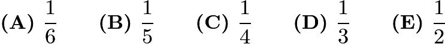

---

## Problem 20

Ralph went to the store and bought

pairs of socks for a total of
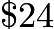
. Some of the socks he bought cost

a pair, some of the socks he bought cost
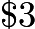
a pair, and some of the socks he bought cost
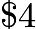
a pair. If he bought at least one pair of each type, how many pairs of

socks did Ralph buy?

---

## Problem 21

In the given figure hexagon

is equiangular,

and

are squares with areas

and

respectively,

is equilateral and

. What is the area of

?
![[asy] draw((-4,6*sqrt(2))--(4,6*sqrt(2))); draw((-4,-6*sqrt(2))--(4,-6*sqrt(2))); draw((-8,0)--(-4,6*sqrt(2))); draw((-8,0)--(-4,-6*sqrt(2))); draw((4,6*sqrt(2))--(8,0)); draw((8,0)--(4,-6*sqrt(2))); draw((-4,6*sqrt(2))--(4,6*sqrt(2))--(4,8+6*sqrt(2))--(-4,8+6*sqrt(2))--cycle); draw((-8,0)--(-4,-6*sqrt(2))--(-4-6*sqrt(2),-4-6*sqrt(2))--(-8-6*sqrt(2),-4)--cycle); label("$I$",(-4,8+6*sqrt(2)),dir(100)); label("$J$",(4,8+6*sqrt(2)),dir(80)); label("$A$",(-4,6*sqrt(2)),dir(280)); label("$B$",(4,6*sqrt(2)),dir(250)); label("$C$",(8,0),W); label("$D$",(4,-6*sqrt(2)),NW); label("$E$",(-4,-6*sqrt(2)),NE); label("$F$",(-8,0),E); draw((4,8+6*sqrt(2))--(4,6*sqrt(2))--(4+4*sqrt(3),4+6*sqrt(2))--cycle); label("$K$",(4+4*sqrt(3),4+6*sqrt(2)),E); draw((4+4*sqrt(3),4+6*sqrt(2))--(8,0),dashed); label("$H$",(-4-6*sqrt(2),-4-6*sqrt(2)),S); label("$G$",(-8-6*sqrt(2),-4),W); label("$32$",(-10,-8),N); label("$18$",(0,6*sqrt(2)+2),N); [/asy]](images/2015/f11d24db37ed085cbc452224454338f8eabdfb37.png)
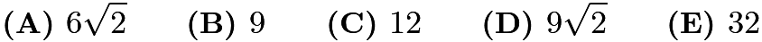

---

## Problem 22

On June

, a group of students are standing in rows, with

students in each row. On June

, the same group is standing with all of the students in one long row. On June

, the same group is standing with just one student in each row. On June

, the same group is standing with

students in each row. This process continues through June

with a different number of students per row each day. However, on June

, they cannot find a new way of organizing the students. What is the smallest possible number of students in the group?

---

## Problem 23

Tom has twelve slips of paper which he wants to put into five cups labeled

,

,

,

,

. He wants the sum of the numbers on the slips in each cup to be an integer. Furthermore, he wants the five integers to be consecutive and increasing from

to

. The numbers on the papers are
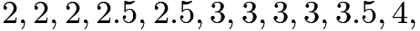
and
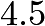
. If a slip with

goes into cup

and a slip with

goes into cup

, then the slip with
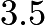
must go into what cup?
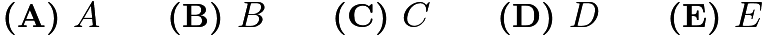

---

## Problem 24

A baseball league consists of two four-team divisions. Each team plays every other team in its division

games. Each team plays every team in the other division

games with

and
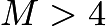
. Each team plays a
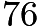
-game schedule. How many games does a team play within its own division?
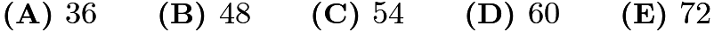

---

## Problem 25

One-inch squares are cut from the corners of this

inch square. What is the area in square inches of the largest square that can fit into the remaining space?
![[asy]  draw((0,0)--(0,5)--(5,5)--(5,0)--cycle); filldraw((0,4)--(1,4)--(1,5)--(0,5)--cycle, gray); filldraw((0,0)--(1,0)--(1,1)--(0,1)--cycle, gray); filldraw((4,0)--(4,1)--(5,1)--(5,0)--cycle, gray); filldraw((4,4)--(4,5)--(5,5)--(5,4)--cycle, gray);  [/asy]](images/2015/982db2bf33cb4d4ee824cf1f5eb3b856df66d084.png)
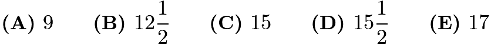

---

