# AMC 8 2016 Problems

## Problem 1

The longest professional tennis match lasted a total of 11 hours and 5 minutes. How many minutes is that?

---

## Problem 2

In rectangle

,
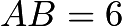
and

.  Point

is the midpoint of
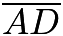
.  What is the area of

?
![[asy]draw((0,4)--(0,0)--(6,0)--(6,8)--(0,8)--(0,4)--(6,8)--(0,0)); label("$A$", (0,0), SW); label("$B$", (6, 0), SE); label("$C$", (6,8), NE); label("$D$", (0, 8), NW); label("$M$", (0, 4), W); label("$4$", (0, 2), W); label("$6$", (3, 0), S);[/asy]](images/2016/b5d7e3f5ecfd57e90e56a341f52fc4b9b93b2457.png)

---

## Problem 3

Four students take an exam. Three of their scores are

,

, and

. If the average of their four scores is

, then what is the remaining score??

---

## Problem 4

When Cheenu was a boy, he could run

miles in
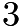
hours and

minutes. As an old man, he can now walk

miles in
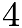
hours. How many minutes longer does it take for him to travel a mile now compared to when he was a boy?

---

## Problem 5

The number

is a two-digit number.
• When

is divided by

, the remainder is

.
• When

is divided by

, the remainder is

.
What is the remainder when

is divided by

?
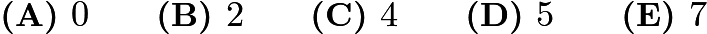

---

## Problem 6

The following bar graph represents the length (in letters) of the names of 19 people. What is the median length of these names?
![[asy] unitsize(0.9cm); draw((-0.5,0)--(10,0), linewidth(1.5)); draw((-0.5,1)--(10,1)); draw((-0.5,2)--(10,2)); draw((-0.5,3)--(10,3)); draw((-0.5,4)--(10,4)); draw((-0.5,5)--(10,5)); draw((-0.5,6)--(10,6)); draw((-0.5,7)--(10,7)); label("frequency",(-0.5,8)); label("0", (-1, 0)); label("1", (-1, 1)); label("2", (-1, 2)); label("3", (-1, 3)); label("4", (-1, 4)); label("5", (-1, 5)); label("6", (-1, 6)); label("7", (-1, 7)); filldraw((0,0)--(0,7)--(1,7)--(1,0)--cycle, black); filldraw((2,0)--(2,3)--(3,3)--(3,0)--cycle, black); filldraw((4,0)--(4,1)--(5,1)--(5,0)--cycle, black); filldraw((6,0)--(6,4)--(7,4)--(7,0)--cycle, black); filldraw((8,0)--(8,4)--(9,4)--(9,0)--cycle, black); label("3", (0.5, -0.5)); label("4", (2.5, -0.5)); label("5", (4.5, -0.5)); label("6", (6.5, -0.5)); label("7", (8.5, -0.5)); label("name length", (4.5, -1)); [/asy]](images/2016/7396694d92e8f9794065daafaf571852434d0b08.png)
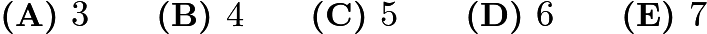

---

## Problem 7

Which of the following numbers is not a perfect square?

---

## Problem 8

Find the value of the expression:
![\[100-98+96-94+92-90+\cdots+8-6+4-2.\]](images/2016/027ea184e9e3fde749ba37eb702069fa8e201387.png)

---

## Problem 9

What is the sum of the distinct prime integer divisors of
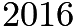
?
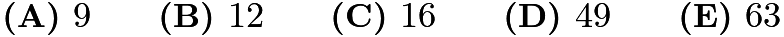

---

## Problem 10

Suppose that
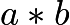
means
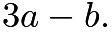
What is the value of
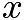
if
![\[2 * (5 * x)=1\]](images/2016/c2f6515e388e34fda66b684dcf2dc3b67ef1bc83.png)
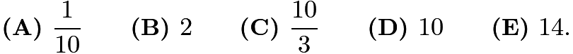

---

## Problem 11

Determine how many two-digit numbers satisfy the following property: when the number is added to the number obtained by reversing its digits, the sum is
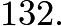
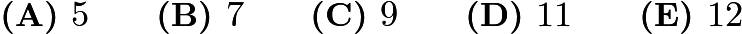

---

## Problem 12

Jefferson Middle School has the same number of boys and girls.

of the girls and
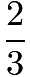
of the boys went on a field trip. What fraction of the students on the field trip were girls?
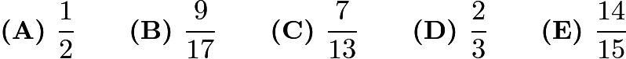

---

## Problem 13

Two different numbers are randomly selected from the set
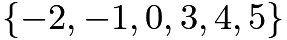
and multiplied together. What is the probability that the product is

?
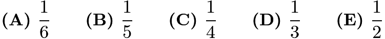

---

## Problem 14

Karl's car uses a gallon of gas every

miles, and his gas tank holds
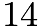
gallons when it is full. One day, Karl started with a full tank of gas, 
drove
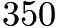
miles, bought

gallons of gas, and continued driving to his destination. When he arrived, his gas tank was half full. How many miles did Karl drive that day?
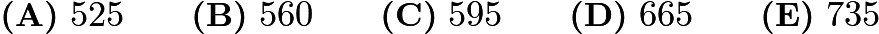

---

## Problem 15

What is the largest power of

that is a divisor of
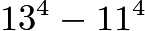
?
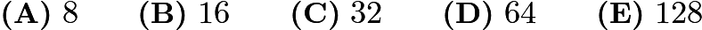

---

## Problem 16

Annie and Bonnie are running laps around a

-meter oval track. They started at the same time, at the same place, but Annie has pulled ahead because she runs

faster than Bonnie. How many laps will Annie have run when she first passes Bonnie?
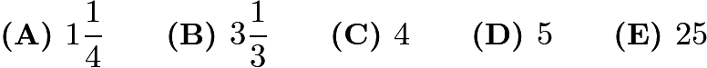

---

## Problem 17

An ATM password at Fred's Bank is composed of four digits from

to

, with repeated digits allowable. If no password may begin with the sequence
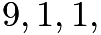
then how many passwords are possible?

---

## Problem 18

In an All-Area track meet,
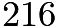
sprinters enter a
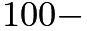
meter dash competition. The track has

lanes, so only

sprinters can compete at a time. At the end of each race, the five non-winners are eliminated, and the winner will compete again in a later race. How many races are needed to determine the champion sprinter?
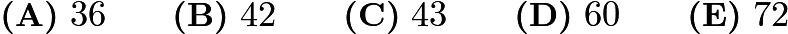

---

## Problem 19

The sum of

consecutive even integers is

. What is the largest of these

consecutive integers?
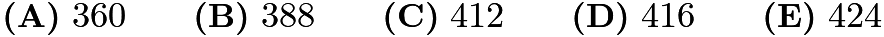

---

## Problem 20

The least common multiple of

and

is

, and the least common multiple of

and

is

. What is the least possible value of the least common multiple of

and

?

---

## Problem 21

A top hat contains 3 red chips and 2 green chips. Chips are drawn randomly, one at a time without replacement, until all 3 of the reds are drawn or until both green chips are drawn. What is the probability that the 3 reds are drawn?
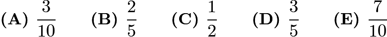

---

## Problem 22

Rectangle

below is a
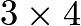
rectangle with

. What is the area of the "bat wings" (shaded region)?
![[asy] draw((0,0)--(3,0)--(3,4)--(0,4)--(0,0)--(2,4)--(3,0)); draw((3,0)--(1,4)--(0,0)); fill((0,0)--(1,4)--(1.5,3)--cycle, black); fill((3,0)--(2,4)--(1.5,3)--cycle, black); label("$A$",(3.05,4.2)); label("$B$",(2,4.2)); label("$C$",(1,4.2)); label("$D$",(0,4.2)); label("$E$", (0,-0.2)); label("$F$", (3,-0.2)); [/asy]](images/2016/7fd8455ce082d7e31a8c1ead67467b4bcf747e8d.png)
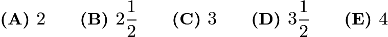

---

## Problem 23

Two congruent circles centered at points

and

each pass through the other circle's center. The line containing both

and

is extended to intersect the circles at points

and

. The circles intersect at two points, one of which is

. What is the degree measure of
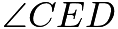
?

---

## Problem 24

The digits

,

,

,

, and

are each used once to write a five-digit number

. The three-digit number

is divisible by

, the three-digit number
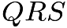
is divisible by

, and the three-digit number

is divisible by

. What is

?

---

## Problem 25

A semicircle is inscribed in an isosceles triangle with base

and height

so that the diameter of the semicircle is contained in the base of the triangle as shown. What is the radius of the semicircle?
![[asy]draw((0,0)--(8,15)--(16,0)--(0,0)); draw(arc((8,0),7.0588,0,180));[/asy]](images/2016/585fca3c7a910c5787429738a441c0c2accc394d.png)
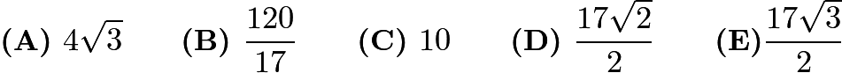

---

