# AMC 8 2017 Problems

## Problem 1

Which of the following values is the largest?
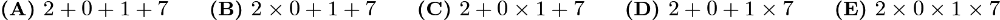

---

## Problem 2

Alicia, Brenda, and Colby were the candidates in a recent election for student president. The pie chart below shows how the votes were distributed among the three candidates. If Brenda received
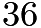
votes, then how many votes were cast all together?
![[asy] draw((-1,0)--(0,0)--(0,1)); draw((0,0)--(0.309, -0.951)); filldraw(arc((0,0), (0,1), (-1,0))--(0,0)--cycle, lightgray); filldraw(arc((0,0), (0.309, -0.951), (0,1))--(0,0)--cycle, gray); draw(arc((0,0), (-1,0), (0.309, -0.951))); label("Colby", (-0.5, 0.5)); label("25\%", (-0.5, 0.3)); label("Alicia", (0.7, 0.2)); label("45\%", (0.7, 0)); label("Brenda", (-0.5, -0.4)); label("30\%", (-0.5, -0.6)); [/asy]](images/2017/ec034c8e9051c7cc81e1be57e224cbc1ee86693a.png)

---

## Problem 3

What is the value of the expression
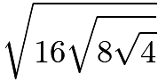
?
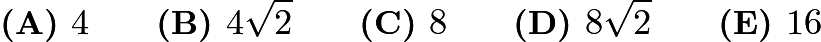

---

## Problem 4

When
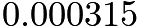
is multiplied by
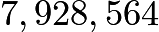
the product is closest to which of the following?

---

## Problem 5

What is the value of the expression
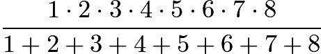
?
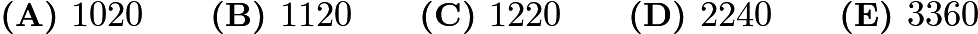

---

## Problem 6

If the degree measures of the angles of a triangle are in the ratio
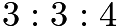
, what is the degree measure of the largest angle of the triangle?

---

## Problem 7

Let

be a 6-digit positive integer, such as 247247, whose first three digits are the same as its last three digits taken in the same order. Which of the following numbers must also be a factor of

?
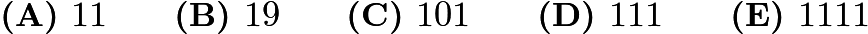

---

## Problem 8

Malcolm wants to visit Isabella after school today and knows the street where she lives but doesn't know her house number. She tells him, "My house number has two digits, and exactly three of the following four statements about it are true."
(1) It is prime.
(2) It is even
(3) It is divisible by 7.
(4) One of its digits is 9.
This information allows Malcolm to determine Isabella's house number. What is its units digit?
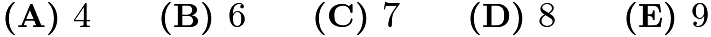

---

## Problem 9

All of Marcy's marbles are blue, red, green, or yellow. One third of her marbles are blue, one fourth of them are red, and six of them are green. What is the smallest number of yellow marbles?

---

## Problem 10

A box contains five cards, numbered 1, 2, 3, 4, and 5. Three cards are selected randomly without replacement from the box. What is the probability that 4 is the largest value selected?
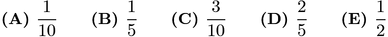

---

## Problem 11

A square-shaped floor is covered with congruent square tiles. If the total number of tiles that lie on the two diagonals is 37, how many tiles cover the floor?
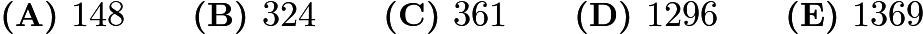

---

## Problem 12

The smallest positive integer greater than 1 that leaves a remainder of 1 when divided by 4, 5, and 6 lies between which of the following pairs of numbers?
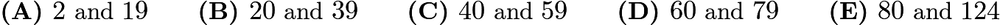

---

## Problem 13

Peter, Emma, and Kyler played chess with each other. Peter won 4 games and lost 2 games. Emma won 3 games and lost 3 games. If Kyler lost 3 games, how many games did he win?

---

## Problem 14

Chloe and Zoe are both students in Ms. Demeanor's math class. Last night, they each solved half of the problems in their homework assignment alone and then solved the other half together. Chloe had correct answers to only

of the problems she solved alone, but overall
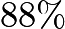
of her answers were correct. Zoe had correct answers to

of the problems she solved alone. What was Zoe's  overall percentage of correct answers?
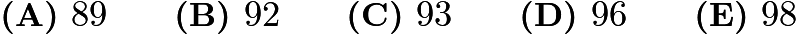

---

## Problem 15

In the arrangement of letters and numerals below, by how many different paths can one spell AMC8? Beginning at the A in the middle, a path allows only moves from one letter to an adjacent (above, below, left, or right, but not diagonal) letter. One example of such a path is traced in the picture.
![[asy] fill((0.5, 4.5)--(1.5,4.5)--(1.5,2.5)--(0.5,2.5)--cycle,lightgray); fill((1.5,3.5)--(2.5,3.5)--(2.5,1.5)--(1.5,1.5)--cycle,lightgray); label("$8$", (1, 0)); label("$C$", (2, 0)); label("$8$", (3, 0)); label("$8$", (0, 1)); label("$C$", (1, 1)); label("$M$", (2, 1)); label("$C$", (3, 1)); label("$8$", (4, 1)); label("$C$", (0, 2)); label("$M$", (1, 2)); label("$A$", (2, 2)); label("$M$", (3, 2)); label("$C$", (4, 2)); label("$8$", (0, 3)); label("$C$", (1, 3)); label("$M$", (2, 3)); label("$C$", (3, 3)); label("$8$", (4, 3)); label("$8$", (1, 4)); label("$C$", (2, 4)); label("$8$", (3, 4));[/asy]](images/2017/baaa2d90720f246bef7a701403186f934f736b9d.png)
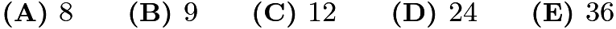

---

## Problem 16

In the figure below, choose point

on

so that

and

have equal perimeters. What is the area of

?
![[asy] draw((0,0)--(4,0)--(0,3)--(0,0)); label("$A$", (0,0), SW); label("$B$", (4,0), ESE); label("$C$", (0, 3), N); label("$3$", (0, 1.5), W); label("$4$", (2, 0), S); label("$5$", (2, 1.5), NE);[/asy]](images/2017/66d652cfcda55a46a6951b545f346c08115ed54f.png)
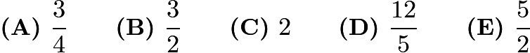

---

## Problem 17

Starting with some gold coins and some empty treasure chests, I tried to put
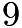
gold coins in each treasure chest, but that left

treasure chests empty.  So instead I put

gold coins in each treasure chest, but then I had

gold coins left over.  How many gold coins did I have?
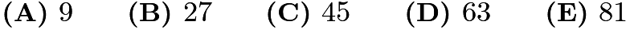

---

## Problem 18

In the non-convex quadrilateral

shown below,

is a right angle,
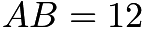
,
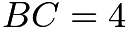
,

, and
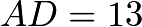
.
![[asy]draw((0,0)--(2.4,3.6)--(0,5)--(12,0)--(0,0)); label("$B$", (0, 0), SW); label("$A$", (12, 0), ESE); label("$C$", (2.4, 3.6), SE); label("$D$", (0, 5), N);[/asy]](images/2017/33e637e719aa8bfde9e98b9e0abeec6fe1bc2cce.png)
What is the area of quadrilateral

?
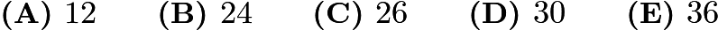

---

## Problem 19

For any positive integer

, the notation

denotes the product of the integers

through

. What is the largest integer

for which
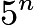
is a factor of the sum

?
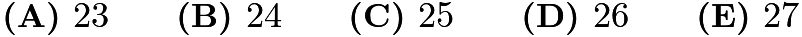

---

## Problem 20

An integer between

and

, inclusive, is chosen at random. What is the probability that it is an odd integer whose digits are all distinct?
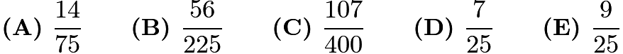

---

## Problem 21

Suppose
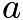
,

, and

are nonzero real numbers, and
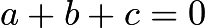
. What are the possible value(s) for
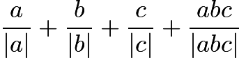
?
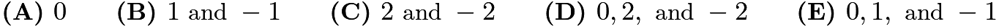

---

## Problem 22

In the right triangle

,

,
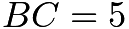
, and angle

is a right angle. A semicircle is inscribed in the triangle as shown. What is the radius of the semicircle?
![[asy] draw((0,0)--(12,0)--(12,5)--(0,0)); draw(arc((8.67,0),(12,0),(5.33,0))); label("$A$", (0,0), W); label("$C$", (12,0), E); label("$B$", (12,5), NE); label("$12$", (6, 0), S); label("$5$", (12, 2.5), E);[/asy]](images/2017/17f66d4cef8b689eb626ec8c226380e1e72d8719.png)
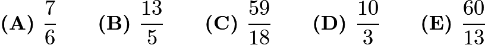

---

## Problem 23

Each day for four days, Linda traveled for one hour at a speed that resulted in her traveling one mile in an integer number of minutes. Each day after the first, her speed decreased so that the number of minutes to travel one mile increased by 5 minutes over the preceding day. Each of the four days, her distance traveled was also an integer number of miles. What was the total number of miles for the four trips?
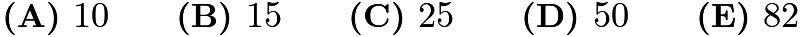

---

## Problem 24

Mrs. Sanders has three grandchildren, who call her regularly. One calls her every three days, one calls her every four days, and one calls her every five days. All three called her on December 31, 2016. On how many days during the next year did she not receive a phone call from any of her grandchildren?
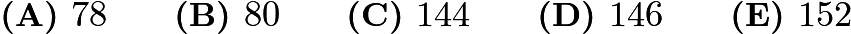

---

## Problem 25

In the figure shown,
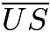
and
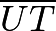
are line segments each of length 2, and

. Arcs

and

are each one-sixth of a circle with radius 2. What is the area of the region shown?
![[asy]draw((1,1.732)--(2,3.464)--(3,1.732)); draw(arc((0,0),(2,0),(1,1.732))); draw(arc((4,0),(3,1.732),(2,0))); label("$U$", (2,3.464), N); label("$S$", (1,1.732), W); label("$T$", (3,1.732), E); label("$R$", (2,0), S);[/asy]](images/2017/79f3ffcfa12364f64959c7aeadc809ba8d2aa6ac.png)
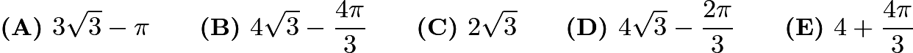

---

