# AMC 8 2018 Problems

## Problem 1

An amusement park has a collection of scale models, with ratio

, of buildings and other sights from around the country. The height of the United States Capitol is 289 feet. What is the height in feet of its replica to the nearest whole number?

---

## Problem 2

What is the value of the product
![\[\left(1+\frac{1}{1}\right)\cdot\left(1+\frac{1}{2}\right)\cdot\left(1+\frac{1}{3}\right)\cdot\left(1+\frac{1}{4}\right)\cdot\left(1+\frac{1}{5}\right)\cdot\left(1+\frac{1}{6}\right)?\]](images/2018/2c7aacf4c691c580906f1aaa847be38a7dbf6f26.png)
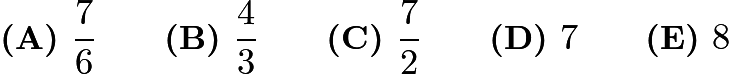

---

## Problem 3

Students Arn, Bob, Cyd, Dan, Eve, and Fon are arranged in that order in a circle. They start counting: Arn first, then Bob, and so forth. When the number contains a 7 as a digit (such as 47) or is a multiple of 7 that person leaves the circle and the counting continues. Who is the last one present in the circle?

---

## Problem 4

The twelve-sided figure shown has been drawn on

graph paper. What is the area of the figure in

?
![[asy] unitsize(8mm); for (int i=0; i<7; ++i) {   draw((i,0)--(i,7),gray);   draw((0,i+1)--(7,i+1),gray); } draw((1,3)--(2,4)--(2,5)--(3,6)--(4,5)--(5,5)--(6,4)--(5,3)--(5,2)--(4,1)--(3,2)--(2,2)--cycle,black+2bp); [/asy]](images/2018/f4d92072ddf7f5314e710dc9641eb84c3ea32879.png)

---

## Problem 5

What is the value of
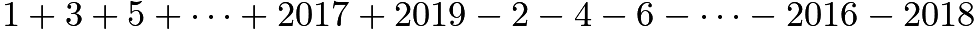
?

---

## Problem 6

On a trip to the beach, Anh traveled 50 miles on the highway and 10 miles on a coastal access road. He drove three times as fast on the highway as on the coastal road. If Anh spent 30 minutes driving on the coastal road, how many minutes did his entire trip take?

---

## Problem 7

The

-digit number

is divisible by

. What is the remainder when this number is divided by

?
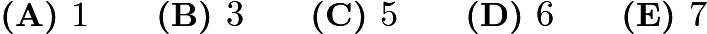

---

## Problem 8

Mr. Garcia asked the members of his health class how many days last week they exercised for at least 30 minutes. The results are summarized in the following bar graph, where the heights of the bars represent the number of students.
![[asy] size(8cm); void drawbar(real x, real h) {   fill((x-0.15,0.5)--(x+0.15,0.5)--(x+0.15,h)--(x-0.15,h)--cycle,gray); } draw((0.5,0.5)--(7.5,0.5)--(7.5,5)--(0.5,5)--cycle); for (real i=1; i<5; i=i+0.5) {   draw((0.5,i)--(7.5,i),gray); } drawbar(1.0,1.0); drawbar(2.0,2.0); drawbar(3.0,1.5); drawbar(4.0,3.5); drawbar(5.0,4.5); drawbar(6.0,2.0); drawbar(7.0,1.5); for (int i=1; i<8; ++i) {   label("$"+string(i)+"$",(i,0.25)); } for (int i=1; i<9; ++i) {   label("$"+string(i)+"$",(0.5,0.5*(i+1)),W); } label("Number of Days of Exercise",(4,-0.1)); label(rotate(90)*"Number of Students",(-0.1,2.75)); [/asy]](images/2018/f7add6258fd09de75421fb0d08e39071b65b128c.png)
What was the mean number of days of exercise last week, rounded to the nearest hundredth, reported by the students in Mr. Garcia's class?

---

## Problem 9

Jenica is tiling the floor of her 12 foot by 16 foot living room. She plans to place one-foot by one-foot square tiles to form a border along the edges of the room and to fill in the rest of the floor with two-foot by two-foot square tiles. How many tiles will she use?

---

## Problem 10

The
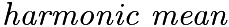
of a set of non-zero numbers is the reciprocal of the average of the reciprocals of the numbers. What is the harmonic mean of 1, 2, and 4?
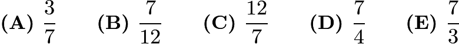

---

## Problem 11

Abby, Bridget, and four of their classmates will be seated in two rows of three for a group picture, as shown.
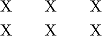
If the seating positions are assigned randomly, what is the probability that Abby and Bridget are adjacent to each other in the same row or the same column?
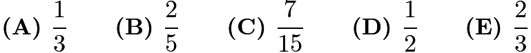

---

## Problem 12

The clock in Sri's car, which is not accurate, gains time at a constant rate. One day as he begins shopping, he notes that his car clock and his watch (which is accurate) both say 12:00 noon. When he is done shopping, his watch says 12:30 and his car clock says 12:35. Later that day, Sri loses his watch. He looks at his car clock and it says 7:00. What is the actual time?

---

## Problem 13

Laila took five math tests, each worth a maximum of 100 points. Laila's score on each test was an integer between 0 and 100, inclusive. Laila received the same score on the first four tests, and she received a higher score on the last test. Her average score on the five tests was 82. How many values are possible for Laila's score on the last test?

---

## Problem 14

Let

be the greatest five-digit number whose digits have a product of
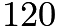
. What is the sum of the digits of

?

---

## Problem 15

In the diagram below, a diameter of each of the two smaller circles is a radius of the larger circle. If the two smaller circles have a combined area of

square unit, then what is the area of the shaded region, in square units?
![[asy] size(4cm); filldraw(scale(2)*unitcircle,gray,black); filldraw(shift(-1,0)*unitcircle,white,black); filldraw(shift(1,0)*unitcircle,white,black); [/asy]](images/2018/1814b98003d8f9d763c70aa6a56a765673f27d59.png)
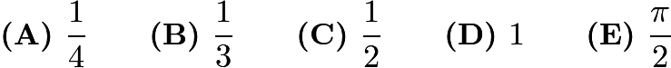

---

## Problem 16

Professor Chang has nine different language books lined up on a bookshelf: two Arabic, three German, and four Spanish. How many ways are there to arrange the nine books on the shelf keeping the Arabic books together and keeping the Spanish books together?

---

## Problem 17

Bella begins to walk from her house toward her friend Ella's house. At the same time, Ella begins to ride her bicycle toward Bella's house. They each maintain a constant speed, and Ella rides 5 times as fast as Bella walks. The distance between their houses is

miles, which is
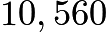
feet, and Bella covers
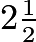
feet with each step. How many steps will Bella take by the time she meets Ella?

---

## Problem 18

How many positive factors does
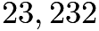
have?
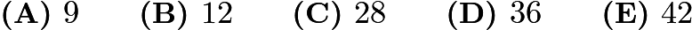

---

## Problem 19

In a sign pyramid a cell gets a "+" if the two cells below it have the same sign, and it gets a "-" if the two cells below it have different signs. The diagram below illustrates a sign pyramid with four levels. How many possible ways are there to fill the four cells in the bottom row to produce a "+" at the top of the pyramid?
![[asy] unitsize(2cm); path box = (-0.5,-0.2)--(-0.5,0.2)--(0.5,0.2)--(0.5,-0.2)--cycle; draw(box); label("$+$",(0,0)); draw(shift(1,0)*box); label("$-$",(1,0)); draw(shift(2,0)*box); label("$+$",(2,0)); draw(shift(3,0)*box); label("$-$",(3,0)); draw(shift(0.5,0.4)*box); label("$-$",(0.5,0.4)); draw(shift(1.5,0.4)*box); label("$-$",(1.5,0.4)); draw(shift(2.5,0.4)*box); label("$-$",(2.5,0.4)); draw(shift(1,0.8)*box); label("$+$",(1,0.8)); draw(shift(2,0.8)*box); label("$+$",(2,0.8)); draw(shift(1.5,1.2)*box); label("$+$",(1.5,1.2)); [/asy]](images/2018/f59b1af815a0ba23baf250a48b1029ee9d1bd5e4.png)
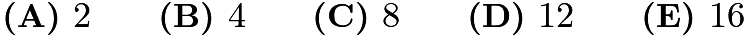

---

## Problem 20

In
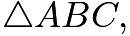
a point

is on

with

and

Point

is on

so that

and point

is on

so that

What is the ratio of the area of

to the area of

![[asy] size(7cm); pair A,B,C,DD,EE,FF; A = (0,0); B = (3,0); C = (0.5,2.5); EE = (1,0); DD = intersectionpoint(A--C,EE--EE+(C-B)); FF = intersectionpoint(B--C,EE--EE+(C-A)); draw(A--B--C--A--DD--EE--FF,black+1bp); label("$A$",A,S); label("$B$",B,S); label("$C$",C,N); label("$D$",DD,W); label("$E$",EE,S); label("$F$",FF,NE); label("$1$",(A+EE)/2,S); label("$2$",(EE+B)/2,S); [/asy]](images/2018/0571cfd5e8f21ce8031af38df8ba2295bdf2449a.png)
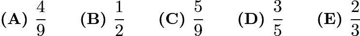

---

## Problem 21

How many positive three-digit integers have a remainder of 2 when divided by 6, a remainder of 5 when divided by 9, and a remainder of 7 when divided by 11?

---

## Problem 22

Point

is the midpoint of side

in square
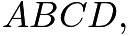
and

meets diagonal

at

The area of quadrilateral

is
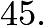
What is the area of

![[asy] size(5cm); draw((0,0)--(6,0)--(6,6)--(0,6)--cycle); draw((0,6)--(6,0)); draw((3,0)--(6,6)); label("$A$",(0,6),NW); label("$B$",(6,6),NE); label("$C$",(6,0),SE); label("$D$",(0,0),SW); label("$E$",(3,0),S); label("$F$",(4,2),E); [/asy]](images/2018/7c13c3d233bfe4e1b9a7ecd2e6343fe5b8aa2e3a.png)

---

## Problem 23

From a regular octagon, a triangle is formed by connecting three randomly chosen vertices of the octagon. What is the probability that at least one of the sides of the triangle is also a side of the octagon?
![[asy] size(3cm); pair A[]; for (int i=0; i<9; ++i) { A[i] = rotate(22.5+45*i)*(1,0); } filldraw(A[0]--A[1]--A[2]--A[3]--A[4]--A[5]--A[6]--A[7]--cycle,gray,black); for (int i=0; i<8; ++i) { dot(A[i]); } [/asy]](images/2018/54d911c096b9c5403a914f8b8c2b05b4915494f1.png)
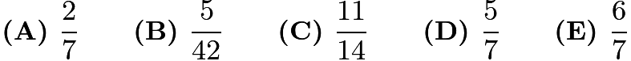

---

## Problem 24

In the cube

with opposite vertices

and
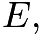

and

are the midpoints of edges
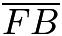
and

respectively. Let

be the ratio of the area of the cross-section

to the area of one of the faces of the cube. What is
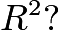
![[asy] size(6cm); pair A,B,C,D,EE,F,G,H,I,J; C = (0,0); B = (-1,1); D = (2,0.5); A = B+D; G = (0,2); F = B+G; H = G+D; EE = G+B+D; I = (D+H)/2; J = (B+F)/2; filldraw(C--I--EE--J--cycle,lightgray,black); draw(C--D--H--EE--F--B--cycle);  draw(G--F--G--C--G--H); draw(A--B,dashed); draw(A--EE,dashed); draw(A--D,dashed); dot(A); dot(B); dot(C); dot(D); dot(EE); dot(F); dot(G); dot(H); dot(I); dot(J); label("$A$",A,E); label("$B$",B,W); label("$C$",C,S); label("$D$",D,E); label("$E$",EE,N); label("$F$",F,W); label("$G$",G,N); label("$H$",H,E); label("$I$",I,E); label("$J$",J,W); [/asy]](images/2018/a1d819cf8339fd4ae7e3d612b459da3b1e8cdc7b.png)
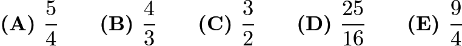

---

## Problem 25

How many perfect cubes lie between
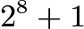
and
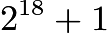
, inclusive?
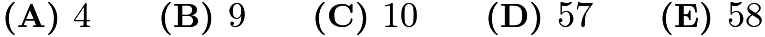

---

