# AMC 8 2019 Problems

## Problem 1

Ike and Mike go into a sandwich shop with a total of

to spend. Sandwiches cost

each and soft drinks cost

each. Ike and Mike plan to buy as many sandwiches as they can, and use any remaining money to buy soft drinks. Counting both sandwiches and soft drinks, how many items will they buy?

---

## Problem 2

Three identical rectangles are put together to form rectangle

, as shown in the figure below. Given that the length of the shorter side of each of the smaller rectangles is  5 feet, what is the area in square feet of rectangle

?
![[asy] draw((0,0)--(3,0)); draw((0,0)--(0,2)); draw((0,2)--(3,2)); draw((3,2)--(3,0)); dot((0,0)); dot((0,2)); dot((3,0)); dot((3,2)); draw((2,0)--(2,2)); draw((0,1)--(2,1)); label("A",(0,0),S); label("B",(3,0),S); label("C",(3,2),N); label("D",(0,2),N); [/asy]](images/2019/e0752885e3cff488bd89893347c595b7c570d339.png)

---

## Problem 3

Which of the following is the correct order of the fractions
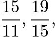
and
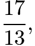
from least to greatest?

---

## Problem 4

Quadrilateral

is a rhombus with perimeter
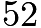
meters. The length of diagonal
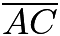
is

meters. What is the area in square meters of rhombus

?
![[asy] draw((-13,0)--(0,5)); draw((0,5)--(13,0)); draw((13,0)--(0,-5)); draw((0,-5)--(-13,0)); dot((-13,0)); dot((0,5)); dot((13,0)); dot((0,-5)); label("A",(-13,0),W); label("B",(0,5),N); label("C",(13,0),E); label("D",(0,-5),S); [/asy]](images/2019/e54b35c6e9f6a1eaa16a3138ed06ebc73122be63.png)

---

## Problem 5

A tortoise challenges a hare to a race. The hare eagerly agrees and quickly runs ahead, leaving the slow-moving tortoise behind. Confident that he will win, the hare stops to take a nap. Meanwhile, the tortoise walks at a slow steady pace for the entire race. The hare awakes and runs to the finish line, only to find the tortoise already there. Which of the following graphs matches the description of the race, showing the distance

traveled by the two animals over time

from start to finish?

---

## Problem 6

There are
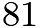
grid points (uniformly spaced) in the square shown in the diagram below, including the points on the edges. Point

is in the center of the square. Given that point

is randomly chosen among the other

points, what is the probability that the line

is a line of symmetry for the square?
![[asy] draw((0,0)--(0,8)); draw((0,8)--(8,8)); draw((8,8)--(8,0)); draw((8,0)--(0,0)); dot((0,0)); dot((0,1)); dot((0,2)); dot((0,3)); dot((0,4)); dot((0,5)); dot((0,6)); dot((0,7)); dot((0,8));  dot((1,0)); dot((1,1)); dot((1,2)); dot((1,3)); dot((1,4)); dot((1,5)); dot((1,6)); dot((1,7)); dot((1,8));  dot((2,0)); dot((2,1)); dot((2,2)); dot((2,3)); dot((2,4)); dot((2,5)); dot((2,6)); dot((2,7)); dot((2,8));  dot((3,0)); dot((3,1)); dot((3,2)); dot((3,3)); dot((3,4)); dot((3,5)); dot((3,6)); dot((3,7)); dot((3,8));  dot((4,0)); dot((4,1)); dot((4,2)); dot((4,3)); dot((4,4)); dot((4,5)); dot((4,6)); dot((4,7)); dot((4,8));  dot((5,0)); dot((5,1)); dot((5,2)); dot((5,3)); dot((5,4)); dot((5,5)); dot((5,6)); dot((5,7)); dot((5,8));  dot((6,0)); dot((6,1)); dot((6,2)); dot((6,3)); dot((6,4)); dot((6,5)); dot((6,6)); dot((6,7)); dot((6,8));  dot((7,0)); dot((7,1)); dot((7,2)); dot((7,3)); dot((7,4)); dot((7,5)); dot((7,6)); dot((7,7)); dot((7,8));  dot((8,0)); dot((8,1)); dot((8,2)); dot((8,3)); dot((8,4)); dot((8,5)); dot((8,6)); dot((8,7)); dot((8,8)); label("P",(4,4),NE); [/asy]](images/2019/2ef50880b9e105fcb40568742659a26c359c6c1a.png)
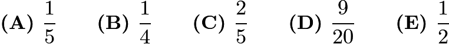

---

## Problem 7

Shauna takes five tests, each worth a maximum of

points. Her scores on the first three tests are

,
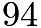
, and
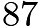
. In order to average

for all five tests, what is the lowest score she could earn on one of the other two tests?

---

## Problem 8

Gilda has a bag of marbles. She gives

of them to her friend Pedro. Then Gilda gives

of what is left to another friend, Ebony. Finally, Gilda gives
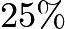
of what is now left in the bag to her brother Jimmy. What percentage of her original bag of marbles does Gilda have left for herself?
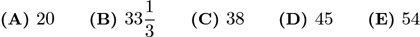

---

## Problem 9

Alex and Felicia each have cats as pets. Alex buys cat food in cylindrical cans that are

cm in diameter and

cm high. Felicia buys cat food in cylindrical cans that are

cm in diameter and

cm high. What is the ratio of the volume of one of Alex's cans to the volume one of Felicia's cans?
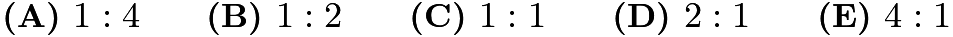

---

## Problem 10

The diagram shows the number of students at soccer practice each weekday during last week. After computing the mean and median values, Coach discovers that there were actually

participants on Wednesday. Which of the following statements describes the change in the mean and median after the correction is made?
![[asy] unitsize(2mm); defaultpen(fontsize(8bp)); real d = 5; real t = 0.7; real r; int[] num = {20,26,16,22,16}; string[] days = {"Monday","Tuesday","Wednesday","Thursday","Friday"}; for (int i=0; i<30; i=i+2) { draw((i,0)--(i,-5*d),gray); }for (int i=0; i<5; ++i) {   r = -1*(i+0.5)*d; fill((0,r-t)--(0,r+t)--(num[i],r+t)--(num[i],r-t)--cycle,gray); label(days[i],(-1,r),W); }for(int i=0; i<32; i=i+4) { label(string(i),(i,1)); }label("Number of students at soccer practice",(14,3.5)); [/asy]](images/2019/e1796ef723acbb9a4cfeacf57e69202cddf3e0d3.png)

The mean increases by

and the median does not change.

The mean increases by

and the median increases by

.

The mean increases by

and the median increases by

.

The mean increases by

and the median increases by

.

The mean increases by

and the median increases by

.

---

## Problem 11

The third-grade class at Lincoln Elementary School has

students. Each student takes a math class or a foreign language class or both. There are
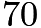
third graders taking a math class, and there are

third graders taking a foreign language class. How many third graders take
only
a math class and
not
a foreign language class?

---

## Problem 12

The faces of a cube are painted in six different colors: red

, white

, green

, brown

, aqua

, and purple

. Three views of the cube are shown below. What is the color of the face opposite the aqua face?
![[asy] unitsize(2cm); pair x, y, z, trans; int i;  x = dir(-5); y = (0.6,0.5); z = (0,1); trans = (2,0);  for (i = 0; i <= 2; ++i) { draw(shift(i*trans)*((0,0)--x--(x + y)--(x + y + z)--(y + z)--z--cycle)); draw(shift(i*trans)*((x + z)--x)); draw(shift(i*trans)*((x + z)--(x + y + z))); draw(shift(i*trans)*((x + z)--z)); }  label(rotate(-3)*"$R$", (x + z)/2); label(rotate(-5)*slant(0.5)*"$B$", ((x + z) + (y + z))/2); label(rotate(35)*slant(0.5)*"$G$", ((x + z) + (x + y))/2);  label(rotate(-3)*"$W$", (x + z)/2 + trans); label(rotate(50)*slant(-1)*"$B$", ((x + z) + (y + z))/2 + trans); label(rotate(35)*slant(0.5)*"$R$", ((x + z) + (x + y))/2 + trans);  label(rotate(-3)*"$P$", (x + z)/2 + 2*trans); label(rotate(-5)*slant(0.5)*"$R$", ((x + z) + (y + z))/2 + 2*trans); label(rotate(-85)*slant(-1)*"$G$", ((x + z) + (x + y))/2 + 2*trans); [/asy]](images/2019/3a8268817eeb341bf2b3a7be997d68e5f2fd5c56.png)

---

## Problem 13

A
palindrome
is a number that has the same value when read from left to right or from right to left. (For example, 12321 is a palindrome.) Let

be the least three-digit integer which is not a palindrome but which is the sum of three distinct two-digit palindromes. What is the sum of the digits of

?
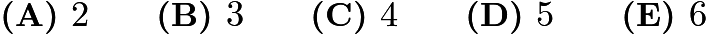

---

## Problem 14

Isabella has

coupons that can be redeemed for free ice cream cones at Pete's Sweet Treats. In order to make the coupons last, she decides that she will redeem one every

days until she has used them all. She knows that Pete's is closed on Sundays, but as she circles the

dates on her calendar, she realizes that no circled date falls on a Sunday. On what day of the week does Isabella redeem her first coupon?

---

## Problem 15

On a beach,

people are wearing sunglasses and
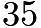
people are wearing caps. Some people are wearing both sunglasses and caps. If one of the people wearing a cap is selected at random, the probability that this person is also wearing sunglasses is
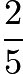
. If instead, someone wearing sunglasses is selected at random, what is the probability that this person is also wearing a cap?
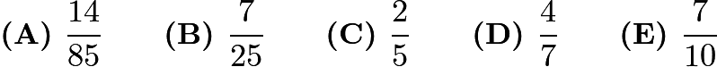

---

## Problem 16

Qiang drives

miles at an average speed of

miles per hour. How many additional miles will he have to drive at
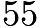
miles per hour to average

miles per hour for the entire trip?
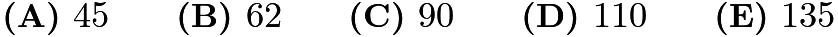

---

## Problem 17

What is the value of the product
![\[\left(\frac{1\cdot3}{2\cdot2}\right)\left(\frac{2\cdot4}{3\cdot3}\right)\left(\frac{3\cdot5}{4\cdot4}\right)\cdots\left(\frac{97\cdot99}{98\cdot98}\right)\left(\frac{98\cdot100}{99\cdot99}\right)?\]](images/2019/9ca55aef127eee6fc870173ae1b23e1abd56a02b.png)
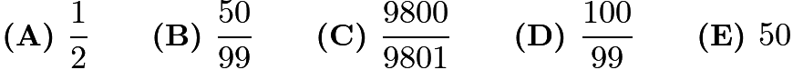

---

## Problem 18

The faces of each of two fair dice are numbered 1, 2, 3, 5, 7, and 8. When the two dice are tossed, what is the probability that their sum will be an even number?
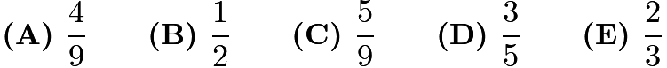

---

## Problem 19

In a tournament there are six teams that play each other twice. A team earns

points for a win,

point for a draw, and

points for a loss. After all the games have been played it turns out that the top three teams earned the same number of total points. What is the greatest possible number of total points for each of the top three teams?

---

## Problem 20

How many different real numbers

satisfy the equation
![\[(x^{2}-5)^{2}=16?\]](images/2019/d188c4697f3f7cf1889796a037bd60b6dae3b29e.png)

---

## Problem 21

What is the area of the triangle formed by the lines
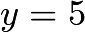
,
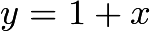
, and
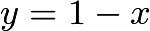
?
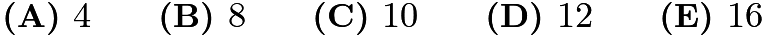

---

## Problem 22

A store increased the original price of a shirt by a certain percent and then decreased the new price by the same amount. Given that the resulting price was
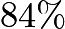
of the original price, by what percent was the price increased and decreased?

---

## Problem 23

After Euclid High School's last basketball game, it was determined that
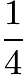
of the team's points were scored by Alexa and
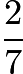
were scored by Brittany. Chelsea scored

points. None of the other

team members scored more than

points. What was the total number of points scored by the other

team members?

---

## Problem 24

In triangle

, point

divides side

so that

. Let

be the midpoint of

and let

be the point of intersection of line

and line

. Given that the area of

is

, what is the area of
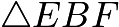
?
![[asy] unitsize(2cm); pair A,B,C,DD,EE,FF; B = (0,0); C = (3,0);  A = (1.2,1.7); DD = (2/3)*A+(1/3)*C; EE = (B+DD)/2; FF = intersectionpoint(B--C,A--A+2*(EE-A)); draw(A--B--C--cycle); draw(A--FF);  draw(B--DD);dot(A);  label("$A$",A,N); dot(B);  label("$B$", B,SW);dot(C);  label("$C$",C,SE); dot(DD);  label("$D$",DD,NE); dot(EE);  label("$E$",EE,NW); dot(FF);  label("$F$",FF,S); [/asy]](images/2019/cf5d315e13b9e158a6df354d7f9a8ecafaf2b131.png)

---

## Problem 25

Alice has 24 apples. In how many ways can she share them with Becky and
Chris so that each of the three people has at least two apples?

---

