# AMC 8 2020 Problems

## Problem 1

Luka is making lemonade to sell at a school fundraiser. His recipe requires

times as much water as sugar and twice as much sugar as lemon juice. He uses

cups of lemon juice. How many cups of water does he need?
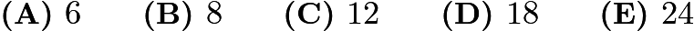

---

## Problem 2

Four friends do yardwork for their neighbors over the weekend, earning
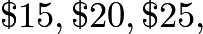
and
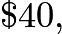
respectively. They decide to split their earnings equally among themselves. In total how much will the friend who earned
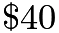
give to the others?
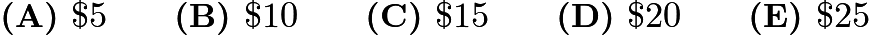

---

## Problem 3

Carrie has a rectangular garden that measures

feet by

feet. She plants the entire garden with strawberry plants. Carrie is able to plant

strawberry plants per square foot, and she harvests an average of

strawberries per plant. How many strawberries can she expect to harvest?

---

## Problem 4

Three hexagons of increasing size are shown below. Suppose the dot pattern continues so that each successive hexagon contains one more band of dots. How many dots are in the next hexagon?
![[asy] // diagram by SirCalcsALot, edited by MRENTHUSIASM size(250); path p = scale(0.8)*unitcircle; pair[] A; pen grey1 = rgb(100/256, 100/256, 100/256); pen grey2 = rgb(183/256, 183/256, 183/256); for (int i=0; i<7; ++i) { A[i] = rotate(60*i)*(1,0);} path hex = A[0]--A[1]--A[2]--A[3]--A[4]--A[5]--cycle; fill(p,grey1); draw(scale(1.25)*hex,black+linewidth(1.25)); pair S = 6A[0]+2A[1]; fill(shift(S)*p,grey1); for (int i=0; i<6; ++i) { fill(shift(S+2*A[i])*p,grey2);} draw(shift(S)*scale(3.25)*hex,black+linewidth(1.25)); pair T = 16A[0]+4A[1]; fill(shift(T)*p,grey1); for (int i=0; i<6; ++i) {   fill(shift(T+2*A[i])*p,grey2);  fill(shift(T+4*A[i])*p,grey1);  fill(shift(T+2*A[i]+2*A[i+1])*p,grey1); } draw(shift(T)*scale(5.25)*hex,black+linewidth(1.25)); [/asy]](images/2020/381ea96ddcbeccb0522187fcd4a41c78bd9c8364.png)
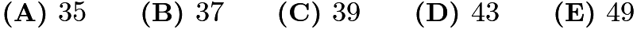

---

## Problem 5

Three fourths of a pitcher is filled with pineapple juice. The pitcher is emptied by pouring an equal amount of juice into each of

cups. What percent of the total capacity of the pitcher did each cup receive?
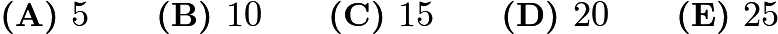

---

## Problem 6

Aaron, Darren, Karen, Maren, and Sharon rode on a small train that has five cars that seat one person each. Maren sat in the last car. Aaron sat directly behind Sharon. Darren sat in one of the cars in front of Aaron. At least one person sat between Karen and Darren. Who sat in the middle car?

---

## Problem 7

How many integers between

and

have four distinct digits arranged in increasing order? (For example,
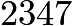
is one integer.)
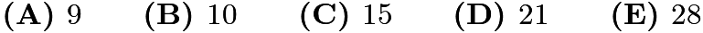

---

## Problem 8

Ricardo has

coins, some of which are pennies (

-cent coins) and the rest of which are nickels (

-cent coins). He has at least one penny and at least one nickel. What is the difference in cents between the greatest possible and least possible amounts of money that Ricardo can have?
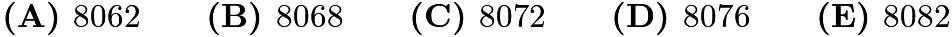

---

## Problem 9

Akash's birthday cake is in the form of a
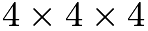
inch cube. The cake has icing on the top and the four side faces, and no icing on the bottom. Suppose the cake is cut into

smaller cubes, each measuring
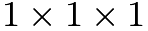
inch, as shown below. How many small pieces will have icing on exactly two sides?
![[asy] import three; currentprojection=orthographic(1.75,7,2);  //++++ edit colors, names are self-explainatory ++++ //pen top=rgb(27/255, 135/255, 212/255); //pen right=rgb(254/255,245/255,182/255); //pen left=rgb(153/255,200/255,99/255); pen top = rgb(170/255, 170/255, 170/255); pen left = rgb(81/255, 81/255, 81/255); pen right = rgb(165/255, 165/255, 165/255); pen edges=black; int max_side = 4; //+++++++++++++++++++++++++++++++++++++++  path3 leftface=(1,0,0)--(1,1,0)--(1,1,1)--(1,0,1)--cycle; path3 rightface=(0,1,0)--(1,1,0)--(1,1,1)--(0,1,1)--cycle; path3 topface=(0,0,1)--(1,0,1)--(1,1,1)--(0,1,1)--cycle;  for(int i=0; i<max_side; ++i){ for(int j=0; j<max_side; ++j){  draw(shift(i,j,-1)*surface(topface),top); draw(shift(i,j,-1)*topface,edges);  draw(shift(i,-1,j)*surface(rightface),right); draw(shift(i,-1,j)*rightface,edges);  draw(shift(-1,j,i)*surface(leftface),left); draw(shift(-1,j,i)*leftface,edges);  } }  picture CUBE; draw(CUBE,surface(leftface),left,nolight); draw(CUBE,surface(rightface),right,nolight); draw(CUBE,surface(topface),top,nolight); draw(CUBE,topface,edges); draw(CUBE,leftface,edges); draw(CUBE,rightface,edges);  int[][] heights = {{4,4,4,4},{4,4,4,4},{4,4,4,4},{4,4,4,4}};  for (int i = 0; i < max_side; ++i) { for (int j = 0; j < max_side; ++j) { for (int k = 0; k < min(heights[i][j], max_side); ++k) { add(shift(i,j,k)*CUBE); } } } [/asy]](images/2020/13575720613929277699552cc394543fb9d0346b.png)
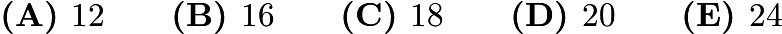

---

## Problem 10

Zara has a collection of

marbles: an Aggie, a Bumblebee, a Steelie, and a Tiger. She wants to display them in a row on a shelf, but does not want to put the Steelie and the Tiger next to one another. In how many ways can she do this?

---

## Problem 11

After school, Maya and Naomi headed to the beach,

miles away. Maya decided to bike while Naomi took a bus. The graph below shows their journeys, indicating the time and distance traveled. What was the difference, in miles per hour, between Naomi's and Maya's average speeds?
![[asy] // diagram by SirCalcsALot unitsize(1.25cm); dotfactor = 10; pen shortdashed=linetype(new real[] {2.7,2.7});  for (int i = 0; i < 6; ++i) {     for (int j = 0; j < 6; ++j) {         draw((i,0)--(i,6), grey);         draw((0,j)--(6,j), grey);     } }  for (int i = 1; i <= 6; ++i) {     draw((-0.1,i)--(0.1,i),linewidth(1.25));     draw((i,-0.1)--(i,0.1),linewidth(1.25));     label(string(5*i), (i,0), 2*S);     label(string(i), (0, i), 2*W);  }  draw((0,0)--(0,6)--(6,6)--(6,0)--(0,0)--cycle,linewidth(1.25));  label(rotate(90) * "Distance (miles)", (-0.5,3), W); label("Time (minutes)", (3,-0.5), S);  dot("Naomi", (2,6), 3*dir(305)); dot((6,6));  label("Maya", (4.45,3.5));  draw((0,0)--(1.15,1.3)--(1.55,1.3)--(3.15,3.2)--(3.65,3.2)--(5.2,5.2)--(5.4,5.2)--(6,6),linewidth(1.35)); draw((0,0)--(0.4,0.1)--(1.15,3.7)--(1.6,3.7)--(2,6),linewidth(1.35)+shortdashed); [/asy]](images/2020/869acf55e021604fd3829ae77107a07511f6945f.png)
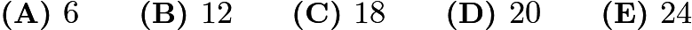

---

## Problem 12

For a positive integer
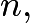
the factorial notation
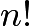
represents the product of the integers
from

to

. (For example,
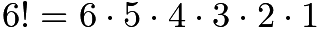
.) What value of

satisfies the following equation?
![\[5! \cdot 9! = 12 \cdot N!\]](images/2020/ca29f6c195342acdd31f46bca2322a6fbdfeb766.png)
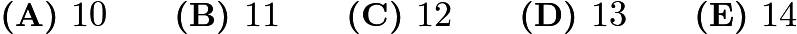

---

## Problem 13

Jamal has a drawer containing

green socks,

purple socks, and

orange socks. After adding more purple socks, Jamal noticed that there is now a
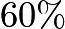
chance that a sock randomly selected from the drawer is purple. How many purple socks did Jamal add?
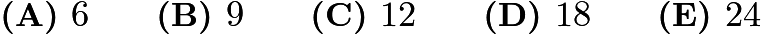

---

## Problem 14

There are

cities in the County of Newton. Their populations are shown in the bar chart below. The average population of all the cities is indicated by the horizontal dashed line. Which of the following is closest to the total population of all

cities?
![[asy] // made by SirCalcsALot  size(300);  pen shortdashed=linetype(new real[] {6,6});  for (int i = 2000; i < 9000; i = i + 2000) {     draw((0,i)--(11550,i), linewidth(0.5)+1.5*grey);     label(string(i), (0,i), W); }   for (int i = 500; i < 9300; i=i+500) {     draw((0,i)--(150,i),linewidth(1.25));     if (i % 2000 == 0) {         draw((0,i)--(250,i),linewidth(1.25));     } }  int[] data = {8750, 3800, 5000, 2900, 6400, 7500, 4100, 1400, 2600, 1470, 2600, 7100, 4070, 7500, 7000, 8100, 1900, 1600, 5850, 5750}; int data_length = 20;  int r = 550; for (int i = 0; i < data_length; ++i) {     fill(((i+1)*r,0)--((i+1)*r, data[i])--((i+1)*r,0)--((i+1)*r, data[i])--((i+1)*r,0)--((i+1)*r, data[i])--((i+2)*r-100, data[i])--((i+2)*r-100,0)--cycle, 1.5*grey);     draw(((i+1)*r,0)--((i+1)*r, data[i])--((i+1)*r,0)--((i+1)*r, data[i])--((i+1)*r,0)--((i+1)*r, data[i])--((i+2)*r-100, data[i])--((i+2)*r-100,0)); }  draw((0,4750)--(11450,4750),shortdashed);  label("Cities", (11450*0.5,0), S); label(rotate(90)*"Population", (0,9000*0.5), 10*W);  // axis draw((0,0)--(0,9300), linewidth(1.25)); draw((0,0)--(11550,0), linewidth(1.25)); [/asy]](images/2020/abffd65d59aacaaf81b6039c162d0898cca8b729.png)

---

## Problem 15

Suppose

of

equals
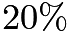
of
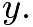
What percentage of

is
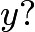
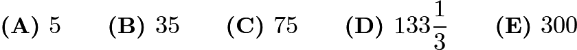

---

## Problem 16

Each of the points
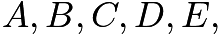
and

in the figure below represents a different digit from

to
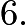
Each of the five lines shown passes through some of these points. The digits along each line are added to produce five sums, one for each line. The total of the five sums is
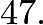
What is the digit represented by B?
![[asy] // made by SirCalcsALot  size(200); dotfactor = 10;  pair p1 = (-28,0); pair p2 = (-111,213); draw(p1--p2,linewidth(1));  pair p3 = (-160,0); pair p4 = (-244,213); draw(p3--p4,linewidth(1));  pair p5 = (-316,0); pair p6 = (-67,213); draw(p5--p6,linewidth(1));  pair p7 = (0, 68); pair p8 = (-350,10); draw(p7--p8,linewidth(1));  pair p9 = (0, 150); pair p10 = (-350, 62); draw(p9--p10,linewidth(1));  pair A = intersectionpoint(p1--p2, p5--p6); dot("$A$", A, 2*W);  pair B = intersectionpoint(p5--p6, p3--p4); dot("$B$", B, 2*WNW);  pair C = intersectionpoint(p7--p8, p5--p6); dot("$C$", C, 1.5*NW);  pair D = intersectionpoint(p3--p4, p7--p8); dot("$D$", D, 2*NNE);  pair EE = intersectionpoint(p1--p2, p7--p8); dot("$E$", EE, 2*NNE);  pair F = intersectionpoint(p1--p2, p9--p10); dot("$F$", F, 2*NNE); [/asy]](images/2020/9f1f0f8c2be3a35542af7640459f9a938b659c27.png)
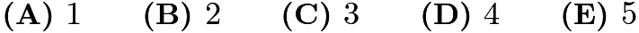

---

## Problem 17

How many factors of

have more than

factors? (As an example,

has

factors, namely
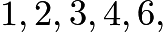
and
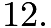
)

---

## Problem 18

Rectangle

is inscribed in a semicircle with diameter

as shown in the figure. Let
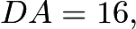
and let
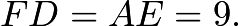
What is the area of

![[asy] // diagram by SirCalcsALot draw(arc((0,0),17,180,0)); draw((-17,0)--(17,0)); fill((-8,0)--(-8,15)--(8,15)--(8,0)--cycle, 1.5*grey); draw((-8,0)--(-8,15)--(8,15)--(8,0)--cycle); dot("$A$",(8,0), 1.25*S); dot("$B$",(8,15), 1.25*N); dot("$C$",(-8,15), 1.25*N); dot("$D$",(-8,0), 1.25*S); dot("$E$",(17,0), 1.25*S); dot("$F$",(-17,0), 1.25*S); label("$16$",(0,0),N); label("$9$",(12.5,0),N); label("$9$",(-12.5,0),N); [/asy]](images/2020/15fcfb06af407c88283742b188e91074fb48b60a.png)
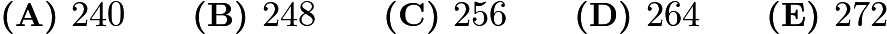

---

## Problem 19

A number is called flippy if its digits alternate between two distinct digits. For example,

and
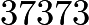
are flippy, but
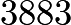
and
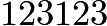
are not. How many five-digit flippy numbers are divisible by
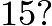
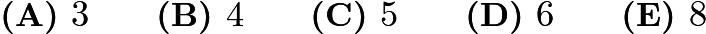

---

## Problem 20

A scientist walking through a forest recorded as integers the heights of

trees standing in a row. She observed that each tree was either twice as tall or half as tall as the one to its right. Unfortunately some of her data was lost when rain fell on her notebook. Her notes are shown below, with blanks indicating the missing numbers. Based on her observations, the scientist was able to reconstruct the lost data. What was the average height of the trees, in meters?
![\[\begingroup \setlength{\tabcolsep}{10pt} \renewcommand{\arraystretch}{1.5} \begin{tabular}{|c|c|} \hline Tree 1 & \rule{0.4cm}{0.15mm} meters \\ Tree 2 & 11 meters \\ Tree 3 & \rule{0.5cm}{0.15mm} meters \\ Tree 4 & \rule{0.5cm}{0.15mm} meters \\ Tree 5 & \rule{0.5cm}{0.15mm} meters \\ \hline Average height & \rule{0.5cm}{0.15mm}\text{ .}2 meters \\ \hline \end{tabular} \endgroup\]](images/2020/f706bfa6f4339d99d594acb5159f6140c8eb1bb9.png)
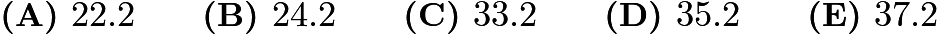

---

## Problem 21

A game board consists of

squares that alternate in color between black and white. The figure below shows square

in the bottom row and square
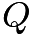
in the top row. A marker is placed at

A step consists of moving the marker onto one of the adjoining white squares in the row above. How many
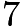
-step paths are there from

to
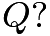
(The figure shows a sample path.)
![[asy] // diagram by SirCalcsALot size(200); int[] x = {6, 5, 4, 5, 6, 5, 6}; int[] y = {1, 2, 3, 4, 5, 6, 7}; int N = 7; for (int i = 0; i < 8; ++i) { for (int j = 0; j < 8; ++j) { draw((i,j)--(i+1,j)--(i+1,j+1)--(i,j+1)--(i,j)); if ((i+j) % 2 == 0) { filldraw((i,j)--(i+1,j)--(i+1,j+1)--(i,j+1)--(i,j)--cycle,black); } } } for (int i = 0; i < N; ++i) { draw(circle((x[i],y[i])+(0.5,0.5),0.35),grey); } label("$P$", (5.5, 0.5)); label("$Q$", (6.5, 7.5)); [/asy]](images/2020/3626126e77aef045aa58c34a5af6adc480e57f17.png)
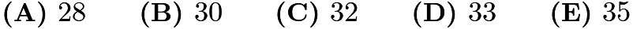

---

## Problem 22

When a positive integer

is fed into a machine, the output is a number calculated according to the rule shown below.
![[asy] size(300); defaultpen(linewidth(0.8)+fontsize(13)); real r = 0.05; draw((0.9,0)--(3.5,0),EndArrow(size=7)); filldraw((4,2.5)--(7,2.5)--(7,-2.5)--(4,-2.5)--cycle,gray(0.65)); fill(circle((5.5,1.25),0.8),white); fill(circle((5.5,1.25),0.5),gray(0.65)); fill((4.3,-r)--(6.7,-r)--(6.7,-1-r)--(4.3,-1-r)--cycle,white); fill((4.3,-1.25+r)--(6.7,-1.25+r)--(6.7,-2.25+r)--(4.3,-2.25+r)--cycle,white); fill((4.6,-0.25-r)--(6.4,-0.25-r)--(6.4,-0.75-r)--(4.6,-0.75-r)--cycle,gray(0.65)); fill((4.6,-1.5+r)--(6.4,-1.5+r)--(6.4,-2+r)--(4.6,-2+r)--cycle,gray(0.65)); label("$N$",(0.45,0)); draw((7.5,1.25)--(11.25,1.25),EndArrow(size=7)); draw((7.5,-1.25)--(11.25,-1.25),EndArrow(size=7)); label("if $N$ is even",(9.25,1.25),N); label("if $N$ is odd",(9.25,-1.25),N); label("$\frac N2$",(12,1.25)); label("$3N+1$",(12.6,-1.25)); [/asy]](images/2020/640f84b97add51c20f2c5af092b282884530e77b.png)
For example, starting with an input of
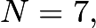
the machine will output
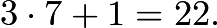
Then if the output is repeatedly inserted into the machine five more times, the final output is
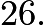
![\[7 \to 22 \to 11 \to 34 \to 17 \to 52 \to 26\]](images/2020/4f7a3ef049942c89a393ca7cf10d85cc7ddd0b8d.png)
When the same

-step process is applied to a different starting value of
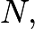
the final output is
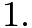
What is the sum of all such integers
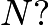
![\[N \to \rule{0.5cm}{0.15mm} \to \rule{0.5cm}{0.15mm} \to \rule{0.5cm}{0.15mm} \to \rule{0.5cm}{0.15mm} \to \rule{0.5cm}{0.15mm} \to 1\]](images/2020/c8914c251134025522a9009e8cdf1f898c2e9e08.png)
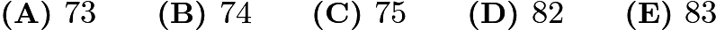

---

## Problem 23

Five different awards are to be given to three students. Each student will receive at least one award. In how many different ways can the awards be distributed?

---

## Problem 24

A large square region is paved with

gray square tiles, each measuring

inches on a side. A border

inches wide surrounds each tile. The figure below shows the case for

. When

, the

gray tiles cover

of the area of the large square region. What is the ratio

for this larger value of

![[asy] draw((0,0)--(13,0)--(13,13)--(0,13)--cycle); filldraw((1,1)--(4,1)--(4,4)--(1,4)--cycle, mediumgray); filldraw((1,5)--(4,5)--(4,8)--(1,8)--cycle, mediumgray); filldraw((1,9)--(4,9)--(4,12)--(1,12)--cycle, mediumgray); filldraw((5,1)--(8,1)--(8,4)--(5,4)--cycle, mediumgray); filldraw((5,5)--(8,5)--(8,8)--(5,8)--cycle, mediumgray); filldraw((5,9)--(8,9)--(8,12)--(5,12)--cycle, mediumgray); filldraw((9,1)--(12,1)--(12,4)--(9,4)--cycle, mediumgray); filldraw((9,5)--(12,5)--(12,8)--(9,8)--cycle, mediumgray); filldraw((9,9)--(12,9)--(12,12)--(9,12)--cycle, mediumgray); [/asy]](images/2020/c0d420afb8c2f467480a85d6c02e403e50af81a8.png)

---

## Problem 25

Rectangles

and

and squares

and

shown below, combine to form a rectangle that is 3322 units wide and 2020 units high. What is the side length of

in units?
![[asy] draw((0,0)--(5,0)--(5,3)--(0,3)--(0,0)); draw((3,0)--(3,1)--(0,1)); draw((3,1)--(3,2)--(5,2)); draw((3,2)--(2,2)--(2,1)--(2,3)); label("$R_1$",(3/2,1/2)); label("$S_3$",(4,1)); label("$S_2$",(5/2,3/2)); label("$S_1$",(1,2)); label("$R_2$",(7/2,5/2)); [/asy]](images/2020/a55c518a1179d67520c6a03827b4ba25ca1413f2.png)

---

