# AMC 8 2022 Problems

## Problem 1

The Math Team designed a logo shaped like a multiplication symbol, shown below on a grid of 1-inch squares. What is the area of the logo in square inches?
![[asy] defaultpen(linewidth(0.5)); size(5cm); defaultpen(fontsize(14pt)); label("$\textbf{Math}$", (2.1,3.7)--(3.9,3.7)); label("$\textbf{Team}$", (2.1,3)--(3.9,3)); filldraw((1,2)--(2,1)--(3,2)--(4,1)--(5,2)--(4,3)--(5,4)--(4,5)--(3,4)--(2,5)--(1,4)--(2,3)--(1,2)--cycle, mediumgray*0.5 + lightgray*0.5);  draw((0,0)--(6,0), gray); draw((0,1)--(6,1), gray); draw((0,2)--(6,2), gray); draw((0,3)--(6,3), gray); draw((0,4)--(6,4), gray); draw((0,5)--(6,5), gray); draw((0,6)--(6,6), gray);  draw((0,0)--(0,6), gray); draw((1,0)--(1,6), gray); draw((2,0)--(2,6), gray); draw((3,0)--(3,6), gray); draw((4,0)--(4,6), gray); draw((5,0)--(5,6), gray); draw((6,0)--(6,6), gray); [/asy]](images/2022/fd9026b556ba0538a3fa5fcbceab37f93ade3d4c.png)
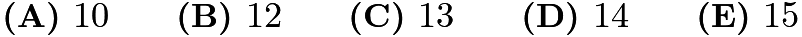

---

## Problem 2

Consider these two operations:
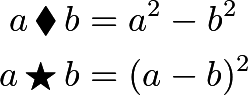
What is the value of
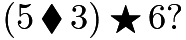

---

## Problem 3

When three positive integers

,

, and

are multiplied together, their product is

. Suppose
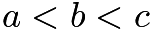
. In how many ways can the numbers be chosen?
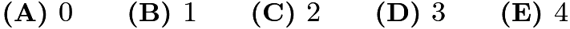

---

## Problem 4

The letter
M
in the figure below is first reflected over the line
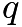
and then reflected over the line

. What is the resulting image?
![[asy] // pog diagram usepackage("newtxtext"); size(3cm); draw((-1,0)--(1,0)); draw((0,-1)--(0,1)); label("$\textbf{\textsf{M}}$",(0.25,0.6)); draw((-0.8,-0.8)--(0.8,0.8),linewidth(1.1)); label("$p$", (-1,0),NE); label("$q$", (-0.75,-0.75), N*1.5); [/asy]](images/2022/c38b67d113d5fbf1b6d6eae0d87161b539dbd849.png)
![[asy] // pog diagram usepackage("newtxtext"); size(12.5cm); draw((-1,0)--(1,0)); draw((0,-1)--(0,1)); label(rotate(90)*"$\textbf{\textsf{M}}$",(0.6,-0.25)); draw((-0.8,-0.8)--(0.8,0.8),linewidth(1.1));  label("$\textbf{(A)}$",(-1,1),W); draw((2,0)--(4,0)); draw((3,-1)--(3,1)); label(rotate(270)*"$\textbf{\textsf{M}}$",(2.8,0.7)); draw((2.2,-0.8)--(3.8,0.8),linewidth(1.1));  label("$\textbf{(B)}$",(2,1),W); draw((5,0)--(7,0)); draw((6,-1)--(6,1)); label(rotate(90)*"$\textbf{\textsf{M}}$",(5.4,0.2)); draw((5.2,-0.8)--(6.8,0.8),linewidth(1.1));  label("$\textbf{(C)}$",(5,1),W); draw((-1,-2.5)--(1,-2.5)); draw((0,-3.5)--(0,-1.5)); label(rotate(180)*"$\textbf{\textsf{M}}$",(-0.25,-3.1)); draw((-0.8,-3.3)--(0.8,-1.7),linewidth(1.1));  label("$\textbf{(D)}$",(-1,-1.5),W); draw((2,-2.5)--(4,-2.5)); draw((3,-3.5)--(3,-1.5)); label(rotate(270)*"$\textbf{\textsf{M}}$",(3.6,-2.75)); draw((2.2,-3.3)--(3.8,-1.7),linewidth(1.1));  label("$\textbf{(E)}$",(2,-1.5),W); [/asy]](images/2022/19b58c8f6aafe00e0ad5454583fda04c3567f944.png)

---

## Problem 5

Anna and Bella are celebrating their birthdays together. Five years ago, when Bella turned

years old, she received a newborn kitten as a birthday present. Today the sum of the ages of the two children and the kitten is

years. How many years older than Bella is Anna?
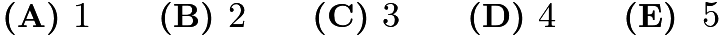

---

## Problem 6

Three positive integers are equally spaced on a number line. The middle number is
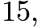
and the largest number is

times the smallest number. What is the smallest of these three numbers?
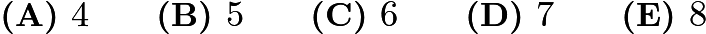

---

## Problem 7

When the World Wide Web first became popular in the

s, download speeds reached a maximum of about
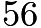
kilobits per second. Approximately how many minutes would the download of a
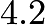
-megabyte song have taken at that speed? (Note that there are

kilobits in a megabyte.)

---

## Problem 8

What is the value of
![\[\frac{1}{3}\cdot\frac{2}{4}\cdot\frac{3}{5}\cdots\frac{18}{20}\cdot\frac{19}{21}\cdot\frac{20}{22}?\]](images/2022/8e422ea624f4cc14204e47ec836017b740d90c3d.png)
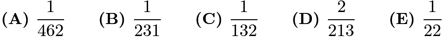

---

## Problem 9

A cup of boiling water (
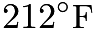
) is placed to cool in a room whose temperature remains constant at
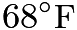
. Suppose the difference between the water temperature and the room temperature is halved every

minutes. What is the water temperature, in degrees Fahrenheit, after

minutes?

---

## Problem 10

One sunny day, Ling decided to take a hike in the mountains. She left her house at
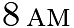
, drove at a constant speed of
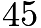
miles per hour, and arrived at the hiking trail at

. After hiking for

hours, Ling drove home at a constant speed of

miles per hour. Which of the following graphs best illustrates the distance between Ling’s car and her house over the course of her trip?
![[asy] unitsize(12); usepackage("mathptmx"); defaultpen(fontsize(8)+linewidth(.7)); int mod12(int i) {if (i<13) {return i;} else {return i-12;}} void drawgraph(pair sh,string lab) { for (int i=0;i<11;++i) { for (int j=0;j<6;++j) { draw(shift(sh+(i,j))*unitsquare,mediumgray); } } draw(shift(sh)*((-1,0)--(11,0)),EndArrow(angle=20,size=8)); draw(shift(sh)*((0,-1)--(0,6)),EndArrow(angle=20,size=8)); for (int i=1;i<10;++i) { draw(shift(sh)*((i,-.2)--(i,.2))); } label("8\tiny{\textsc{am}}",sh+(1,-.2),S);   for (int i=2;i<9;++i) { label(string(mod12(i+7)),sh+(i,-.2),S); } label("4\tiny{\textsc{pm}}",sh+(9,-.2),S); for (int i=1;i<6;++i) { label(string(30*i),sh+(0,i),2*W); } draw(rotate(90)*"Distance (miles)",sh+(-2.1,3),fontsize(10)); label("$\textbf{("+lab+")}$",sh+(-2.1,6.8),fontsize(12)); } drawgraph((0,0),"A"); drawgraph((15,0),"B"); drawgraph((0,-10),"C"); drawgraph((15,-10),"D"); drawgraph((0,-20),"E"); dotfactor=6; draw((1,0)--(3,3)--(6,3)--(8,0),linewidth(.9)); dot((1,0)^^(3,3)^^(6,3)^^(8,0)); pair sh = (15,0); draw(shift(sh)*((1,0)--(3,1.5)--(6,1.5)--(8,0)),linewidth(.9)); dot(sh+(1,0)^^sh+(3,1.5)^^sh+(6,1.5)^^sh+(8,0)); pair sh = (0,-10); draw(shift(sh)*((1,0)--(3,1.5)--(6,1.5)--(7.5,0)),linewidth(.9)); dot(sh+(1,0)^^sh+(3,1.5)^^sh+(6,1.5)^^sh+(7.5,0)); pair sh = (15,-10); draw(shift(sh)*((1,0)--(3,4)--(6,4)--(9.3,0)),linewidth(.9)); dot(sh+(1,0)^^sh+(3,4)^^sh+(6,4)^^sh+(9.3,0)); pair sh = (0,-20); draw(shift(sh)*((1,0)--(3,3)--(6,3)--(7.5,0)),linewidth(.9)); dot(sh+(1,0)^^sh+(3,3)^^sh+(6,3)^^sh+(7.5,0)); [/asy]](images/2022/cb1e2b28781a01015ec88e8948e5bda92a234383.png)

---

## Problem 11

Henry the donkey has a very long piece of pasta. He takes a number of bites of pasta, each time eating

inches of pasta from the middle of one piece. In the end, he has

pieces of pasta whose total length is
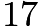
inches. How long, in inches, was the piece of pasta he started with?
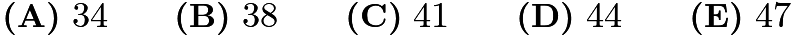

---

## Problem 12

The arrows on the two spinners shown below are spun. Let the number

equal

times the number on Spinner

, added to the number on Spinner

. What is the probability that

is a perfect square number?
![[asy] //diagram by pog give me 1 billion dollars for this size(6cm); usepackage("mathptmx"); filldraw(arc((0,0), r=4, angle1=0, angle2=90)--(0,0)--cycle,mediumgray*0.5+gray*0.5); filldraw(arc((0,0), r=4, angle1=90, angle2=180)--(0,0)--cycle,lightgray); filldraw(arc((0,0), r=4, angle1=180, angle2=270)--(0,0)--cycle,mediumgray); filldraw(arc((0,0), r=4, angle1=270, angle2=360)--(0,0)--cycle,lightgray*0.5+mediumgray*0.5); label("$5$", (-1.5,1.7)); label("$6$", (1.5,1.7)); label("$7$", (1.5,-1.7)); label("$8$", (-1.5,-1.7)); label("Spinner A", (0, -5.5)); filldraw(arc((12,0), r=4, angle1=0, angle2=90)--(12,0)--cycle,mediumgray*0.5+gray*0.5); filldraw(arc((12,0), r=4, angle1=90, angle2=180)--(12,0)--cycle,lightgray); filldraw(arc((12,0), r=4, angle1=180, angle2=270)--(12,0)--cycle,mediumgray); filldraw(arc((12,0), r=4, angle1=270, angle2=360)--(12,0)--cycle,lightgray*0.5+mediumgray*0.5); label("$1$", (10.5,1.7)); label("$2$", (13.5,1.7)); label("$3$", (13.5,-1.7)); label("$4$", (10.5,-1.7)); label("Spinner B", (12, -5.5)); [/asy]](images/2022/552b70fd0a4e9d6d464f53f730e82883afd5b278.png)
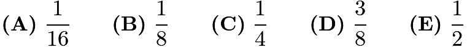

---

## Problem 13

How many positive integers can fill the blank in the sentence below?
“One positive integer is _____ more than twice another, and the sum of the two numbers is
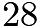
.”
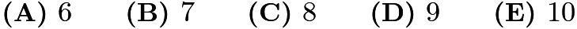

---

## Problem 14

In how many ways can the letters in

be rearranged so that two or more

s do not appear together?

---

## Problem 15

Laszlo went online to shop for black pepper and found thirty different black pepper options varying in weight and price, shown in the scatter plot below. In ounces, what is the weight of the pepper that offers the lowest price per ounce?
![[asy] //diagram by pog size(5.5cm); usepackage("mathptmx"); defaultpen(mediumgray*0.5+gray*0.5+linewidth(0.63)); add(grid(6,6)); label(scale(0.7)*"$1$", (1,-0.3), black); label(scale(0.7)*"$2$", (2,-0.3), black); label(scale(0.7)*"$3$", (3,-0.3), black); label(scale(0.7)*"$4$", (4,-0.3), black); label(scale(0.7)*"$5$", (5,-0.3), black); label(scale(0.7)*"$1$", (-0.3,1), black); label(scale(0.7)*"$2$", (-0.3,2), black); label(scale(0.7)*"$3$", (-0.3,3), black); label(scale(0.7)*"$4$", (-0.3,4), black); label(scale(0.7)*"$5$", (-0.3,5), black); label(scale(0.8)*rotate(90)*"Price (dollars)", (-1,3.2), black); label(scale(0.8)*"Weight (ounces)", (3.2,-1), black); dot((1,1.2),black); dot((1,1.7),black); dot((1,2),black); dot((1,2.8),black);  dot((1.5,2.1),black); dot((1.5,3),black); dot((1.5,3.3),black); dot((1.5,3.75),black);  dot((2,2),black); dot((2,2.9),black); dot((2,3),black); dot((2,4),black); dot((2,4.35),black); dot((2,4.8),black);  dot((2.5,2.7),black); dot((2.5,3.7),black); dot((2.5,4.2),black); dot((2.5,4.4),black);  dot((3,2.5),black); dot((3,3.4),black); dot((3,4.2),black);  dot((3.5,3.8),black); dot((3.5,4.5),black); dot((3.5,4.8),black);  dot((4,3.9),black); dot((4,5.1),black);  dot((4.5,4.75),black); dot((4.5,5),black);  dot((5,4.5),black); dot((5,5),black); [/asy]](images/2022/6a53d139336647bb978d693c547d713dd1f48d5f.png)
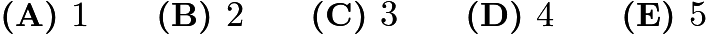

---

## Problem 16

Four numbers are written in a row. The average of the first two is
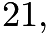
the average of the middle two is
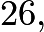
and the average of the last two is

What is the average of the first and last of the numbers?
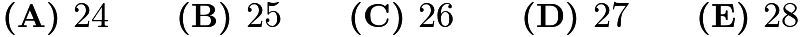

---

## Problem 17

If

is an even positive integer, the
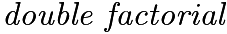
notation
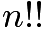
represents the product of all the even integers from

to

. For example,
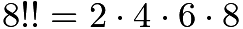
. What is the units digit of the following sum?
![\[2!! + 4!! + 6!! + \cdots + 2018!! + 2020!! + 2022!!\]](images/2022/6b7552c1c8d367a79bf701d4631efea748362631.png)
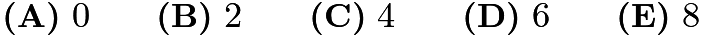

---

## Problem 18

The midpoints of the four sides of a rectangle are
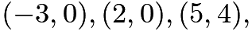
and
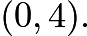
What is the
area of the rectangle?

---

## Problem 19

Mr. Ramos gave a test to his class of

students. The dot plot below shows the distribution of test scores.
![[asy] //diagram by pog . give me 1,000,000,000 dollars for this diagram size(5cm); defaultpen(0.7); dot((0.5,1)); dot((0.5,1.5)); dot((1.5,1)); dot((1.5,1.5)); dot((2.5,1)); dot((2.5,1.5)); dot((2.5,2)); dot((2.5,2.5)); dot((3.5,1)); dot((3.5,1.5)); dot((3.5,2)); dot((3.5,2.5)); dot((3.5,3)); dot((4.5,1)); dot((4.5,1.5)); dot((5.5,1)); dot((5.5,1.5)); dot((5.5,2)); dot((6.5,1)); dot((7.5,1)); draw((0,0.5)--(8,0.5),linewidth(0.7)); defaultpen(fontsize(10.5pt)); label("$65$", (0.5,-0.1)); label("$70$", (1.5,-0.1)); label("$75$", (2.5,-0.1)); label("$80$", (3.5,-0.1)); label("$85$", (4.5,-0.1)); label("$90$", (5.5,-0.1)); label("$95$", (6.5,-0.1)); label("$100$", (7.5,-0.1)); [/asy]](images/2022/8f168ff6d1e7635e68e0139420bed9ecfc2e4993.png)
Later Mr. Ramos discovered that there was a scoring error on one of the questions. He regraded the tests, awarding some of the students

extra points, which increased the median test score to
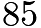
. What is the minimum number of students who received extra points?
(Note that the
median
test score equals the average of the

scores in the middle if the

test scores are arranged in increasing order.)

---

## Problem 20

The grid below is to be filled with integers in such a way that the sum of the numbers in each row and the sum of the numbers in each column are the same. Four numbers are missing. The number

in the lower left corner is larger than the other three missing numbers. What is the smallest possible value of

?
![[asy] unitsize(0.5cm); draw((3,3)--(-3,3)); draw((3,1)--(-3,1)); draw((3,-3)--(-3,-3)); draw((3,-1)--(-3,-1)); draw((3,3)--(3,-3)); draw((1,3)--(1,-3)); draw((-3,3)--(-3,-3)); draw((-1,3)--(-1,-3)); label((-2,2),"$-2$"); label((0,2),"$9$"); label((2,2),"$5$"); label((2,0),"${-}1$"); label((2,-2),"$8$"); label((-2,-2),"$x$"); [/asy]](images/2022/814e3a8ce1c3c82c9dc6e97078dc7dbfcc954b3e.png)
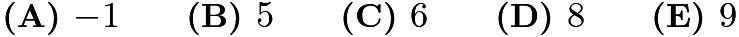

---

## Problem 21

Steph scored

baskets out of

attempts in the first half of a game, and

baskets out of

attempts in the second half. Candace took

attempts in the first half and

attempts in the second. In each half, Steph scored a higher percentage of baskets than Candace. Surprisingly they ended with the same overall percentage of baskets scored. How many more baskets did Candace score in the second half than in the first?
![[asy] size(7cm); draw((-8,27)--(72,27)); draw((16,0)--(16,35)); draw((40,0)--(40,35)); label("12", (28,3)); draw((25,6.5)--(25,12)--(31,12)--(31,6.5)--cycle); draw((25,5.5)--(31,5.5)); label("18", (56,3)); draw((53,6.5)--(53,12)--(59,12)--(59,6.5)--cycle); draw((53,5.5)--(59,5.5)); draw((53,5.5)--(59,5.5)); label("20", (28,18)); label("15", (28,24)); draw((25,21)--(31,21)); label("10", (56,18)); label("10", (56,24)); draw((53,21)--(59,21)); label("First Half", (28,31)); label("Second Half", (56,31)); label("Candace", (2.35,6)); label("Steph", (0,21)); [/asy]](images/2022/42aefbe42671b2aeb0b90d88e171e5e03a00b73e.png)
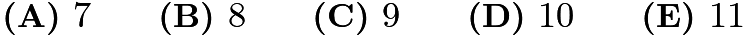

---

## Problem 22

A bus takes

minutes to drive from one stop to the next, and waits

minute at each stop to let passengers board. Zia takes

minutes to walk from one bus stop to the next. As Zia reaches a bus stop, if the bus is at the previous stop or has already left the previous stop, then she will wait for the bus. Otherwise she will start walking toward the next stop. Suppose the bus and Zia start at the same time toward the library, with the bus

stops behind. After how many minutes will Zia board the bus?

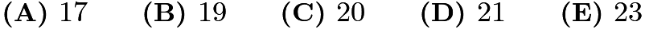

---

## Problem 23

A
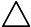
or

is placed in each of the nine squares in a

-by-

grid. Shown below is a sample configuration with three

s in a line.
![[asy] //diagram by kante314 size(3.3cm); defaultpen(linewidth(1)); real r = 0.37; path equi = r * dir(-30) -- (r+0.03) * dir(90) -- r * dir(210) -- cycle; draw((0,0)--(0,3)--(3,3)--(3,0)--cycle); draw((0,1)--(3,1)--(3,2)--(0,2)--cycle); draw((1,0)--(1,3)--(2,3)--(2,0)--cycle); draw(circle((3/2,5/2),1/3)); draw(circle((5/2,1/2),1/3)); draw(circle((3/2,3/2),1/3)); draw(shift(0.5,0.38) * equi); draw(shift(1.5,0.38) * equi); draw(shift(0.5,1.38) * equi); draw(shift(2.5,1.38) * equi); draw(shift(0.5,2.38) * equi); draw(shift(2.5,2.38) * equi); [/asy]](images/2022/f79f74a5bed66611fe027a9dd5ab0948b3a033ac.png)
How many configurations will have three

s in a line and three

s in a line?
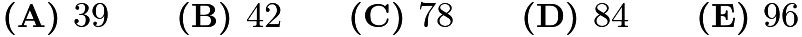

---

## Problem 24

The figure below shows a polygon

, consisting of rectangles and right triangles. When cut out and folded on the dotted lines, the polygon forms a triangular prism. Suppose that
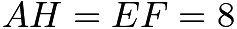
and
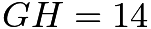
. What is the volume of the prism?
![[asy] usepackage("mathptmx"); size(275); defaultpen(linewidth(0.8)); real r = 2, s = 2.5, theta = 14; pair G = (0,0), F = (r,0), C = (r,s), B = (0,s), M = (C+F)/2, I = M + s/2 * dir(-theta); pair N = (B+G)/2, J = N + s/2 * dir(180+theta); pair E = F + r * dir(- 45 - theta/2), D = I+E-F; pair H = J + r * dir(135 + theta/2), A = B+H-J; draw(A--B--C--I--D--E--F--G--J--H--cycle^^rightanglemark(F,I,C)^^rightanglemark(G,J,B)); draw(J--B--G^^C--F--I,linetype ("4 4")); dot("$A$",A,N); dot("$B$",B,1.2*N); dot("$C$",C,N); dot("$D$",D,dir(0)); dot("$E$",E,S); dot("$F$",F,1.5*dir(-100)); dot("$G$",G,S); dot("$H$",H,W); dot("$I$",I,NE); dot("$J$",J,1.5*S); [/asy]](images/2022/8c0183579e57a39614f2c3be1824f286b6bf4b86.png)
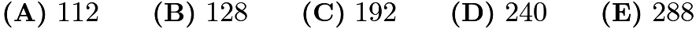

---

## Problem 25

A cricket randomly hops between

leaves, on each turn hopping to one of the other

leaves with equal probability. After

hops, what is the probability that the cricket has returned to the leaf where it started?

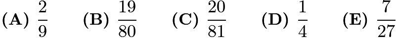

---

