# AMC 8 2023 Problems

## Problem 1

What is the value of
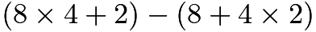
?
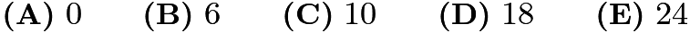

---

## Problem 2

A square piece of paper is folded twice into four equal quarters, as shown below, then cut along the dashed line. When unfolded, the paper will match which of the following figures?
![[asy]  //Restored original diagram. Alter it if you would like, but it was made by TheMathGuyd, // Diagram by TheMathGuyd. I even put the lined texture :) // Thank you Kante314 for inspiring thicker arrows. They do look much better size(0,3cm); path sq = (-0.5,-0.5)--(0.5,-0.5)--(0.5,0.5)--(-0.5,0.5)--cycle; path rh = (-0.125,-0.125)--(0.5,-0.5)--(0.5,0.5)--(-0.125,0.875)--cycle; path sqA = (-0.5,-0.5)--(-0.25,-0.5)--(0,-0.25)--(0.25,-0.5)--(0.5,-0.5)--(0.5,-0.25)--(0.25,0)--(0.5,0.25)--(0.5,0.5)--(0.25,0.5)--(0,0.25)--(-0.25,0.5)--(-0.5,0.5)--(-0.5,0.25)--(-0.25,0)--(-0.5,-0.25)--cycle; path sqB = (-0.5,-0.5)--(-0.25,-0.5)--(0,-0.25)--(0.25,-0.5)--(0.5,-0.5)--(0.5,0.5)--(0.25,0.5)--(0,0.25)--(-0.25,0.5)--(-0.5,0.5)--cycle; path sqC = (-0.25,-0.25)--(0.25,-0.25)--(0.25,0.25)--(-0.25,0.25)--cycle; path trD = (-0.25,0)--(0.25,0)--(0,0.25)--cycle; path sqE = (-0.25,0)--(0,-0.25)--(0.25,0)--(0,0.25)--cycle; filldraw(sq,mediumgrey,black); draw((0.75,0)--(1.25,0),currentpen+1,Arrow(size=6)); //folding path sqside = (-0.5,-0.5)--(0.5,-0.5); path rhside = (-0.125,-0.125)--(0.5,-0.5); transform fld = shift((1.75,0))*scale(0.5); draw(fld*sq,black); int i; for(i=0; i<10; i=i+1) {   draw(shift(0,0.05*i)*fld*sqside,deepblue); } path rhedge = (-0.125,-0.125)--(-0.125,0.8)--(-0.2,0.85)--cycle; filldraw(fld*rhedge,grey); path sqedge = (-0.5,-0.5)--(-0.5,0.4475)--(-0.575,0.45)--cycle; filldraw(fld*sqedge,grey); filldraw(fld*rh,white,black); int i; for(i=0; i<10; i=i+1) {   draw(shift(0,0.05*i)*fld*rhside,deepblue); } draw((2.25,0)--(2.75,0),currentpen+1,Arrow(size=6)); //cutting transform cut = shift((3.25,0))*scale(0.5); draw(shift((-0.01,+0.01))*cut*sq); draw(cut*sq); filldraw(shift((0.01,-0.01))*cut*sq,white,black); int j; for(j=0; j<10; j=j+1) { draw(shift(0,0.05*j)*cut*sqside,deepblue); } draw(shift((0.01,-0.01))*cut*(0,-0.5)--shift((0.01,-0.01))*cut*(0.5,0),dashed); //Answers Below, but already Separated //filldraw(sqA,grey,black); //filldraw(sqB,grey,black); //filldraw(sq,grey,black); //filldraw(sqC,white,black); //filldraw(sq,grey,black); //filldraw(trD,white,black); //filldraw(sq,grey,black); //filldraw(sqE,white,black); [/asy]](images/2023/6d385621437744e469b64fd20d5c8183e9e93ac1.png)
![[asy] // Diagram by TheMathGuyd. size(0,7.5cm); path sq = (-0.5,-0.5)--(0.5,-0.5)--(0.5,0.5)--(-0.5,0.5)--cycle; path rh = (-0.125,-0.125)--(0.5,-0.5)--(0.5,0.5)--(-0.125,0.875)--cycle; path sqA = (-0.5,-0.5)--(-0.25,-0.5)--(0,-0.25)--(0.25,-0.5)--(0.5,-0.5)--(0.5,-0.25)--(0.25,0)--(0.5,0.25)--(0.5,0.5)--(0.25,0.5)--(0,0.25)--(-0.25,0.5)--(-0.5,0.5)--(-0.5,0.25)--(-0.25,0)--(-0.5,-0.25)--cycle; path sqB = (-0.5,-0.5)--(-0.25,-0.5)--(0,-0.25)--(0.25,-0.5)--(0.5,-0.5)--(0.5,0.5)--(0.25,0.5)--(0,0.25)--(-0.25,0.5)--(-0.5,0.5)--cycle; path sqC = (-0.25,-0.25)--(0.25,-0.25)--(0.25,0.25)--(-0.25,0.25)--cycle; path trD = (-0.25,0)--(0.25,0)--(0,0.25)--cycle; path sqE = (-0.25,0)--(0,-0.25)--(0.25,0)--(0,0.25)--cycle;  //ANSWERS real sh = 1.5; label("$\textbf{(A)}$",(-0.5,0.5),SW); label("$\textbf{(B)}$",shift((sh,0))*(-0.5,0.5),SW); label("$\textbf{(C)}$",shift((2sh,0))*(-0.5,0.5),SW); label("$\textbf{(D)}$",shift((0,-sh))*(-0.5,0.5),SW); label("$\textbf{(E)}$",shift((sh,-sh))*(-0.5,0.5),SW); filldraw(sqA,mediumgrey,black); filldraw(shift((sh,0))*sqB,mediumgrey,black); filldraw(shift((2*sh,0))*sq,mediumgrey,black); filldraw(shift((2*sh,0))*sqC,white,black); filldraw(shift((0,-sh))*sq,mediumgrey,black); filldraw(shift((0,-sh))*trD,white,black); filldraw(shift((sh,-sh))*sq,mediumgrey,black); filldraw(shift((sh,-sh))*sqE,white,black); [/asy]](images/2023/0f8ca5448d7ae5672368a192ed9ee5af7a40419b.png)

---

## Problem 3

Wind chill
is a measure of how cold people feel when exposed to wind outside. A good estimate for wind chill can be found using this calculation
![\[(\text{wind chill}) = (\text{air temperature}) - 0.7 \times (\text{wind speed}),\]](images/2023/66810c2843261301faabc4441239f8fa51b1f231.png)
where temperature is measured in degrees Fahrenheit
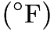
and the wind speed is measured in miles per hour (mph). Suppose the air temperature is
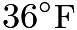
and the wind speed is

mph. Which of the following is closest to the approximate wind chill?
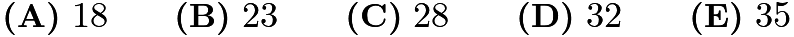

---

## Problem 4

The numbers from

to

are arranged in a spiral pattern on a square grid, beginning at the center. The first few numbers have been entered into the grid below. Consider the four numbers that will appear in the shaded squares, on the same diagonal as the number
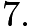
How many of these four numbers are prime?
![[asy] /* Made by MRENTHUSIASM */ size(175);  void ds(pair p) { 	filldraw((0.5,0.5)+p--(-0.5,0.5)+p--(-0.5,-0.5)+p--(0.5,-0.5)+p--cycle,mediumgrey); }  ds((0.5,4.5)); ds((1.5,3.5)); ds((3.5,1.5)); ds((4.5,0.5));  add(grid(7,7,grey+linewidth(1.25)));  int adj = 1; int curUp = 2; int curLeft = 4; int curDown = 6;  label("$1$",(3.5,3.5));  for (int len = 3; len<=3; len+=2) { 	for (int i=1; i<=len-1; ++i)     		{ 			label("$"+string(curUp)+"$",(3.5+adj,3.5-adj+i));     		label("$"+string(curLeft)+"$",(3.5+adj-i,3.5+adj));      		label("$"+string(curDown)+"$",(3.5-adj,3.5+adj-i));     		++curDown;     		++curLeft;     		++curUp; 		} 	++adj;     curUp = len^2 + 1;     curLeft = len^2 + len + 2;     curDown = len^2 + 2*len + 3; }  draw((4,4)--(3,4)--(3,3)--(5,3)--(5,5)--(2,5)--(2,2)--(6,2)--(6,6)--(1,6)--(1,1)--(7,1)--(7,7)--(0,7)--(0,0)--(7,0),linewidth(2)); [/asy]](images/2023/6e88180afd53a16ea3b9e0389e44933a31876e70.png)
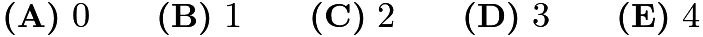

---

## Problem 5

A lake contains
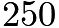
trout, along with a variety of other fish. When a marine biologist catches and releases a sample of
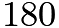
fish from the lake,

are identified as trout. Assume that the ratio of trout to the total number of fish is the same in both the sample and the lake. How many fish are there in the lake?

---

## Problem 6

The digits
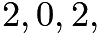
and

are placed in the expression below, one digit per box. What is the maximum possible value of the expression?
![[asy] // Diagram by TheMathGuyd. I can compress this later size(5cm); real w=2.2; pair O,I,J; O=(0,0);I=(1,0);J=(0,1); path bsqb = O--I; path bsqr = I--I+J; path bsqt = I+J--J; path bsql = J--O; path lsqb = shift((1.2,0.75))*scale(0.5)*bsqb; path lsqr = shift((1.2,0.75))*scale(0.5)*bsqr; path lsqt = shift((1.2,0.75))*scale(0.5)*bsqt; path lsql = shift((1.2,0.75))*scale(0.5)*bsql; draw(bsqb,dashed); draw(bsqr,dashed); draw(bsqt,dashed); draw(bsql,dashed); draw(lsqb,dashed); draw(lsqr,dashed); draw(lsqt,dashed); draw(lsql,dashed); label(scale(3)*"$\times$",(w,1/3)); draw(shift(1.3w,0)*bsqb,dashed); draw(shift(1.3w,0)*bsqr,dashed); draw(shift(1.3w,0)*bsqt,dashed); draw(shift(1.3w,0)*bsql,dashed); draw(shift(1.3w,0)*lsqb,dashed); draw(shift(1.3w,0)*lsqr,dashed); draw(shift(1.3w,0)*lsqt,dashed); draw(shift(1.3w,0)*lsql,dashed); [/asy]](images/2023/4e639504d3a7127498b862326310586835b4dfa3.png)
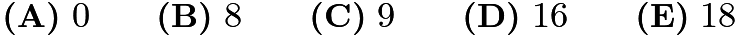

---

## Problem 7

A rectangle, with sides parallel to the

-axis and

-axis, has opposite vertices located at
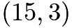
and
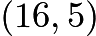
. A line is drawn through points
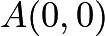
and
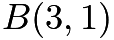
. Another line is drawn through points
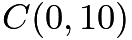
and
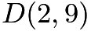
. How many points on the rectangle lie on at least one of the two lines?
![[asy] usepackage("mathptmx"); size(9cm); draw((0,-.5)--(0,11),EndArrow(size=.15cm)); draw((1,0)--(1,11),mediumgray); draw((2,0)--(2,11),mediumgray); draw((3,0)--(3,11),mediumgray); draw((4,0)--(4,11),mediumgray); draw((5,0)--(5,11),mediumgray); draw((6,0)--(6,11),mediumgray); draw((7,0)--(7,11),mediumgray); draw((8,0)--(8,11),mediumgray); draw((9,0)--(9,11),mediumgray); draw((10,0)--(10,11),mediumgray); draw((11,0)--(11,11),mediumgray); draw((12,0)--(12,11),mediumgray); draw((13,0)--(13,11),mediumgray); draw((14,0)--(14,11),mediumgray); draw((15,0)--(15,11),mediumgray); draw((16,0)--(16,11),mediumgray);  draw((-.5,0)--(17,0),EndArrow(size=.15cm)); draw((0,1)--(17,1),mediumgray); draw((0,2)--(17,2),mediumgray); draw((0,3)--(17,3),mediumgray); draw((0,4)--(17,4),mediumgray); draw((0,5)--(17,5),mediumgray); draw((0,6)--(17,6),mediumgray); draw((0,7)--(17,7),mediumgray); draw((0,8)--(17,8),mediumgray); draw((0,9)--(17,9),mediumgray); draw((0,10)--(17,10),mediumgray);  draw((-.13,1)--(.13,1)); draw((-.13,2)--(.13,2)); draw((-.13,3)--(.13,3)); draw((-.13,4)--(.13,4)); draw((-.13,5)--(.13,5)); draw((-.13,6)--(.13,6)); draw((-.13,7)--(.13,7)); draw((-.13,8)--(.13,8)); draw((-.13,9)--(.13,9)); draw((-.13,10)--(.13,10));  draw((1,-.13)--(1,.13)); draw((2,-.13)--(2,.13)); draw((3,-.13)--(3,.13)); draw((4,-.13)--(4,.13)); draw((5,-.13)--(5,.13)); draw((6,-.13)--(6,.13)); draw((7,-.13)--(7,.13)); draw((8,-.13)--(8,.13)); draw((9,-.13)--(9,.13)); draw((10,-.13)--(10,.13)); draw((11,-.13)--(11,.13)); draw((12,-.13)--(12,.13)); draw((13,-.13)--(13,.13)); draw((14,-.13)--(14,.13)); draw((15,-.13)--(15,.13)); draw((16,-.13)--(16,.13));  label(scale(.7)*"$1$", (1,-.13), S); label(scale(.7)*"$2$", (2,-.13), S); label(scale(.7)*"$3$", (3,-.13), S); label(scale(.7)*"$4$", (4,-.13), S); label(scale(.7)*"$5$", (5,-.13), S); label(scale(.7)*"$6$", (6,-.13), S); label(scale(.7)*"$7$", (7,-.13), S); label(scale(.7)*"$8$", (8,-.13), S); label(scale(.7)*"$9$", (9,-.13), S); label(scale(.7)*"$10$", (10,-.13), S); label(scale(.7)*"$11$", (11,-.13), S); label(scale(.7)*"$12$", (12,-.13), S); label(scale(.7)*"$13$", (13,-.13), S); label(scale(.7)*"$14$", (14,-.13), S); label(scale(.7)*"$15$", (15,-.13), S); label(scale(.7)*"$16$", (16,-.13), S);  label(scale(.7)*"$1$", (-.13,1), W); label(scale(.7)*"$2$", (-.13,2), W); label(scale(.7)*"$3$", (-.13,3), W); label(scale(.7)*"$4$", (-.13,4), W); label(scale(.7)*"$5$", (-.13,5), W); label(scale(.7)*"$6$", (-.13,6), W); label(scale(.7)*"$7$", (-.13,7), W); label(scale(.7)*"$8$", (-.13,8), W); label(scale(.7)*"$9$", (-.13,9), W); label(scale(.7)*"$10$", (-.13,10), W);   dot((0,0),linewidth(4)); label(scale(.75)*"$A$", (0,0), NE); dot((3,1),linewidth(4)); label(scale(.75)*"$B$", (3,1), NE);  dot((0,10),linewidth(4)); label(scale(.75)*"$C$", (0,10), NE); dot((2,9),linewidth(4)); label(scale(.75)*"$D$", (2,9), NE);  draw((15,3)--(16,3)--(16,5)--(15,5)--cycle,linewidth(1.125)); dot((15,3),linewidth(4)); dot((16,3),linewidth(4)); dot((16,5),linewidth(4)); dot((15,5),linewidth(4)); [/asy]](images/2023/3f2bc5fa9ed29072b71e62f652eec4cdbbf3f142.png)

---

## Problem 8

Lola, Lolo, Tiya, and Tiyo participated in a ping pong tournament. Each player competed against each of the other three players exactly twice. Shown below are the win-loss records for the players. The numbers

and

represent a win or loss, respectively. For example, Lola won five matches and lost the fourth match. What was Tiyo’s win-loss record?
![\[\begin{tabular}{c | c} Player & Result \\ \hline Lola & \texttt{111011}\\ Lolo & \texttt{101010}\\ Tiya & \texttt{010100}\\ Tiyo & \texttt{??????} \end{tabular}\]](images/2023/c136a605154465c99d38f4ee944f29137bfb226a.png)

---

## Problem 9

Malaika is skiing on a mountain. The graph below shows her elevation, in meters, above the base of the mountain as she skis along a trail. In total, how many seconds does she spend at an elevation between

and

meters?
![[asy] // Diagram by TheMathGuyd. Found cubic, so graph is perfect. import graph; size(8cm); int i; for(i=1; i<9; i=i+1) { draw((-0.2,2i-1)--(16.2,2i-1), mediumgrey); draw((2i-1,-0.2)--(2i-1,16.2), mediumgrey); draw((-0.2,2i)--(16.2,2i), grey); draw((2i,-0.2)--(2i,16.2), grey); } Label f;  f.p=fontsize(6);  xaxis(-0.5,17.8,Ticks(f, 2.0),Arrow());  yaxis(-0.5,17.8,Ticks(f, 2.0),Arrow());  real f(real x)  {  return -0.03125 x^(3) + 0.75x^(2) - 5.125 x + 14.5;  }  draw(graph(f,0,15.225),currentpen+1); real dpt=2; real ts=0.75; transform st=scale(ts); label(rotate(90)*st*"Elevation (meters)",(-dpt,8)); label(st*"Time (seconds)",(8,-dpt)); [/asy]](images/2023/8fb400c99ed94b8b0a7d87fc66909b3cde3ca1fa.png)
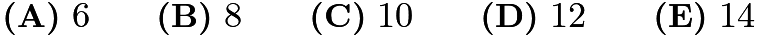

---

## Problem 10

Harold made a plum pie to take on a picnic. He was able to eat only

of the pie, and he left the rest for his friends. A moose came by and ate
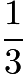
of what Harold left behind. After that, a porcupine ate

of what the moose left behind. How much of the original pie still remained after the porcupine left?
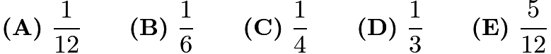

---

## Problem 11

NASA’s Perseverance Rover was launched on July
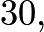

After traveling
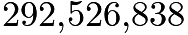
miles, it landed on Mars in Jezero Crater about
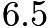
months later. Which of the following is closest to the Rover’s average interplanetary speed in miles per hour?

---

## Problem 12

The figure below shows a large white circle with a number of smaller white and shaded circles in its
interior. What fraction of the interior of the large white circle is shaded?
![[asy] // Diagram by TheMathGuyd size(6cm); draw(circle((3,3),3)); filldraw(circle((2,3),2),lightgrey); filldraw(circle((3,3),1),white); filldraw(circle((1,3),1),white); filldraw(circle((5.5,3),0.5),lightgrey); filldraw(circle((4.5,4.5),0.5),lightgrey); filldraw(circle((4.5,1.5),0.5),lightgrey); int i, j; for(i=0; i<7; i=i+1) { draw((0,i)--(6,i), dashed+grey); draw((i,0)--(i,6), dashed+grey); } [/asy]](images/2023/8828bc341da153e3d2856185043028e8ceb903cf.png)
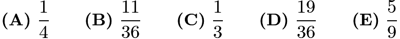

---

## Problem 13

Along the route of a bicycle race,

water stations are evenly spaced between the start and finish lines,
as shown in the figure below. There are also

repair stations evenly spaced between the start and
finish lines. The

rd water station is located

miles after the

st repair station. How long is the race
in miles?
![[asy] // Credits given to Themathguyd‎ and Kante314 usepackage("mathptmx"); size(10cm); filldraw((11,4.5)--(171,4.5)--(171,17.5)--(11,17.5)--cycle,mediumgray*0.4 + lightgray*0.6); draw((11,11)--(171,11),linetype("2 2")+white+linewidth(1.2)); draw((0,0)--(11,0)--(11,22)--(0,22)--cycle); draw((171,0)--(182,0)--(182,22)--(171,22)--cycle);  draw((31,4.5)--(31,0)); draw((51,4.5)--(51,0)); draw((151,4.5)--(151,0));  label(scale(.85)*rotate(45)*"Water 1", (23,-13.5)); label(scale(.85)*rotate(45)*"Water 2", (43,-13.5)); label(scale(.85)*rotate(45)*"Water 7", (143,-13.5));  filldraw(circle((103,-13.5),.2)); filldraw(circle((98,-13.5),.2)); filldraw(circle((93,-13.5),.2)); filldraw(circle((88,-13.5),.2)); filldraw(circle((83,-13.5),.2));  label(scale(.85)*rotate(90)*"Start", (5.5,11)); label(scale(.85)*rotate(270)*"Finish", (176.5,11)); [/asy]](images/2023/efaa138f2f7bc240bc49299009af49a7fc9a0420.png)
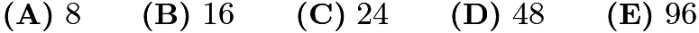

---

## Problem 14

Nicolas is planning to send a package to his friend Anton, who is a stamp collector. To pay for the postage, Nicolas would like to cover the package with a large number of stamps. Suppose he has a collection of

-cent,

-cent, and

-cent stamps, with exactly

of each type. What is the greatest number of stamps Nicolas can use to make exactly
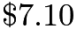
in postage?
(Note: The amount

corresponds to

dollars and

cents. One dollar is worth

cents.)
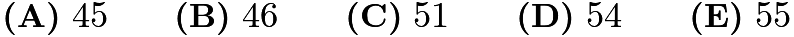

---

## Problem 15

Viswam walks half a mile to get to school each day. His route consists of

city blocks of equal length and he takes

minute to walk each block. Today, after walking

blocks, Viswam discovers he has to make a detour, walking

blocks of equal length instead of

block to reach the next corner. From the time he starts his detour, at what speed, in mph, must he walk, in order to get to school at his usual time?
![[asy] // Diagram by TheMathGuyd size(13cm); // this is an important stickman to the left of the origin pair C=midpoint((-0.5,0.5)--(-0.6,0.05)); draw((-0.5,0.5)--(-0.6,0.05)); // Head to butt draw((-0.64,0.16)--(-0.7,0.2)--C--(-0.47,0.2)--(-0.4,0.22)); // LH-C-RH draw((-0.6,0.05)--(-0.55,-0.1)--(-0.57,-0.25)); draw((-0.6,0.05)--(-0.68,-0.12)--(-0.8,-0.20));  filldraw(circle((-0.5,0.5),0.1),white,black);  int i; real d,s; // gap and side d=0.2; s=1-2*d; for(i=0; i<10; i=i+1) {   //dot((i,0), red); //marks to start   filldraw((i+d,d)--(i+1-d,d)--(i+1-d,1-d)--(i+d,1-d)--cycle, lightgrey, black);   filldraw(conj((i+d,d))--conj((i+1-d,d))--conj((i+1-d,1-d))--conj((i+d,1-d))--cycle,lightgrey,black); }  fill((5+d,-d/2)--(6-d,-d/2)--(6-d,d/2)--(5+d,d/2)--cycle,lightred);  draw((0,0)--(5,0)--(5,1)--(6,1)--(6,0)--(10.1,0),deepblue+linewidth(1.25)); //Who even noticed label("School", (10,0),E, Draw()); [/asy]](images/2023/f75d299d4b35cf040c71ccfca989da9a7787ce2b.png)
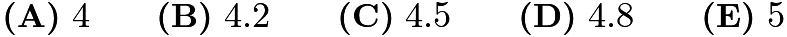

---

## Problem 16

The letters
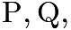
and

are entered into a

table according to the pattern shown below. How many

s,
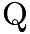
s, and

s will appear in the completed table?
![[asy] /* Made by MRENTHUSIASM, Edited by Kante314 */ usepackage("mathdots"); size(5cm); draw((0,0)--(6,0),linewidth(1.5)+mediumgray); draw((0,1)--(6,1),linewidth(1.5)+mediumgray); draw((0,2)--(6,2),linewidth(1.5)+mediumgray); draw((0,3)--(6,3),linewidth(1.5)+mediumgray); draw((0,4)--(6,4),linewidth(1.5)+mediumgray); draw((0,5)--(6,5),linewidth(1.5)+mediumgray);  draw((0,0)--(0,6),linewidth(1.5)+mediumgray); draw((1,0)--(1,6),linewidth(1.5)+mediumgray); draw((2,0)--(2,6),linewidth(1.5)+mediumgray); draw((3,0)--(3,6),linewidth(1.5)+mediumgray); draw((4,0)--(4,6),linewidth(1.5)+mediumgray); draw((5,0)--(5,6),linewidth(1.5)+mediumgray);  label(scale(.9)*"\textsf{P}", (.5,.5)); label(scale(.9)*"\textsf{Q}", (.5,1.5)); label(scale(.9)*"\textsf{R}", (.5,2.5)); label(scale(.9)*"\textsf{P}", (.5,3.5)); label(scale(.9)*"\textsf{Q}", (.5,4.5)); label("$\vdots$", (.5,5.6));  label(scale(.9)*"\textsf{Q}", (1.5,.5)); label(scale(.9)*"\textsf{R}", (1.5,1.5)); label(scale(.9)*"\textsf{P}", (1.5,2.5)); label(scale(.9)*"\textsf{Q}", (1.5,3.5)); label(scale(.9)*"\textsf{R}", (1.5,4.5)); label("$\vdots$", (1.5,5.6));  label(scale(.9)*"\textsf{R}", (2.5,.5)); label(scale(.9)*"\textsf{P}", (2.5,1.5)); label(scale(.9)*"\textsf{Q}", (2.5,2.5)); label(scale(.9)*"\textsf{R}", (2.5,3.5)); label(scale(.9)*"\textsf{P}", (2.5,4.5)); label("$\vdots$", (2.5,5.6));  label(scale(.9)*"\textsf{P}", (3.5,.5)); label(scale(.9)*"\textsf{Q}", (3.5,1.5)); label(scale(.9)*"\textsf{R}", (3.5,2.5)); label(scale(.9)*"\textsf{P}", (3.5,3.5)); label(scale(.9)*"\textsf{Q}", (3.5,4.5)); label("$\vdots$", (3.5,5.6));  label(scale(.9)*"\textsf{Q}", (4.5,.5)); label(scale(.9)*"\textsf{R}", (4.5,1.5)); label(scale(.9)*"\textsf{P}", (4.5,2.5)); label(scale(.9)*"\textsf{Q}", (4.5,3.5)); label(scale(.9)*"\textsf{R}", (4.5,4.5)); label("$\vdots$", (4.5,5.6));  label(scale(.9)*"$\dots$", (5.5,.5)); label(scale(.9)*"$\dots$", (5.5,1.5)); label(scale(.9)*"$\dots$", (5.5,2.5)); label(scale(.9)*"$\dots$", (5.5,3.5)); label(scale(.9)*"$\dots$", (5.5,4.5)); label(scale(.9)*"$\iddots$", (5.5,5.6)); [/asy]](images/2023/cb56c83bbe94022221482c1b9445b3a1810eeca2.png)

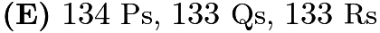

---

## Problem 17

A
regular octahedron
has eight equilateral triangle faces with four faces meeting at each vertex. Jun will make the regular octahedron shown on the right by folding the piece of paper shown on the left. Which numbered face will end up to the right of

?
![[asy] // Diagram by TheMathGuyd import graph; // The Solid // To save processing time, do not use three (dimensions) // Project (roughly) to two size(15cm); pair Fr, Lf, Rt, Tp, Bt, Bk; Lf=(0,0); Rt=(12,1); Fr=(7,-1); Bk=(5,2); Tp=(6,6.7); Bt=(6,-5.2); draw(Lf--Fr--Rt); draw(Lf--Tp--Rt); draw(Lf--Bt--Rt); draw(Tp--Fr--Bt); draw(Lf--Bk--Rt,dashed); draw(Tp--Bk--Bt,dashed); label(rotate(-8.13010235)*slant(0.1)*"$Q$", (4.2,1.6)); label(rotate(21.8014095)*slant(-0.2)*"$?$", (8.5,2.05)); pair g = (-8,0); // Define Gap transform real a = 8; draw(g+(-a/2,1)--g+(a/2,1), Arrow()); // Make arrow // Time for the NET pair DA,DB,DC,CD,O; DA = (4*sqrt(3),0); DB = (2*sqrt(3),6); DC = (DA+DB)/3; CD = conj(DC); O=(0,0); transform trf=shift(3g+(0,3)); path NET = O--(-2*DA)--(-2DB)--(-DB)--(2DA-DB)--DB--O--DA--(DA-DB)--O--(-DB)--(-DA)--(-DA-DB)--(-DB); draw(trf*NET); label("$7$",trf*DC); label("$Q$",trf*DC+DA-DB); label("$5$",trf*DC-DB); label("$3$",trf*DC-DA-DB); label("$6$",trf*CD); label("$4$",trf*CD-DA); label("$2$",trf*CD-DA-DB); label("$1$",trf*CD-2DA); [/asy]](images/2023/73573481f96dd080a6118ceb2a3c4588148704dc.png)

---

## Problem 18

Greta Grasshopper sits on a long line of lily pads in a pond. From any lily pad, Greta can jump

pads to the right or

pads to the left. What is the fewest number of jumps Greta must make to reach the lily pad located
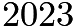
pads to the right of her starting point?
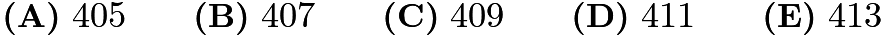

---

## Problem 19

An equilateral triangle is placed inside a larger equilateral triangle so that the region between them can be divided into three congruent trapezoids, as shown below. The side length of the inner triangle is

the side length of the larger triangle. What is the ratio of the area of one trapezoid to the area of the inner triangle?
![[asy] // Diagram by TheMathGuyd  pair A,B,C; A=(0,1); B=(sqrt(3)/2,-1/2); C=-conj(B); fill(2B--3B--3C--2C--cycle,grey); dot(3A); dot(3B); dot(3C); dot(2A); dot(2B); dot(2C); draw(2A--2B--2C--cycle); draw(3A--3B--3C--cycle); draw(2A--3A); draw(2B--3B); draw(2C--3C); [/asy]](images/2023/c5f0d710200d86f7fe0ffc7ea4226812f1de1cf8.png)
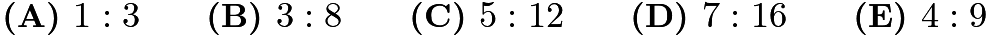

---

## Problem 20

Two integers are inserted into the list
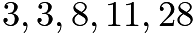
to double its range. The mode and median remain unchanged. What is the maximum possible sum of the two additional numbers?
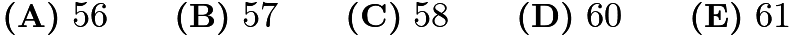

---

## Problem 21

Alina writes the numbers
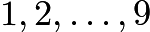
on separate cards, one number per card. She wishes to divide the cards into

groups of

cards so that the sum of the numbers in each group will be the same. In how many ways can this be done?

---

## Problem 22

In a sequence of positive integers, each term after the second is the product of the previous two terms. The sixth term is

. What is the first term?
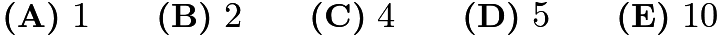

---

## Problem 23

Each square in a
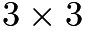
grid is randomly filled with one of the

gray and white tiles shown below on the right.
![[asy] size(5.663333333cm); draw((0,0)--(3,0)--(3,3)--(0,3)--cycle,gray); draw((1,0)--(1,3)--(2,3)--(2,0),gray); draw((0,1)--(3,1)--(3,2)--(0,2),gray);  fill((6,.33)--(7,.33)--(7,1.33)--cycle,mediumgray); draw((6,.33)--(7,.33)--(7,1.33)--(6,1.33)--cycle,gray); fill((6,1.67)--(7,2.67)--(6,2.67)--cycle,mediumgray); draw((6,1.67)--(7,1.67)--(7,2.67)--(6,2.67)--cycle,gray); fill((7.33,.33)--(8.33,.33)--(7.33,1.33)--cycle,mediumgray); draw((7.33,.33)--(8.33,.33)--(8.33,1.33)--(7.33,1.33)--cycle,gray); fill((8.33,1.67)--(8.33,2.67)--(7.33,2.67)--cycle,mediumgray); draw((7.33,1.67)--(8.33,1.67)--(8.33,2.67)--(7.33,2.67)--cycle,gray); [/asy]](images/2023/c01163352203e89b9926215ea00f34b275a6c630.png)
What is the probability that the tiling will contain a large gray diamond in one of the smaller
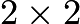
grids? Below is an example of such tiling.
![[asy] size(2cm);  fill((1,0)--(0,1)--(0,2)--(1,1)--cycle,mediumgray); fill((2,0)--(3,1)--(2,2)--(1,1)--cycle,mediumgray); fill((1,2)--(1,3)--(0,3)--cycle,mediumgray); fill((1,2)--(2,2)--(2,3)--cycle,mediumgray); fill((3,2)--(3,3)--(2,3)--cycle,mediumgray);  draw((0,0)--(3,0)--(3,3)--(0,3)--cycle,gray); draw((1,0)--(1,3)--(2,3)--(2,0),gray); draw((0,1)--(3,1)--(3,2)--(0,2),gray); [/asy]](images/2023/8d9055c9c5a4feb6f71e870557f61ce1d6b5033a.png)
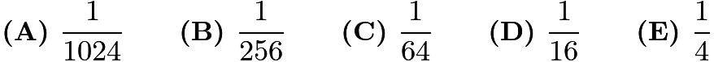

---

## Problem 24

Isosceles triangle

has equal side lengths
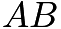
and

. In the figures below, segments are drawn parallel to

so that the shaded portions of

have the same area. The heights of the two unshaded portions are 11 and 5 units, respectively. What is the height
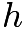
of

?
![[asy] //Diagram by TheMathGuyd size(12cm); real h = 2.5; // height real g=4; //c2c space real s = 0.65; //Xcord of Hline real adj = 0.08; //adjust line diffs pair A,B,C; B=(0,h); C=(1,0); A=-conj(C); pair PONE=(s,h*(1-s)); //Endpoint of Hline ONE pair PTWO=(s+adj,h*(1-s-adj)); //Endpoint of Hline ONE path LONE=PONE--(-conj(PONE)); //Hline ONE path LTWO=PTWO--(-conj(PTWO)); path T=A--B--C--cycle; //Triangle   fill (shift(g,0)*(LTWO--B--cycle),mediumgrey); fill (LONE--A--C--cycle,mediumgrey);  draw(LONE); draw(T); label("$A$",A,SW); label("$B$",B,N); label("$C$",C,SE);  draw(shift(g,0)*LTWO); draw(shift(g,0)*T); label("$A$",shift(g,0)*A,SW); label("$B$",shift(g,0)*B,N); label("$C$",shift(g,0)*C,SE);  draw(B--shift(g,0)*B,dashed); draw(C--shift(g,0)*A,dashed); draw((g/2,0)--(g/2,h),dashed); draw((0,h*(1-s))--B,dashed); draw((g,h*(1-s-adj))--(g,0),dashed); label("$5$", midpoint((g,h*(1-s-adj))--(g,0)),UnFill); label("$h$", midpoint((g/2,0)--(g/2,h)),UnFill); label("$11$", midpoint((0,h*(1-s))--B),UnFill); [/asy]](images/2023/61696b1f6c1847f1610683505bd7e902290c51da.png)
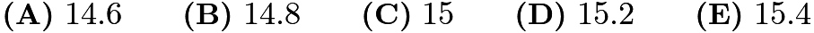

---

## Problem 25

Fifteen integers
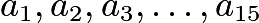
are arranged in order on a number line. The integers are equally spaced and have the property that
![\[1 \le a_1 \le 10, \thickspace 13 \le a_2 \le 20, \thickspace \text{ and } \thickspace 241 \le a_{15}\le 250.\]](images/2023/1d2ca926ca9cbd962c46878abaecad6ef507d5ff.png)
What is the sum of digits of
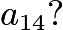
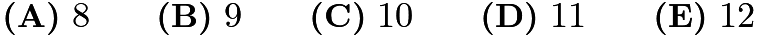

---

