# AMC 8 2025 Problems

## Problem 1

The eight-pointed star, shown in the figure below, is a popular quilting pattern. What percent of the entire \(4\times4\) grid is covered by the star?
![[asy] path x = (0,1)--(1,2)--(2,2)--(1,1)--cycle; path y = reflect((0,0),(4,4)) * x;  fill(x, gray(0.6)); fill(rotate(90, (2,2)) * x, gray(0.6)); fill(rotate(180, (2,2)) * x, gray(0.6)); fill(rotate(270, (2,2)) * x, gray(0.6));  fill(y, gray(0.8)); fill(rotate(90, (2,2)) * y, gray(0.8)); fill(rotate(180, (2,2)) * y, gray(0.8)); fill(rotate(270, (2,2)) * y, gray(0.8));  draw((1,1)--(3,3)); draw((3,1)--(1,3));  add(grid(4,4));  path w = (1,0)--(2,1)--(3,0);  draw(w); draw(rotate(90, (2,2)) * w); draw(rotate(180, (2,2)) * w); draw(rotate(270, (2,2)) * w); [/asy]](images/2025/img_53877e85.png)
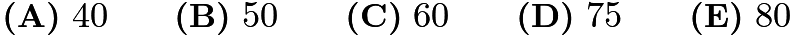

---

## Problem 2

The table below shows the Ancient Egyptian hieroglyphs that were used to represent different numbers.

For example, the number
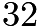
was represented by the hieroglyphs

. What number is represented by the following combination of hieroglyphs?
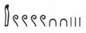
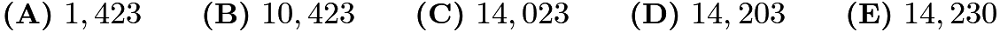

---

## Problem 3

Buffalo Shuffle-o
is a card game in which all the cards are distributed evenly among all players at the start of the game. When Annika and

of her friends play
Buffalo Shuffle-o
, each player is dealt
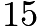
cards. Suppose

more friends join the next game. How many cards will be dealt to each player?

---

## Problem 4

Lucius is counting backward by

s. His first three numbers are

,
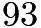
, and
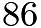
. What is his

th number?
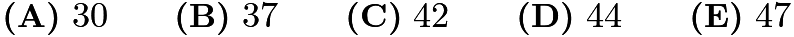

---

## Problem 5

Betty drives a truck to deliver packages in a neighborhood whose street map is shown below.
Betty starts at the factory (labled
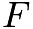
) and drives to location

, then

, then

, before returning to

. What is the shortest distance, in blocks, she can drive to complete the route?
![[asy]  unitsize(20);  add(grid(8,6));  path w = circle((0,0),0.4);  fill(w, white); draw(w); label("$B$",(0,0));  fill(shift((2,4)) * w, white); draw(shift((2,4)) * w); label("$C$",(2,4));  fill(shift((7,3)) * w, white); draw(shift((7,3)) * w); label("$A$",(7,3));  fill(shift((6,5)) * w, white); draw(shift((6,5)) * w); label("$F$",(6,5));  draw((6,-0.2)--(7,-0.2), EndArrow(3)); draw((7,-0.2)--(6,-0.2), EndArrow(3)); draw(shift(6.5, -0.48) * scale(0.03) * texpath("1 block"));  draw((8.2,1)--(8.2,2), EndArrow(3)); draw((8.2,2)--(8.2,1), EndArrow(3)); draw(shift(8.88, 1.5) * scale(0.03) * texpath("1 block"));  [/asy]](images/2025/img_bd9012ed.png)
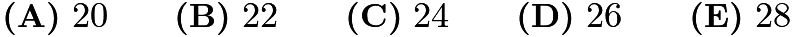

---

## Problem 6

Sekou writes the numbers
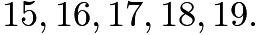
After he erases one of his numbers, the sum of the remaining four numbers is a multiple of
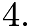
Which number did he erase?
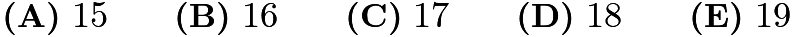

---

## Problem 7

On the most recent exam on Prof. Xochi's class,

students earned a score of at least
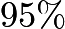
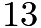
students earned a score of at least

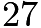
students earned a score of at least
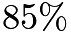

students earned a score of at least

How many students earned a score of at least

and less than

?
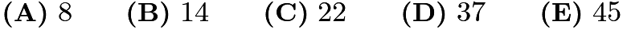

---

## Problem 8

Isaiah cuts open a cardboard cube along some of its edges to form the flat shape shown on the right, which has an area of

square centimeters. What is the volume of the cube in cubic centimeters?
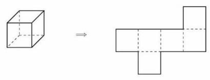
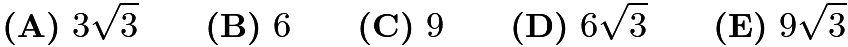

---

## Problem 9

Ningli looks at the

pairs of numbers directly across from each other on a clock. She takes the average of each pair of numbers. What is the average of the resulting

numbers?
![[asy] /* AMC8 P9 2025, by NUMANA: BUI VAN HIEU buivanhieu@husc.edu.vn, https://husc.edu.vn */ unitsize(1cm); draw(circle((0,0),2));  for(int i = 1; i <= 12; ++i) { draw(1.9*dir(90-i*30)-- 2*dir(90-i*30));//,linewidth(1pt) label("$"+string(i)+"$",2.3*dir(90-i*30)); }  draw(2*dir(-150)--2*dir(30),dashed); [/asy]](images/2025/img_216d2598.png)
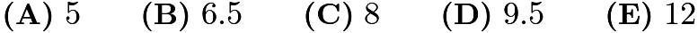

---

## Problem 10

In the figure below,

is a rectangle with sides of length
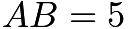
inches and

=

inches. Rectangle

is rotated

clockwise around the midpoint of side

to give a second rectangle. What is the total area, in square inches, covered by the two overlapping rectangles?
![[asy] /* 2025 AMC 8 Problem 10 Diagram */ unitsize(1cm);  pair A = (-2.5,1.5), B = (2.5,1.5), C = (2.5,-1.5), D = (-2.5,-1.5); filldraw(A--B--C--D--cycle, gray(0.8), black+1bp); label("$A$", A, NW); label("$B$", B, NE); label("$C$", C, SE); label("$D$", D, SW);  pair P = (3,1), Q = (3,-4), R = (0,-4), S = (0,1);  draw(P--Q--R--S--cycle, black+1bp);  pair M = (0,-1.5); dot(M, black+5bp);  draw(arc((0,-1.5), 0.3, 180, -90), Arrow(TeXHead)); [/asy]](images/2025/img_834512bd.png)
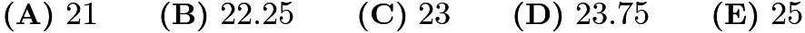

---

## Problem 11

A
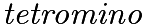
consists of four squares connected along their edges. There are five possible tetromino shapes,
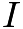
,

,
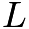
,
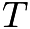
, and
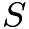
, shown below, which can be rotated or flipped over. Three tetrominoes are used to completely cover a
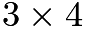
rectangle. At least one of the tiles is an

tile. What are the other two tiles?
![[asy]  unitsize(12);  add(grid(1,4)); label("I", (0.5,-1));  add(shift((5,0)) * grid(2,2)); label("O", (6,-1));  add(shift((11,0)) * grid(1,3)); add(shift((11,0)) * grid(2,1)); label("L", (12,-1));  add(shift((18,0)) * grid(1,1)); add(shift((17,1)) * grid(3,1)); label("T", (18.5,-1));  add(shift((25,1)) * grid(2,1)); add(shift((24,0)) * grid(2,1)); label("S", (25.5,-1));  add(shift((12,-6)) * grid(4,3));  [/asy]](images/2025/img_426546ed.png)
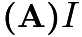
and
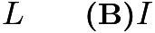
and
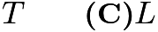
and
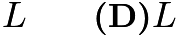
and
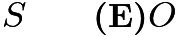
and

---

## Problem 12

The region shown below consists of 24 squares, each with side length 1 centimeter. What is the area, in square centimeters, of the largest circle that can fit inside the region, possibly touching the boundaries?
![[asy] import graph;  size(100);  pen gridPen = black;  void drawSquare(pair p) {     draw(box(p, p + (1,1)), gridPen); }  int[][] grid = {     {0, 0, 0, 0, 0, 0},     {0, 0, 1, 1, 0, 0},     {0, 1, 1, 1, 1, 0},     {1, 1, 1, 1, 1, 1},     {1, 1, 1, 1, 1, 1},     {0, 1, 1, 1, 1, 0},     {0, 0, 1, 1, 0, 0},     {0, 0, 0, 0, 0, 0} };  int rows = grid.length; int cols = grid[0].length;  for (int i = 0; i < rows; ++i) {     for (int j = 0; j < cols; ++j) {         if (grid[i][j] == 1) {             drawSquare((j, rows - i - 1));         }     } } [/asy]](images/2025/img_0992e8be.png)
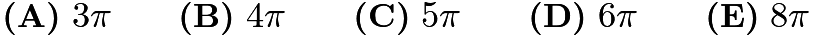

---

## Problem 13

*Problem not found*

---

## Problem 14

A number
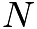
is inserted into the list
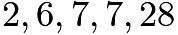
. The mean is now twice as great as the median. What is

?
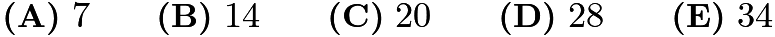

---

## Problem 15

Kei draws a

-by-

grid. He colors

of the unit squares silver and the remaining squares gold. Kei then folds the grid in half vertically, forming pairs of overlapping unit squares. Let
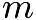
and
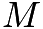
equal the least and greatest possible number of gold-on-gold pairs, respectively. What is the value of
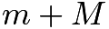
?
![[asy] import graph;  size(100);  pen gridPen = black;  void drawSquare(pair p) {     draw(box(p, p + (1,1)), gridPen); }  int[][] grid = {     {1, 1, 1, 1, 1, 1},     {1, 1, 1, 1, 1, 1},     {1, 1, 1, 1, 1, 1},     {1, 1, 1, 1, 1, 1},     {1, 1, 1, 1, 1, 1},     {1, 1, 1, 1, 1, 1},  };  int rows = grid.length; int cols = grid[0].length;  for (int i = 0; i < rows; ++i) {     for (int j = 0; j < cols; ++j) {         if (grid[i][j] == 1) {             drawSquare((j, rows - i - 1));         }     } } [/asy]](images/2025/img_c6d4458e.png)

---

## Problem 16

Five distinct integers from
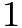
to

are chosen, and five distinct integers from

to

are chosen. No two numbers differ by exactly

. What is the sum of the ten chosen numbers?
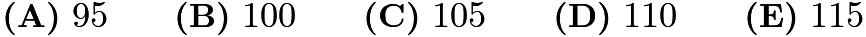

---

## Problem 17

In the land of Markovia, there are three cities:

,

, and

. There are

people who live in

,

who live in

, and
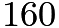
who live in

. Everyone works in one of the three cities, and a person may work in the same city where they live. In the figure below, an arrow pointing from one city to another is labeled with the fraction of people living in the first city who work in the second city. (For example,

of the people who live in

work in

.) How many people work in

?
![[asy] // AMC8 P17 2025, by NUMANA import graph; unitsize(2cm); real r=0.15; pair A, B, C;B = (0,0);C = (2,0);A = (1,sqrt(3)); // Drawing the nodes draw(circle(A,r)); label("$A$", A); draw(circle(B,r)); label("$B$", B); draw(circle(C,r)); label("$C$", C);  guide AB=A+r*dir(-135)..{down}B+r*dir(90),	  	  BA=B+r*dir(60)..{up}A+r*dir(-105),    	  BC=B+r*dir(0)..(1,-0.2)..C+r*dir(180),   		              CB=C+r*dir(150)..(1,0.3)..B+r*dir(30),  	  CA=C+r*dir(90){up}..A+r*dir(-45),     	  AC=A+r*dir(-75){down}..C+r*dir(120);        draw(AB,L=Label("$1/4$", MidPoint, W),Arrow(HookHead));draw(BA,L=Label("$1/3$", MidPoint, W),Arrow(HookHead));draw(BC,L=Label("$1/6$", MidPoint, S),Arrow(HookHead));draw(CB,L=Label("$1/10$", MidPoint, S),Arrow(HookHead)); draw(CA,L=Label("$1/8$", MidPoint, E),Arrow(HookHead));draw(AC,L=Label("$1/5$", MidPoint, E),Arrow(HookHead)); [/asy]](images/2025/img_619bd7db.png)
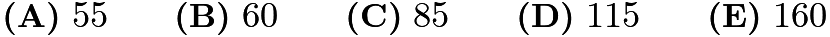

---

## Problem 18

The circle shown below on the left has a radius of 1 unit. The region between the circle and the inscribed square is shaded. In the circle shown on the right, one quarter of the region between the circle and the inscribed square is shaded. The shaded regions in the two circles have the same area. What is the radius

, in units, of the circle on the right?
![[asy]  unitsize(40);  real a = 0.707;  fill(circle((a,a), 1), grey); fill((0,0)--(0,1.414)--(1.414,1.414)--(1.414,0)--cycle, white); draw((0,0)--(0,1.414)--(1.414,1.414)--(1.414,0)--cycle); draw(circle((a,a), 1));  draw((0.707,0.707)--(1.414,1.414)); dot((0.707,0.707)); label("$1$", (1,1), SE);    fill(circle((4+a, a), 2*a), grey); fill(shift((4+a,a)) * ((-2,-2)--(1,-2)--(1,2)--(-2,2)--cycle), white); draw(shift((4+a,a)) * ((-1,-1)--(1,-1)--(1,1)--(-1,1)--cycle)); draw(circle((4+a, a), 2*a));  draw((4+a,a)--(5+a,1+a)); dot((4+a,a)); label("$R$", (a+4.5,a+0.5), SE);  [/asy]](images/2025/img_091c9fe0.png)
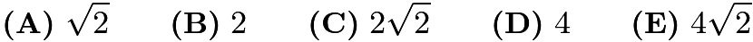

---

## Problem 19

Two towns,

and

, are connected by a straight road,

miles long. Traveling from town

to town

, the speed limit changes every

miles: from
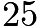
to

to

miles per hour (mph). Two cars, one at town

and one at town

, start moving toward each other at the same time. They drive at exactly the speed limit in each portion of the road. How far from town

, in miles, will the two cars meet?
![[asy] // Asymptote code by aoum size(10cm); real h = 0.1; real s = 0.07; path b = brace((1,0),(0,0),amplitude=s); filldraw((0,0)--(3,0)--(3,h)--(0,h)--cycle,lightgray,black+1bp); draw((1,0)--(1,h),dashed); draw((2,0)--(2,h),dashed); label("$A$",(0,h/2),W); label("$B$",(3,h/2),E); draw(scale(0.7)*"$25\,\textrm{mph}$",(1,h+s)--(0,h+s),Bars); draw(scale(0.7)*"$40\,\textrm{mph}$",(2,h+s)--(1,h+s),Bars); draw(scale(0.7)*"$20\,\textrm{mph}$",(3,h+s)--(2,h+s),Bars); draw(b);  draw(shift(1,0)*b);  draw(shift(2,0)*b); label(scale(0.7)*"$5\,\textrm{mi}$",(0.5,-s),S); label(scale(0.7)*"$5\,\textrm{mi}$",(1.5,-s),S); label(scale(0.7)*"$5\,\textrm{mi}$",(2.5,-s),S); [/asy]](images/2025/img_550aa1cb.png)
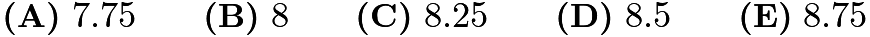

---

## Problem 20

Sarika, Dev, and Rajiv are sharing a large block of cheese. They take turns cutting off half of what
remains and eating it: first Sarika eats half of the cheese, then Dev eats half of the remaining half,
then Rajiv eats half of what remains, then back to Sarika, and so on. They stop when the cheese is
too small to see. About what fraction of the original block of cheese does Sarika eat in total?
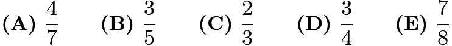

---

## Problem 21

The Konigsberg School has assigned grades 1 through 7 to pods

through

, one grade per
pod. Some of the pods are connected by walkways, as shown in the figure below. The school
noticed that each pair of connected pods has been assigned grades differing by 2 or more grade
levels. (For example, grades 1 and 2 will not be in pods directly connected by a walkway.) What is
the sum of the grade levels assigned to pods
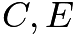
, and

?
![[asy] // Asymptote by aoum size(6cm);  void walkway(path w) {   draw(w,black+3bp);   draw(w,white+2bp); }  void pod(pair P, string s, pen p=white) {   path box = scale(.2)*((-1,-1)--(-1,1)--(1,1)--(1,-1)--cycle);   filldraw(shift(P)*box,p,black);   label("$"+s+"$",P); }  pair A,B,C,D,E,F,G; C = (0.5,0); A = (1.5,2); B = (2,1); D = (2.5,0); E = (4,-0.5); F = (4.5,1); G = (3.5,2);  walkway(A--B);  walkway(B--C); walkway(A..(A+C)/2+(-.5,.5)..C); walkway(C--D); walkway(D--E); walkway(C..(C+E)/2+(-.2,-.5)..E); walkway(B--F); walkway(C--F); walkway(E..(E+F)/2+(.2,-.1)..F); walkway(A--F); walkway(A--G); walkway(G..(G+F)/2+(.2,.2)..F);  pod(A,"A");  pod(B,"B");  pod(C,"C",lightgray);  pod(D,"D"); pod(E,"E",lightgray);  pod(F,"F",lightgray);  pod(G,"G"); [/asy]](images/2025/img_e5cb5988.png)

---

## Problem 22

A classroom has a row of 35 coat hooks. Paulina likes coats to be equally spaced, so that there is the same number of empty hooks before the first coat, after the last coat, and between every coat and the next one. Suppose there is at least 1 coat and at least 1 empty hook. How many different numbers of coats can satisfy Paulina's pattern?

---

## Problem 23

How many four-digit numbers have all three of the following properties?
(I) The tens and ones digit are both 9.
(II) The number is 1 less than a perfect square.
(III) The number is the product of exactly two prime numbers.

---

## Problem 24

In trapezoid

, angles

and

measure

and

. The side lengths are all positive integers, and the perimeter of

is

units. How many non-congruent trapezoids satisfy all of these conditions?
![[asy] // Asymptote by aoum import olympiad; size(7cm);  pair A,B,C,D; A = (-1,2); B = (-2,0); C = (2,0); D = (1,2);  draw(A--B--C--D--cycle);  label("$A$", A, NW); label("$B$", B, SW); label("$C$", C, SE); label("$D$", D, NE);  draw(anglemark(B,A,D,t=6)); draw(anglemark(A,D,C,t=6));  label(scale(0.8)*"$60^\circ$", B, NE + 0.5E); label(scale(0.8)*"$60^\circ$", C, NW + 0.5W);  add(pathticks(A--B)); add(pathticks(D--C)); [/asy]](images/2025/img_9b4f243a.png)

---

## Problem 25

Makayla finds all the possible ways to draw a path in a

diamond-shaped grid. Each path starts at the bottom of the grid and ends at the top, always moving one unit northeast or northwest. She computes the area of the region between each path and the right side of the grid. Two examples are shown in the figures below. What is the sum of the areas determined by all possible paths?
![[asy] // Asymptote by aoum unitsize(5mm);  path createpath(pair[][] P, int[] p) {   int i=0;   int j=0;   path dp = P[0][0];   for (int s=0; s<10; ++s) {     if (p[s] == 0) {++i;} else {++j;}     dp = dp--P[i][j];   }   return(dp); }  pair A[][], B[][]; for (int i=0; i<6; ++i) {   A[i] = new pair[];   B[i] = new pair[];   for (int j=0; j<6; ++j) {     A[i].push(rotate(45)*(i,j));     B[i].push(shift(9,0)*A[i][j]);   } }  int[] p = {0,0,1,1,1,0,0,1,1,0}; path pA = createpath(A,p);  int[] q = {1,0,0,0,1,1,1,1,0,0}; path qB = createpath(B,q);  fill(pA--A[5][0]--cycle,lightgray); fill(qB--B[5][0]--cycle,lightgray);  for (int i=0; i<6; ++i) {   draw(A[i][0]--A[i][5],gray);   draw(B[i][0]--B[i][5],gray);   draw(A[0][i]--A[5][i],gray);   draw(B[0][i]--B[5][i],gray); }  draw(pA,black+2bp); draw(qB,black+2bp);  dot(A[0][0],black+5bp); dot(A[5][5],black+5bp); dot(B[0][0],black+5bp); dot(B[5][5],black+5bp);  label("$\mathrm{area} = 11$", A[0][0], S); label("$\mathrm{area} = 13$", B[0][0], S); [/asy]](images/2025/img_2ba5f770.png)

---

